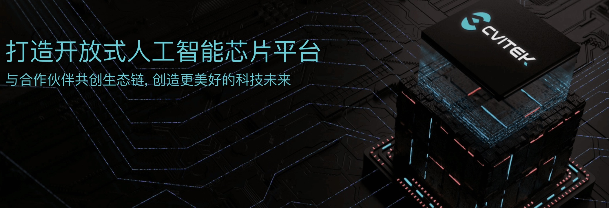
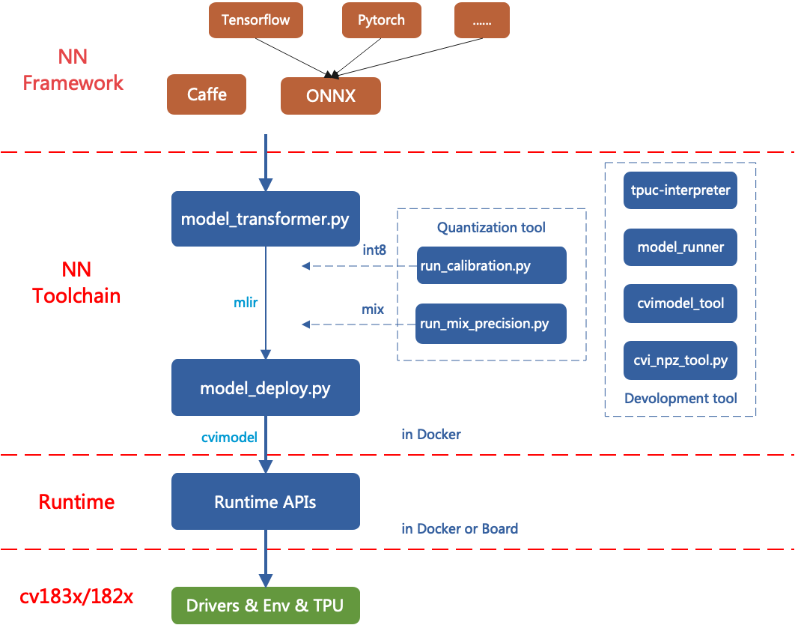

# tpu_compiler

本项目是晶视智能AI芯片的TPU编译器工程，目前已经支持晶视cv183x/cv182x/mars系列产品。

晶视智能是一家专注于视频监控及边缘计算技术研发的芯片设计公司，拥有自主研发的 AI TPU 运算核心及 SoC 芯片整合技术. 目前研发领域涵盖SoC芯片设计， AI TPU处理器及工具链，图像处理算法及设计等，致力于打造人工智能机器视觉一站式平台解决方案，为客户带来丰富价值及技术创新的产品与服务。公司在北京，深圳，武汉，香港等地设有研发中心和运营机构。更多信息参见官网[CVITEK](www.cvitek.com)。

本工程是基于[MLIR架构](https://mlir.llvm.org/)开发，将TPU编译器分层设计，结构如下：




## 经过验证的网络列表

* **Classification:** `resnet50` `resnet18` `mobilenet_v1` `mobilenet_v2` `squeezenet_v1.1` `shufflenet_v2` `googlenet` `inception_v3` `inception_v4` `vgg16` `densenet_121` `densenet_201` `senet_res50` `resnext50` `res2net50` `ecanet50` `efficientnet_b0` `efficientnet_lite_b0` `nasnet_mobile`
* **Detection:** `retinaface_mnet25` `retinaface_res50` `ssd300` `mobilenet_ssd` `yolo_v1`  `yolo_v2` `yolo_v3`  `yolo_v4` `yolo_v5` `yolo_x`
* **Misc:** `arcface_res50` `alphapose` `espcn_3x` `unet` `erfnet`


## 编译代码

* 下载docker和建立容器

  ```shell
  docker pull cvitek/cvitek_dev:1.7-ubuntu-18.04
  cd tpu_compiler
  docker run -it --name work -v $PWD:/work  -v $PWD/../mlir-models:/models cvitek/cvitek_dev:1.7-ubuntu-18.04
  ```

* 编译代码

  ```shell
  source ./envsetup.sh
  ./build.sh
  ```

## 代码验证

* 算子验证

  ``` shell
  mkdir tmp && cd tmp
  # 验证onnx算子
  test_onnx.py
  # 验证pytorch算子
  test_torch.py
  ```

* 模型验证

  ``` shell
  # 在tpu_compiler的同级
  cd regression
  ./run_regression.sh -n resnet50
  ```

## 使用方法

参见[CVKTEK_TPU快速入门指南](./doc/cvitek_tpu_quick_start_guide.md)
