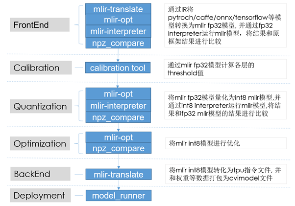
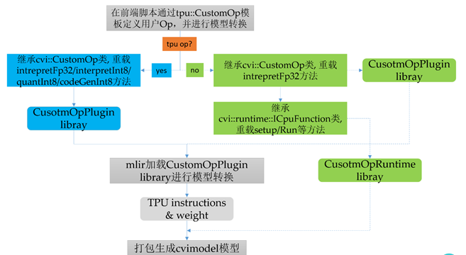
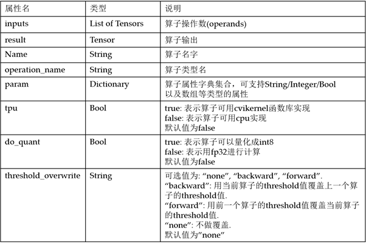
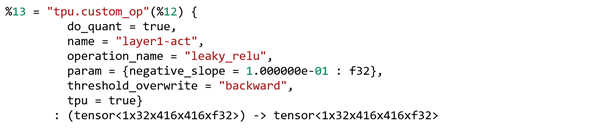
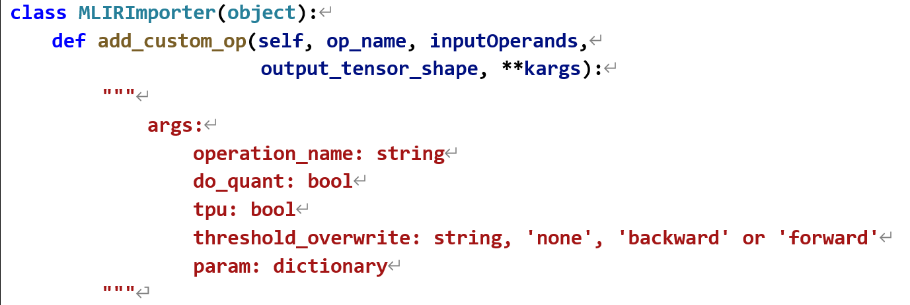
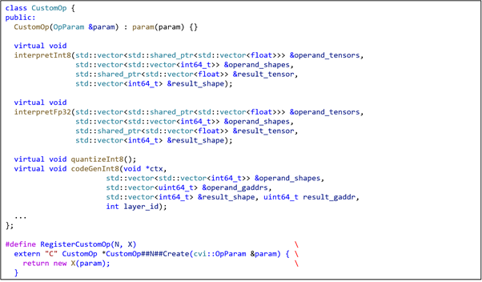
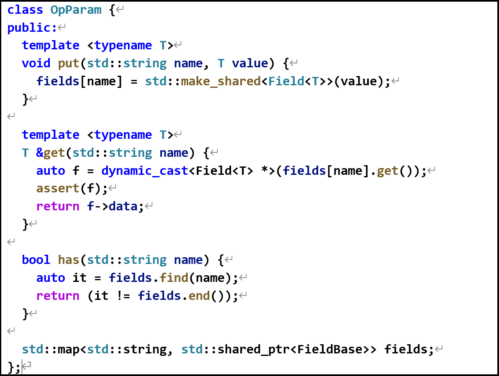

# CV183x TPU自定义算子开发指南


>文档版本: 1.0.0
>
>发布日期: 2021-03-17


© 2020 北京晶视智能科技有限公司

本文件所含信息归<u>北京晶视智能科技有限公司</u>所有。

未经授权，严禁全部或部分复制或披露该等信息。

<div STYLE="page-break-after: always;"></div>

## 修订记录

| 版本   | 日期       | 修改人     | 修改描述              |
| ------ | ---------- | ---------- | --------------------- |
| V0.1.0 | 2020/06/06 | 姜江       | 初始版本              |
| V0.1.1 | 2020/06/29 | 姜江       | 更新编译选项          |
| V0.1.2 | 2020/06/30 | 秦明康     | 根据v1.0 release修订  |
| V0.1.3 | 2020/09/22 | 李全       | 修正后端优化选项      |
| V1.0.0 | 2021/03/17 | 李全       | 根据v1.5 release修订  |

<div STYLE="page-break-after: always;"></div>

## 法律声明

本数据手册包含北京晶视智能科技有限公司（下称“晶视智能”）的保密信息。未经授权，禁止使用或披露本数据手册中包含的信息。如您未经授权披露全部或部分保密信息，导致晶视智能遭受任何损失或损害，您应对因之产生的损失/损害承担责任。

本文件内信息如有更改，恕不另行通知。晶视智能不对使用或依赖本文件所含信息承担任何责任。

本数据手册和本文件所含的所有信息均按“原样”提供，无任何明示、暗示、法定或其他形式的保证。晶视智能特别声明未做任何适销性、非侵权性和特定用途适用性的默示保证，亦对本数据手册所使用、包含或提供的任何第三方的软件不提供任何保证；用户同意仅向该第三方寻求与此相关的任何保证索赔。此外，晶视智能亦不对任何其根据用户规格或符合特定标准或公开讨论而制作的可交付成果承担责任。

<div STYLE="page-break-after: always;"></div>

##  目录

* content
{:toc}


<div STYLE="page-break-after: always;"></div>

## 1 概述

Cvitek工具链提供了丰富多样的IR(OP或算子), 并仍在不断的扩充中。利用这些IR可以很方便的进行各类型网络模型的编译转换并部署到CV1835X平台上。目前已支持IR如下表所示：

| **BatchNorm**      | **BroadCastMal**   | **Concat**          | **Conv2D**     | **Clip**       |
| ------------------ | ------------------ | ------------------- | -------------- | -------------- |
| **DeConv2D**       | **EltwiseAdd**     | **EltWiseMax**      | **EltWiseMin** | **EltWiseMul** |
| **FullyConnected** | **LeakyRelu**      | **Lrn**             | **LrnPart**    | **Normalize**  |
| **Permute**        | **PixelShuffle**   | **PoolAvg2D**       | **PoolMax2D**  | **Power**      |
| **Preprocess**     | **Reciprocal**     | **Relu**            | **Reshape**    | **Reorg**      |
| **Scale**          | **ShuffleChannel** | **Sigmoid**         | **Slice**      | **Sqrt**       |
| **TanH**           | **Upsample**       | **DetectionOutput** | **Softmax**    | **…**          |

模型编译的一般过程如下表所示：

1) 通过IR将pytorch/caffe/onnx/tensorflow等框架模型转换为fp32模型，并通过fp32 interpreter运行mlir模型，将结果和原框架结果进行比较；

2) 运用calibration工具计算mlir fp32各个OP的threshold值；

3) 将mlir fp32模型通过步骤二的计算而来的threshold值量化为int8 mlir模型，并通过int8 interpreter运行mlir模型，将结果和fp32 mlir模型的结果进行比较；

4) 对mlir int8模型进行优化；

5) 将mlir int8模型转化为tpu指令，并和权重等数据打包为cvimodel文件，至此模型的编译完成；




如果用户在进行模型编译的过程中遇到工具链不支持的OP，可以透过Cvitek工具链提供的自定义算子开发的相关机制进行OP的扩展；自定义OP可分为需要部署到TPU engine上的TPU OP以及只能部署到CPU上的CPU OP；相关定制化代码将以插件的形式集成到Cvitek工具链编译器和Runtime中去。

自定义OP的具体开发步骤如下：

1) 在前端模型转化脚本中, 通过tpu::CustomOp模板定义用户算子, 并用此自定义算子转化模型;

2) 继承cvi::CustomOp class, 并重载对应的interpretFp32，interpretInt8，    quantInt8，codeGenInt8等方法，实现算子fp32/int8模式下的测试，量化以及指令代码生成等过程. 然后使用RegisterCustomOp宏去注册这个类；

3) 将上述编译成libCustomOpPlugin.so动态共享库，并在模型编译过程中由编译器以插件的形式进行调用;

4) 若为cpu op, 需要继承cvi::runtime::ICpuFuction class, 并重载setup/run等方法, 使用REGISTER_OP_RUNTIME_FUNCS注册，然后编译成CustomOpRuntime library；

5) 在编译模型时加载CustomOpPlugin 和 CustomOpRuntime转换模型.



<div STYLE="page-break-after: always;"></div>

## 2 算子模板及接口详解

### 2.1 tpu::CusomOp

此为基于llvm tablegen语言描述的自定义算子的模板IR，通过填充tpu::CustomOp相应属性值就可以定义一个新的算子。其主要属性如下表所示:



例如按照如下所示设置tpu::CustomOp的属性值,就可以在编译器前端实现LeakyReluOp的算子的定义:



### 2.2 add_custom_op

此为前端python类MLIRImpotter的方法，按照此方法的参数填入即可添加一个新的自定义OP。然后就可使用此OP在前端python脚本中做模型的转换。此方法定义在”cvitek_mlir/python/ cvi_toolkit/transform/mlirimporter.py”中：



参数含义如下表所示：

| 参数                | 类型           | 含义                       |
| ------------------- | -------------- | -------------------------- |
| op_name             | str            | 模型中op的名字             |
| inputOperands       | list of tensor | op的操作数(输入tensors)    |
| output_tensor_shape | list of int    | op的输出值的shape(n,c,h,w) |
| operation_name      | str            | 请见2.1                    |
| do_quant            | bool           | 请见2.1                    |
| tpu                 | bool           | 请见2.1                    |
| threshold_overwrite | str            | 请见2.1                    |
| param               | dict           | 请见2.1                    |

### 2.3 cvi::CustomOp

此为C++类，用于实现自定义OP的模板。自定义OP需要继承cvi::CustomOp class, 并重载对应的interpretFp32，interpretInt8， quantInt8，codeGenInt8等方法，实现算子fp32/int8模式下的测试，量化以及指令代码生成等过程。



#### 2.3.1 interpretFp32

用于模拟计算mlir fp32模型中自定义OP的输出值。在将模型转换为fp32模型后，需要用mlir_interpreter去运行fp32模型，并将结果和原始模型的结果进行比较，用于确定模型转换是否正确。在此过程中此方法将以callback的形式被调用。

各参数含义如下所示：

| 参数            | 含义                              |
| --------------- | --------------------------------- |
| operand_tensors | Op各操作数的数据, 类型为float     |
| operand_shapes  | Op各操作数的shape                 |
| result_tensor   | Op输出tensor的buffer，类型为float |
| result_shape    | Op输出tensor的shape               |

#### 2.3.2 interpretInt8

用于模拟计算mlir int8模型中自定义OP的输出值。在将模型转换为int8模型后，可用mlir_interpreter去运行int8模型。在此过程中此方法将以callback的形式被调用。

各参数含义如下所示：

| 参数            | 含义                                           |
| --------------- | ---------------------------------------------- |
| operand_tensors | Op各操作数的数据，类型为float存储的int8型.     |
| operand_shapes  | Op各操作数的shape                              |
| result_tensor   | Op输出tensor的buffer，类型为float存储的int8型. |
| Result_shape    | Op输出tensor的shape                            |

#### 2.3.3 quantizeInt8

用于根据Op前后的threshold值来计算量化后的scale及multiplier值，根据这两个值就可以对Op进行量化。

此方法无参数。

#### 2.3.4 codeGenint8

用于将Op转换为TPU的指令数据，需要在此方法中根据cvikernel相关的接口进行TPU编程来实现OP的TPU加速。

各参数含义如下所示：

| 参数           | 含义                                        |
| -------------- | ------------------------------------------- |
| operand_shapes | Op各操作数的shape.                          |
| operand_gaddrs | Op各操作数在ddr中基于TPU Buffer基值得偏移   |
| result_shape   | Op输出tensor的shape                         |
| result_gaddr   | Op输出tensor在ddr中基于TPU Buffer基值得偏移 |
| ctx            | 用于cvikernel编程得context指针              |
| layer_id       | 各Op在mlir fp32 模型中得id号                |

### 2.4 cvi::OpParam

此为c++类，用于存取自定义Op的属性字典。属性值可以支持int8_t/int32_t/float/bool 以这些基本类型的数组。



### 2.5 cvi::runtime::ICpuFunction

此类为c++类，用于自定义CPU OP在Cpu上运行时的计算过程。自定义CPU OP需要继承该类，实现该类中的纯虚函数setup和run的运行时计算过程。

#### 2.5.1 setup

用于设置runtime 时op的参数，以及输入和输出tensor的shape等信息.

各参数的含义如下：

| 参数     | 含义                                                         													|
| -------- | -------------------------------------------------------------------------------------------------------------- |
| Inputs   | 以cvi::runtime::Neuron类型表示的OP输入tensors，可以从中获取到输入tensors的shape/ data等信息，用于下一步的计算. |
| outputs  | 以cvi::runtime::Neuron类型表示的OP输出tensor                 													|
| param    | OP的参数字典，可以使用cvi::OpParam类提供的接口获取到相应的OP参数 												|


#### 2.5.2  run

CPU Op运行时实现计算过程的接口. 在平台上运行时计算过程可以使用arm neon汇编语言去实现提升计算的效率.

此接口无参数.

<div STYLE="page-break-after: always;"></div>

## 3 自定义OP开发示例

### 3.1 自定义TPU OP开发(1)

本章以leaky_relu算子为例，介绍如何开发一个自定义TPU算子，并编译包含此OP的yolov3网络模型至CV183x TPU平台运行。

本章需要如下文件

* cvitek_mlir.tar.gz
* custom_op.tar.gz
* dataset.tar.gz
* cvitek_sysroot.tar.gz


1) 准备开发环境

首先，加载cvitek_mlir环境（默认使用docker）：

```
  $ tar -zxvf cvitek_mlir.tar.gz
  $ tar -zxvf cvitek_sysroot.tar.gz
  $ source cvitek_mlir/cvitek_envs.sh
  $ export TPU_BASE=$PWD
```

其次，解压custom_op示例目录

```
  $ tar -zxvf custom_op.tar.gz
  $ cd custom_op/example
  $ export TOOLCHAIN_FILE_PATH=$PWD/cmake/toolchain-aarch64-linux.cmake
  $ export MLIR_INCLUDE=$TPU_BASE/cvitek_mlir/tpuc/include
  $ export CVIRUNTIME_INCLUDE=$MLIR_INCLUDE
  $ export AARCH64_SYSROOT_PATH=$TPU_BASE/cvitek_sysroot
  $ export INSTALL_PATH=$PWD/install
```

2) 编写LeakyReluOp的功能代码

新增c++源文件和头文件，继承cvi::CustomOp类并重载interpretFp32，interpretInt8，quantizeInt8，codeGenInt8等方法，具体代码其参考：

>  custom_op/example/LeakyReluOp.h
>  custom_op/example/LeakyReluOp.cpp
>  custom_op/example/QuantHelper.h

新增CmakeLists.txt将代码编译为libCustomOpPlugin.so，具体代码请参考：

>  custom_op/example/CMakeLists.txt

编译LeakyReluOp的代码

```
  $ mkdir build && cd build
  $ cmake -DMLIR_INCLUDE=$TPU_BASE/cvitek_mlir/tpuc/include \
    -DCMAKE_INSTALL_PREFIX=$INSTALL_PATH   ..
  $ make install
  $ cd ..
```

编译前端模型转换脚本。首先继承cvi_toolkit.transform.onnx_converter.OnnxConverter, 增加转换onnx LeakyRelu Op的函数 convert_leaky_relu方法。在该方法中可以使用CVI.add_custom_op函数去生成新的自定义Op去映射onnx LeakyRelu Op. 其次，利用新的MyOnnxConverter去对yolov3-416.onnx模型进行转换. 具体代码请参考:

>  custom_op/example/yolo_v3_convert.py

3) 模型前端转换

利用新编写的yolov3_converter.py前端脚本将yolov3-416.onnx模型转换为mlir模型，并作图优化操作，最终得到yolov3_416_fp32.mlir文件：

```
  $ ./yolo_v3_convert.py
  $ mlir-opt                \
    yolo_v3_416.mlir        \
    --assign-layer-id       \
    --convert-bn-to-scale   \
    --canonicalize          \
    --eltwise-early-stride  \
    --print-tpu-op-info     \
    --tpu-op-info-filename  \
    op_info.csv             \
    -o yolo_v3_416_fp32.mlir
```

取得一张测试用图片, 本示例使用cvitek_mlir包含的dog.jpg, 然后运行onnx runtime推理:

```
  $ run_onnx_detector_yolo.py          \
    --model_def model/yolov3-416.onnx  \
    --net_input_dims 416,416           \
    --obj_threshold 0.3                \
    --nms_threshold 0.5                \
    --dump_blobs yolo_v3_416_blobs.npz \
    --batch_size 1                     \
    --input_file $REGRESSION_PATH/data/dog.jpg 	                 \
    --label_file $REGRESSION_PATH/data/coco-labels-2014_2017.txt \
    --draw_image dog_out.jpg
```

得到yolo_v3_416_blobs.npz文件，包含onnx runtime推理过程中每一层的数据。
接下来，运行mlir-tpu-interpreter对mlir进行推理，得到的mlir推理的逐层数据yolo_v3_416_tensor_all_fp32.npz。

```
  $ cvi_npz_tool.py extract yolo_v3_416_blobs.npz yolo_v3_416_in_fp32.npz input

  $ mlir-tpu-interpreter yolo_v3_416_fp32.mlir   \
    --tensor-in  yolo_v3_416_in_fp32.npz         \
    --tensor-out  yolo_v3_416_out_fp32.npz       \
    --custom-op-plugin                           \
	install/lib/custom_op/libCustomOpPlugin.so   \
    --dump-all-tensor=yolo_v3_416_tensor_all_fp32.npz
```

将onnx runtime推理数据和mlir推理数据进行逐层比对

```
  $ cvi_npz_tool.py compare         \
    yolo_v3_416_tensor_all_fp32.npz \
    yolo_v3_416_blobs.npz           \
    --op_info op_info.csv           \
    --tolerance=0.999,0.999,0.998 -vv
```

4) Calibration

Calibration前需要先准备图像文件列表，下述脚本可辅助在指定目录随机选择文件，并将选择结果保存为txt文件（以取1000张为例）。
得到cali_list_imagenet_1000.txt文件。

```
  $ python3 \
    $MLIR_PATH/tpuc/python/gen_data_list.py \
    $DATASET_PATH/coco/val2017  1000        \
    cali_list_coco_1000.txt
```

执行calibration, 得到yolo_v3_threshold_table

```
  $ python3  \
    $MLIR_PATH/python/run_calibration.py \
    yolo_v3_416_fp32.mlir                \
    cali_list_coco_1000.txt              \
    --calibration_table                  \
    yolo_v3_416_threshold_table          \
    --input_num=100                      \
    --custom_op_plugin                   \
    install/lib/custom_op/libCustomOpPlugin.so
```

5) 执行量化并验证精度

执行量化，生成量化后mlir文件, 得到yolo_v3_416_int8.mlir.

```
  $ mlir-opt yolo_v3_416_fp32.mlir  \
    --import-calibration-table      \
    --calibration-table             \
    yolo_v3_threshold_table         \
    --assign-chip-name              \
    --chipname cv183x               \
    --tpu-quant                     \
    --custom-op-plugin              \
    install/lib/custom_op/libCustomOpPlugin.so \
    --print-tpu-op-info                        \
    --tpu-op-info-filename  op_info_int8.csv   \
    -o  yolo_v3_416_int8.mlir
```

对量化后的mlir模型进行推理，mlir-tpu-interpreter对INT8模型的推理结果应与硬件最终计算结果完全一致。
运行mlir-tpu-interpreter对int8 mlir进行推理，得到的逐层数据，得到yolo_v3_416_tensor_all_int8.npz。

```
  $ mlir-tpu-interpreter yolo_v3_416_int8.mlir \
    --tensor-in  yolo_v3_416_in_fp32.npz       \
    --tensor-out  yolo_v3_416_out_int8.npz     \
    --custom-op-plugin                         \
    install/lib/custom_op/libCustomOpPlugin.so \
    --dump-all-tensor=yolo_v3_416_tensor_all_int8.npz
```

6) 后端优化，代码生成及打包为cvimodel

执行命令，得到yolo_v3_416.cvimodel:

```
  $ mlir-opt yolo_v3_416_int8.mlir  \
    --tpu-lower --reorder-op        \
    --eltwise-early-stride          \
    --tg-fuse-leakyrelu             \
    --conv-ic-alignment             \
    --group-ops                     \
    --dce                           \
    --deep-fusion-group-slice       \
    --deep-fusion-opt               \
    --tg-op-tile                    \
    --compress-activation           \
    --compress-weight               \
    --assign-weight-address         \
    --tpu-weight-address-align=16   \
    --tpu-weight-map-filename=weight_map.csv \
    --tpu-weight-bin-filename=weight.bin     \
    --assign-neuron-address                  \
    --tpu-neuron-memory-reuse                \
    --tpu-neuron-address-align=64            \
    --tpu-neuron-map-filename=neuron_map.csv \
    --divide-ops-to-func                     \
    -o yolo_v3_416_int8_opt_func.mlir

  $ mlir-translate --mlir-to-cvimodel          \
    --custom-op-plugin                         \
	install/lib/custom_op/libCustomOpPlugin.so \
    --weight-file weight.bin                   \
    yolo_v3_416_int8_opt_func.mlir             \
    -o yolo_v3_416.cvimodel
```

7) 测试cvimodel

使用model_runner进行测试，model_runner同时支持仿真器测试和EVB运行，命令相同。

```
  $ model_runner                     \
    --input  yolo_v3_416_in_fp32.npz \
    --model  yolo_v3_416.cvimodel    \
    --output  out.npz

  $ cvi_npz_tool.py compare out.npz yolo_v3_416_tensor_all_int8.npz
```

### 3.2 自定义TPU OP开发(2)

本章以UnPooling算子为例，介绍如何开发一个自定义TPU算子，并编译包含此OP的Segnet网络模型至CV183x TPU平台运行。

本章需要如下文件

* cvitek_mlir.tar.gz
* custom_op.tar.gz
* dataset.tar.gz
* cvitek_sysroot.tar.gz


1) 准备开发环境

首先，加载cvitek_mlir环境（默认使用docker):

```
  $ tar -zxvf  cvitek_mlir.tar.gz
  $ tar -zxvf cvitek_sysroot.tar.gz
  $ source  cvitek_mlir/cvitek_envs.sh
  $ export  TPU_BASE=$PWD
```

其次，解压custom_op示例目录

```
  $ tar -zxvf   custom_op.tar.gz
  $ cd custom_op/example
  $ export TOOLCHAIN_FILE_PATH=$PWD/cmake/toolchain-aarch64-linux.cmake
  $ export MLIR_INCLUDE=$TPU_BASE/cvitek_mlir/tpuc/include
  $ export CVIRUNTIME_INCLUDE=$MLIR_INCLUDE
  $ export AARCH64_SYSROOT_PATH=$TPU_BASE/cvitek_sysroot
  $ export INSTALL_PATH=$PWD/install
```

2) 编写LeakyReluOp的功能代码

新增c++源文件和头文件，继承cvi::CustomOp类并重载interpretFp32，interpretInt8，quantizeInt8，codeGenInt8等方法。
具体代码其参考：

> custom_op/example/UnPoolingOp.h
> custom_op/example/UnPoolingOp.cpp
> custom_op/example/QuantHelper.h

新增CmakeLists.txt将代码编译为libCustomOpPlugin.so。
具体代码请参考：

> custom_op/example/CMakeLists.txt

编译UnPoolingOp的代码

```
  $ mkdir build && cd build
  $ cmake -DMLIR_INCLUDE=$TPU_BASE/cvitek_mlir/tpuc/include \
    -DCMAKE_INSTALL_PREFIX=$INSTALL_PATH ..
  $ make install
  $ cd ..
```

编译前端模型转换脚本。首先继承cvi_toolkit.transform.caffe _converter.CaffeConverter, 增加转换UnPoolingOp的函数 convert_unpooling_op方法。
因为目前使用的caffe模型中使用了upsample代替了unpooling, 所以我们在convert脚本中直接将upsample替换成我们编写的unpooling来达到一样的效果。
具体代码请参考:

> custom_op/example/segnet_convert.py

3) 模型前端转换

新建segnet的目录, 并将segnet的caffe模型放到segnet目录中, 利用新编写的segnet_converter.py前端脚本将segnet caffe模型转换为mlir模型，并做前端图优化操作，最终得到segnet_fp32_opt.mlir文件：

```
  $ mkdir  segnet && cd segnet

  $ segnet_convert.py                 \
    --model_path segnet.prototxt 	  \
    --model_dat segnet.caffemodel     \
    --mlir_file_path segnet_fp32.mlir

  $ mlir-opt  segnet_fp32.mlir          \
    --assign-layer-id                   \
    --convert-bn-to-scale               \
    --canonicalize                      \
    --eltwise-early-stride              \
    --print-tpu-op-info                 \
    --tpu-op-info-filename  op_info.csv \
    -o segnet_fp32_opt.mlir
```

取得一张测试用图片，本示例使用cvitek_mlir包含的camvid.png. 然后运行caffe推理:

```
  $ run_caffe_segmentation.py            \
    --model_def segnet.prototxt          \
    --pretrained_model segnet.caffemodel \
    --net_input_dims 360,480             \
    --dump_blobs segnet_blobs.npz        \
    --output segnet_out_fp32.npz         \
    --batch_size 1                       \
    --input_file camvid.png              \
    --colours camvid12_lut.png           \
    --draw_image segmentation_out.jpg
```

得到segnet_blobs.npz文件，包含caffe推理过程中每一层的数据。接下来，运行mlir-tpu-interpreter对mlir进行推理，得到的mlir推理的逐层数据segnet_tensor_all_fp32.npz。

```
  $ cvi_npz_tool.py extract segnet_blobs.npz segnet_in_fp32.npz input
  $ mlir-tpu-interpreter segnet_fp32_opt.mlir   \
    --tensor-in  segnet_in_fp32.npz             \
    --tensor-out  segnet_out_fp32.npz           \
    --custom-op-plugin                          \
    install/lib/custom_op/libCustomOpPlugin.so  \
    --dump-all-tensor=segnet_tensor_all_fp32.npz
```

将caffe推理数据和mlir推理数据进行逐层比对

```
  $ cvi_npz_tool.py compare    \
    segnet_tensor_all_fp32.npz \
    segnet_blobs.npz           \
	  --op_info op_info.csv      \
    --tolerance=0.999,0.999,0.998  -vv
```

4) Calibration

Calibration的过程可以参考前面第一节编写leakyrelu的方式，准备1000张图片，来生成calibration table。
这里直接使用cvitek_mlir里自带的segnet_calibration_table.

5) 执行量化并验证精度

执行量化, 生成量化后mlir文件, 得到segnet_int8.mlir。

```
  $ mlir-opt segnet_fp32_opt.mlir              \
    --import-calibration-table                 \
    --calibration-table                        \
    segnet_calibration_table                   \
    --assign-chip-name                         \
    --chipname cv183x                          \
    --tpu-quant                                \
    --custom-op-plugin                         \
    install/lib/custom_op/libCustomOpPlugin.so \
    --print-tpu-op-info                        \
    --tpu-op-info-filename  op_info_int8.csv   \
    -o  segnet_int8.mlir
```

对量化后的mlir模型进行推理, mlir-tpu-interpreter对INT8模型的推理结果应与硬件最终计算结果完全一致。
运行mlir-tpu-interpreter对int8 mlir进行推理, 得到逐层数据segnet_tensor_all_int8.npz。

```
  $ mlir-tpu-interpreter segnet_int8.mlir 	   \
    --tensor-in  segnet_in_fp32.npz 		   \
    --tensor-out  segnet_out_int8.npz          \
    --custom-op-plugin                         \
	install/lib/custom_op/libCustomOpPlugin.so \
    --dump-all-tensor=segnet_tensor_all_int8.npz
```

6) 后端优化，代码生成及打包为cvimodel

执行命令，得到segnet.cvimodel:

```
  $ mlir-opt segnet_int8.mlir  \
    --tpu-lower --reorder-op   \
    --eltwise-early-stride     \
    --tg-fuse-leakyrelu        \
    --conv-ic-alignment        \
    --group-ops                \
    --dce                      \
    --deep-fusion-group-slice  \
    --deep-fusion-opt          \
    --tg-op-tile               \
    --compress-activation      \
    --compress-weight          \
    --assign-weight-address    \
    --tpu-weight-address-align=16            \
    --tpu-weight-map-filename=weight_map.csv \
    --tpu-weight-bin-filename=weight.bin     \
    --assign-neuron-address                  \
    --tpu-neuron-memory-reuse                \
    --tpu-neuron-address-align=64            \
    --tpu-neuron-map-filename=neuron_map.csv \
    --divide-ops-to-func                     \
    -o segnet_int8_opt_func.mlir
```

7) 测试cvimodel

使用model_runner进行测试，model_runner同时支持仿真器测试和EVB运行，命令相同。

```
  $ model_runner                \
    --input  segnet_in_fp32.npz \
    --model  segnet.cvimodel    \
    --output  out.npz

  $ cvi_npz_tool.py compare out.npz segnet_tensor_all_int8.npz
```

### 3.3 自定义CPU OP开发(1)

本章以resnet18为例，介绍如何增加一个Softmax的自定义OP，并将其onnx模型迁移至CV183x TPU平台运行.

本章需要如下文件

* cvitek_mlir.tar.gz
* dataset.tar.gz
* custom_op.tar.gz
* cvitek_sysroot.tar.gz

1) 准备开发环境

同3.1节

2) 编写SoftmaxOp的功能代码

新增c++源文件和头文件，继承cvi::CustomOp类并重载interpretFp32等方法。
具体代码其参考：

> custom_op/example/SoftmaxOp.h
> custom_op/example/Softmax.cpp

新增CmakeLists.txt将代码编译为libCustomOpPlugin.so。
具体代码请参考：

> custom_op/example/CMakeLists.txt

编译SoftmaxOp Plugin的代码

```
  $ mkdir   build && cd build && rm -rf *
  $ cmake -DMLIR_INCLUDE=$TPU_BASE/cvitek_mlir/tpuc/include \
    -DCMAKE_INSTALL_PREFIX=$INSTALL_PATH ..
  $ make install
```

增加runtime function代码，继承cvi::runtime::ICpuFunction抽象类，并实现setup和run函数，最后通过REGISTER_OP_RUNTIME_FUNCS宏注册Softmax Op runtime function。
具体代码请参考：

> custom_op/example/runtime/SoftmaxOpRuntime.hpp
> custom_op/example/runtime/SoftamxOpRuntime.cpp
> custom_op/example/runtime/OpRuntimeRegister.cpp

新增CmakeLists.txt将SoftmaxOp runtime function代码编译为libCustomOpRuntime.so。
具体代码请参考：

> custom_op/example/runtime/CMakeLists.txt

编译SoftmaxOp runtime function的代码

```
   $ rm -rf *
   $ cmake -DCVIRUNTIME_INCLUDE=$CVIRUNTIME_INCLUDE \
     -DCMAKE_INSTALL_PREFIX=$INSTALL_PATH ../runtime
   $ make install

   $ rm -rf *
   $ cmake -DCMAKE_SYSROOT=$AARCH64_SYSROOT_PATH \
     -DCMAKE_TOOLCHAIN_FILE=$TOOLCHAIN_FILE_PATH \
	 -DCVIRUNTIME_INCLUDE=$CVIRUNTIME_INCLUDE    \
	 -DCMAKE_INSTALL_PREFIX=$INSTALL_PATH ../runtime
   $ make install
   $ cd ..
```

编译前端模型转换脚本。首先继承cvi_toolkit.transform.onnx_converter.OnnxConverter, 增加转换onnx Softmax Op的函数add_softmax_op方法。
在该方法中可以使用CVI.add_custom_op函数去生成新的自定义Op去在网络结尾增加一个Softmax Op, 然后利用新的MyOnnxConverter去对resnet18.onnx模型进行转换。
具体代码请参考:

> custom_op/example/resnet18_convert.py

3) 模型前端转换

利用新编写的resnet18_convert.py前端脚本将resnet18.onnx模型转换为mlir模型，并作图优化操作，最终得到resnet18_fp32.mlir文件：

```
  $ ./resnet18_convert.py
  $ mlir-opt                \
    --assign-layer-id       \
    --convert-bn-to-scale   \
    --canonicalize          \
    --eltwise-early-stride  \
    --print-tpu-op-info     \
    --tpu-op-info-filename  \
    op_info.csv             \
    resnet18.mlir           \
    -o resnet18_fp32.mlir
```

执行onnx推理，产生比对数据，并进行逐层数据比对。取得一张测试用图片，本示例使用cvitek_mlir包含的cat.jpg,运行onnx推理（注意此处mean和std是按照BGR排列，而pytorch是按照RGB排列）, 得到resnet18_tensor_all_ref.npz

```
  $ run_onnx_inference.py                            \
    --model_path  model/resnet18.onnx                \
    --input_file  $MLIR_PATH/regression/data/cat.jpg \
    --image_resize_dims  256,256                     \
    --net_input_dims  224,224                        \
    --raw_scale  1.0                                 \
    --mean  0.406,0.456,0.485                        \
    --std  0.225,0.224,0.229                         \
    --output_file  resnet18_out_ref.npz              \
    --dump_tensor  resnet18_tensor_all_ref.npz

```

运行mlir-tpu-interpreter对mlir进行推理，得到的逐层数据, 得到resnet18_tensor_all_fp32.npz

```
  $ cvi_npz_tool.py extract resnet18_tensor_all_ref.npz resnet18_in_fp32.npz  input
  $ mlir-tpu-interpreter resnet18_fp32.mlir                       \
    --tensor-in  resnet18_in_fp32.npz                             \
    --tensor-out  resnet18_out_fp32.npz                           \
	--custom-op-plugin=install/lib/custom_op/libCustomOpPlugin.so \
    --dump-all-tensor=resnet18_tensor_all_fp32.npz
```

将onnx推理数据和mlir推理数据进行逐层比对

```
  $ cvi_npz_tool.py compare       \
    resnet18_tensor_all_fp32.npz  \
    resnet18_tensor_all_ref.npz   \
    --op_info  op_info.csv        \
    --tolerance=0.999,0.999,0.999  -vv
```

4) Calibration

Calibration前需要先准备图像文件列表，下述脚本可辅助在指定目录随机选择文件，并将选择结果保存为txt文件（以取1000张为例）. 得到cali_list_imagenet_1000.txt文件。

```
  $ python3  \
    $MLIR_PATH/tpuc/python/gen_data_list.py        \
    $DATASET_PATH/imagenet/img_val_extracted  1000 \
    cali_list_imagenet_1000.txt
```

执行calibration, 得到yolo_v3_threshold_table

```
  $ python3  \
    $MLIR_PATH/tpuc/python/run_calibration.py    \
    resnet18_fp32.mlir                           \
	cali_list_imagenet_1000.txt                  \
	--calibration_table resnet18_threshold_table \
	--input_num=100                              \
	--custom_op_plugin                           \
	install/lib/custom_op/libCustomOpPlugin.so
```

5) 其他步骤

量化，优化，代码生成，测试等步骤与3.1节 相同，不再赘述，仅列命令供参考.

```
  $ mlir-opt  resnet18_fp32.mlir  \
    --import-calibration-table    \
    --calibration-table           \
	resnet18_threshold_table      \
	--assign-chip-name            \
	--chipname cv183x             \
    --tpu-quant                   \
    --print-tpu-op-info           \
    --tpu-op-info-filename        \
	op_info_int8.csv              \
    -o  resnet18_int8.mlir

  $ mlir-tpu-interpreter resnet18_int8.mlir    \
    --tensor-in  resnet18_in_fp32.npz          \
    --tensor-out  resnet18_out_int8.npz        \
    --custom-op-plugin                         \
    install/lib/custom_op/libCustomOpPlugin.so \
    --dump-all-tensor=resnet18_tensor_all_int8.npz

  $ mlir-opt \
    resnet18_int8.mlir         \
    --tpu-lower --reorder-op   \
    --eltwise-early-stride     \
    --tg-fuse-leakyrelu        \
    --conv-ic-alignment        \
    --group-ops                \
    --dce                      \
    --deep-fusion-group-slice  \
    --deep-fusion-opt          \
    --tg-op-tile               \
    --compress-activation      \
    --compress-weight          \
    --assign-weight-address    \
    --tpu-weight-address-align=16            \
    --tpu-weight-map-filename=weight_map.csv \
    --tpu-weight-bin-filename=weight.bin     \
    --assign-neuron-address                  \
    --tpu-neuron-memory-reuse                \
    --tpu-neuron-address-align=64            \
    --tpu-neuron-map-filename=neuron_map.csv \
    --divide-ops-to-func                     \
    -o resnet18_int8_opt_func.mlir

  $ mlir-translate     \
    --mlir-to-cvimodel \
    --custom-op-plugin  install/lib/custom_op/libCustomOpPlugin.so                                                          \
    --custom-runtime-lib install/lib/custom_op/libCustomOpRuntime_arm64.so,install/lib/custom_op/libCustomOpRuntime_x86.so  \
    --weight-file weight.bin     \
    resnet18_int8_opt_func.mlir  \
    -o resnet18.cvimodel

  $ model_runner \
    --input  resnet18_in_fp32.npz \
    --model  resnet18.cvimodel    \
    --output out.npz

  $ cvi_npz_tool.py compare out.npz resnet18_tensor_all_int8.npz
```

### 3.4 自定义CPU OP开发(２)

本章介绍如何增加一个ROIAlign的自定义OP，并手动构造只包含ROIAlign op的mlir.

本章需要如下文件

> cvitek_mlir.tar.gz
> dataset.tar.gz
> custom_op.tar.gz
> cvitek_sysroot.tar.gz

1) 准备开发环境

同3.1节

2) 编写ROIAlignOp的功能代码

新增c++源文件和头文件，继承cvi::CustomOp类并重载interpretFp32等方法。
具体代码其参考：

> custom_op/example/ROIAlignOp.h
> custom_op/example/ROIAlign.cpp

新增CmakeLists.txt将代码编译为libCustomOpPlugin.so。
具体代码请参考：

> custom_op/example/CMakeLists.txt

编译ROIAlignOp Plugin的代码

```
  $ mkdir build && cd build && rm -rf *
  $ cmake -DMLIR_INCLUDE=$TPU_BASE/cvitek_mlir/tpuc/include \
    -DCMAKE_INSTALL_PREFIX=$INSTALL_PATH ..
  $ make install
```

增加runtime function代码，继承cvi::runtime::ICpuFunction抽象类，并实现setup和run函数，最后通过REGISTER_OP_RUNTIME_FUNCS宏注册ROIAlignOp runtime function。
具体代码请参考:

> custom_op/example/runtime/ROIAlignOpRuntime.hpp
> custom_op/example/runtime/ROIAlignOpRuntime.cpp
> custom_op/example/runtime/OpRuntimeRegister.cpp

新增CmakeLists.txt将ROIAlignOp runtime function代码编译为libCustomOpRuntime.so。
具体代码请参考:

> custom_op/example/runtime/CMakeLists.txt

编译ROIAlignOp runtime function的代码

```
  $ rm -rf *
  $ cmake -DCVIRUNTIME_INCLUDE=$CVIRUNTIME_INCLUDE  \
    -DCMAKE_INSTALL_PREFIX=$INSTALL_PATH ../runtime
  $ make install
  $ rm -rf *
  $ cmake -DCMAKE_SYSROOT=$AARCH64_SYSROOT_PATH     \
    -DCMAKE_TOOLCHAIN_FILE=$TOOLCHAIN_FILE_PATH     \
	-DCVIRUNTIME_INCLUDE=$CVIRUNTIME_INCLUDE        \
	-DCMAKE_INSTALL_PREFIX=$INSTALL_PATH ../runtime
  $ make install
  $ cd ..
```

3) 手动构造一个只包含ROIAlignOp的mlir。
具体代码请参考:

> custom_op/example/roialign_op_fp32.mlir

运行mlir-tpu-interpreter对mlir进行推理，得到roialign_tensor_all_fp32.npz

```
  $ mlir-tpu-interpreter roialign_op_fp32.mlir \
    --tensor-in  roialign_in_fp32.npz          \
    --tensor-out  roialign_out_fp32.npz        \
    --custom-op-plugin=install/lib/custom_op/libCustomOpPlugin.so \
    --dump-all-tensor=roialign_tensor_all_fp32.npz
```

4) Calibration

因为只包含一个cpu op, 所以不需要进行量化, 这里不需要做calibration.可以使用如下命令生成一个fake calibration_table

```
  $ mlir-opt --gen-pseudo-weight-npz  \
    --pseudo-calibration-table=roialign_calibration_table  \
	roialign_op_fp32.mlir
```

5)  其他步骤

量化，优化，代码生成，测试等步骤与3.1节 相同，不再赘述，仅列命令供参考.

```
  $ mlir-opt \
    roialign_op_fp32.mlir       \
    --import-calibration-table  \
    --calibration-table         \
    roialign_calibration_table  \
	--assign-chip-name          \
	--chipname cv183x           \
    --tpu-quant                 \
    --print-tpu-op-info         \
    --tpu-op-info-filename      \
    op_info_int8.csv            \
    -o roialign_int8.mlir

  $ mlir-tpu-interpreter  roialign_int8.mlir   \
    --tensor-in  roialign_in_fp32.npz          \
    --tensor-out  roialign_out_int8.npz        \
    --custom-op-plugin                         \
    install/lib/custom_op/libCustomOpPlugin.so \
    --dump-all-tensor=roialign_tensor_all_int8.npz

  $ mlir-opt roialign_int8.mlir  \
    --tpu-lower --reorder-op   \
    --eltwise-early-stride     \
    --tg-fuse-leakyrelu        \
    --conv-ic-alignment        \
    --group-ops                \
    --dce                      \
    --deep-fusion-group-slice  \
    --deep-fusion-opt          \
    --tg-op-tile               \
    --compress-activation      \
    --compress-weight          \
    --assign-weight-address    \
    --tpu-weight-address-align=16            \
    --tpu-weight-map-filename=weight_map.csv \
    --tpu-weight-bin-filename=weight.bin     \
    --assign-neuron-address                  \
    --tpu-neuron-memory-reuse                \
    --tpu-neuron-address-align=64            \
    --tpu-neuron-map-filename=neuron_map.csv \
    --divide-ops-to-func                     \
    -o roialign_int8_opt_func.mlir

  $ mlir-translate              \
    --mlir-to-cvimodel          \
    --custom-op-plugin  install/lib/custom_op/libCustomOpPlugin.so \
	--custom-runtime-lib install/lib/custom_op/libCustomOpRuntime_arm64.so,install/lib/custom_op/libCustomOpRuntime_x86.so  \
    --weight-file weight.bin    \
    roialign_int8_opt_func.mlir \
    -o roialign.cvimodel

  $ model_runner \
    --input  roialign_in_fp32.npz \
    --model  roialign.cvimodel    \
    --output out.npz

  $ cvi_npz_tool.py compare out.npz roialign_tensor_all_int8.npz
```