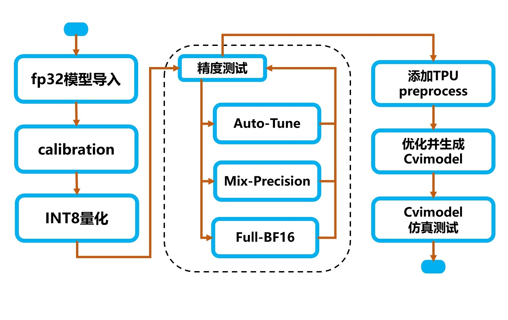

>
> 文档版本: 1.5.0
>
> 发布日期: 2020-01-25

© 2020 北京晶视智能科技有限公司

本文件所含信息归<u>北京晶视智能科技有限公司</u>所有。

未经授权，严禁全部或部分复制或披露该等信息。

**修订记录**

| 版本   | 日期       | 修改人 | 修改描述              |
| ------ | ---------- | ------ | --------------------- |
| V0.0.1 | 2019/12/11 | 王雷   | 初始版本              |
| V0.1.0 | 2020/03/30 | 王雷   | 增加使用说明和API说明 |
| V0.2.0 | 2020/07/17 | 王雷   | 增加使用说明和API说明 |
| V0.3.0 | 2020/10/26 | 秦明康 | 更新使用说明和API说明 |
| V0.3.1 | 2020/11/24 | 肖泉   | 更新mlir op和更新格式 |
| V1.4.0 | 2020/12/04 | 姜江   | 更新文档结构          |
<div STYLE="page-break-after: always;"></div>
# 法律声明

本数据手册包含北京晶视智能科技有限公司（下称"晶视智能"）的保密信息。未经授权，禁止使用或披露本数据手册中包含的信息。如您未经授权披露全部或部分保密信息，导致晶视智能遭受任何损失或损害，您应对因之产生的损失/损害承担责任。

本文件内信息如有更改，恕不另行通知。晶视智能不对使用或依赖本文件所含信息承担任何责任。

本数据手册和本文件所含的所有信息均按"原样"提供，无任何明示、暗示、法定或其他形式的保证。晶视智能特别声明未做任何适销性、非侵权性和特定用途适用性的默示保证，亦对本数据手册所使用、包含或提供的任何第三方的软件不提供任何保证；用户同意仅向该第三方寻求与此相关的任何保证索赔。此外，晶视智能亦不对任何其根据用户规格或符合特定标准或公开讨论而制作的可交付成果承担责任。
<div STYLE="page-break-after: always;"></div>
# 目 录

[TOC]

<div STYLE="page-break-after: always;"></div>

# 第1章 概述

## 1.1 TPU介绍

> CVITEK TPU是晶视智能开发的边缘计算SoC平台(CV183x)的异构计算引擎。实现了对主流神经网络运算的高效硬件加速，兼顾执行效率和可编程灵活性。计算精度方面同时支持高效的INT8和高动态范围的BF16两种模式，并通过软件平台支持灵活的混合精度配置。

## 1.2 工具链介绍

> CVITEK TPU工具链是一个高效，开放，透明，可扩展，模型移植全流程可控的神经网络编译优化开发工具集。

## 1.3 软件框架

> TPU软件开发框图如下图所示。

> 软件框架由Offline工具链和Runtime模型推理库两部分组成。Offline工具链包括模型转换，编译器，量化工具等组件，完成从用户模型导入，变换，量化，优化，到代码生成等步骤，最终组装为cvimodel格式的推理模型文件。Runtime模型推理库加载cvimodel，读取运行时信息进行设置和资源分配，加载权重数据和指令序列，驱动硬件执行其中的指令序列，完成神经网络推理计算任务，输出推理结果数据。Runtime包含完整仿真平台的支持，客户可以先在仿真平台完成模型移植，验证和精度测试，再加载到真实硬件上验证和执行。


## 1.4 神经网络编译器

> 神经网络编译器基于MLIR框架开发。编译器完成从一个现有框架模型文件到TPU指令集的转换。具体包括下述几个工具:

-   模型转换工具：一组python脚本用于将caffe/pytorch等框架生成的模型转换为以mlir为前端的fp32模型文件，用于后续的量化，优化和指令生成.

-   mlir-opt：实现多种优化和变换Pass，并实现组合调用。包含如下类别:

> 优化变换，量化变换，Lowering，性能优化，资源优化，分析统计。

-   mlir-interpreter：实现基于CPU/TPU的IR推理计算，将输出tensor数据，以及用户指定的全部或部分中间结果tensor数据保存为numpy格式（\\*.npz）文件。基于interpreter，开发者可以在模型转换的各个环节随时对转换的正确性和精度进行测试，包括量化前和量化后的各个阶段，验证各种优化路径的正确性，比较各量化选项的精度差异，以及详细比对所有中间计算结果的数据。Interpreter支持python
    binding，开发者可以使用python进行数据预处理，后处理，及数据分析。

-   calibration：基于mlir-interpreter实现的量化校准工具，对开发者指定的校准数据集执行推理计算，对每个tensor的数据进行统计，形成模型量化所需的参数。使用python进行数据读取，预处理，后处理和统计分析。

-   mlir-translate：用于将mlir文件转化为TPU硬件指令序列，并和模型权重数据，Runtime需要的信息打包为cvimodel

-   仿真库：仿真库不同于mlir-interpreter，仿真库模拟真实TPU硬件的指令执行和运算逻辑。对于INT8量化计算，mlir-interpreter的计算结果与仿真库的计算结果bit-accurate一致。对于浮点类型组合计算，mlir-interpreter会和硬件有一定差异，仿真器则仍然保证结果与硬件的bit-accurate一致性。

-   数据分析工具：一组python工具集，用于对模型移植和编译过程中所产生的数据进行比较，统计，分析和问题定位。支持对转换的各个步骤输出的每层Tensor数据进行多种相似度比对，以确保模型INT8定点以及BF16推理精度达到要求。

## 1.5 模型转储cvimodel文件

> cvimodel文件是离线编译的最终结果，交付给runtime进行解析和在线推理。cvimodel还支持：

-   多batch和多分辨率：对于不同的batch_size和输入分辨率，由于资源和优化选择等差异，需要执行不同的指令序列，但共享权重数据。cvimodel采用相应文件数据格式支持同一模型对多种batch和多种分辨率的推理。

-   模型分段：对于包含TPU不支持算子的模型，支持采用TPU和CPU协同方式进行推理计算。将一个模型分成若干段，每段由特定引擎（TPU或CPU）分别执行。

-   自定义算子：自定义算子目前仅支持采用CPU实现。在cvimodel中，用户自定义算子编译为特定平台的动态链接库并保存在cvimodel模型文件中。

## 1.6 Runtime

> Runtime库和应用程序运行在CV183x SoC的ARM
> aarch64处理器Linux系统中。Runtime提供一组API供应用程序运行时调用，实现模型在板端的在线推理。主要功能包括：

-   解析cvimodel文件；

-   加载权重数据、根据配置的batch_size和分辨率信息加载指令序列数据；

-   根据CPU段信息加载CPU函数；

-   加载输入数据；

-   执行推理计算；

-   返回结果数据。

### 1.6.1 Python Binding

> Runtime支持Python
> Binding，方便利用python的数据预处理和后处理代码快速进行模型开发和验证以及离线仿真。

### 1.6.2 仿真器

> Runtime除了调用硬件外，还支持以同样的API调用仿真器，进行离线测试和调试。仿真器具体内容可以参考3.11章节。

### 1.6.3 Profiling工具

> Profiling工具基于Runtime获取的硬件性能计数器或仿真器运行统计数据，对数据分析并提供可视化展现，便于对性能和资源占用情况进行分析和优化。

## 1.7 开发环境配置

推荐使用docker，具体使用方法请参考《TPU快速入门指南》中第三章"开发环境配置"。

<div STYLE="page-break-after: always;"></div>

# 第2章 模型编译指南

## 2.1 工具链参考

### 2.1.1 IR定义参考

#### 2.1.1.1 概述

> IR（Intermediate
> Representation）即中间表示语言，其作用是将基于各类框架的神经网络图转换为统一的中间表示形式。Cvitek编译器借助了MLIR的IR框架，定义了面向TPU开发和优化的TPU
> Dialect。
>
> 每一个操作被定义一个Op，按照SSA规则定义，遵循如下原则

-   每个Op有一个或者多个输入Tensor；

-   每个Op有且只有一个输出Tensor；

-   每个Tensor只有一个Op会改写它的值；

-   每个Op的操作除了会影响输出Tensor的值以外，不会产生任何其他副作用；

> 例如，对于SliceOp，虽然原本含义会有多个Output。但在TPU
> IR的定义中会对每一个sub tensor生成一个SliceOp，它们的input
> tensor指向同一个tensor，通过attribute指定offset等参数，但每个SliceOp只有一个输出tensor。

<br>

#### 2.1.1.2 Operation支持列表

> 支持的Operation如下表所示**：**

|**操作**              |**Engine**^(1)^      |**Quantization**^(2)^   |**Lowering**^(3)^|
|---------------------|---------------|------------------|--------------|
|BatchNorm             |TPU       |yes                 |yes|
|BroadcastMul          |TPU             |Yes                |Yes|
|Clip                  |TPU             |Yes                |Yes|
|Concat                |TPU   |Yes                |Yes|
|Conv2D                |TPU             |Yes                |Yes|
|Crop                  |TPU             |Yes                |Yes|
|Custom                |CPU             |Yes                |No|
|DeConv2D              |TPU             |Yes                |Yes|
|DetectionOutput       |CPU             |No                 |No|
|EltwiseAdd            |TPU             |Yes                |Yes|
|EltwiseMax            |TPU             |Yes                |Yes|
|EltwiseMul            |TPU             |Yes                |Yes|
|FrcnDetection         |CPU             |No                 |No|
|FullyConnected        |TPU             |Yes                |Yes|
|Gru                   |TPU             |Yes                |Yes|
|LeakyRelu             |TPU             |Yes                |Yes|
|Lstm                  |TPU             |Yes                |Yes|
|Mish                  |TPU             |Yes                |Yes|
|Normalize             |TPU       |No                 |No|
|Pad                   |TPU             |Yes                |Yes|
|Permute               |TPU             |Yes                |Yes|
|PixelShuffle          |TPU             |Yes                |Yes|
|PoolAvg2D             |TPU             |Yes                |Yes|
|PoolMask              |TPU       |No                 |No|
|PoolMax2D             |TPU             |Yes                |Yes|
|Power                 |TPU             |Yes                |Yes|
|PRelu                 |TPU             |Yes                |Yes|
|PriorBox              |CPU             |No                 |No|
|Proposal              |CPU             |No                 |No|
|ReduceMax             |TPU             |Yes                |Yes|
|ReduceMean            |TPU             |Yes                |Yes|
|Relu                  |TPU             |Yes                |Yes|
|Reorg                 |TPU             |Yes                |Yes|
|RetinaFaceDetection   |CPU             |No                 |No|
|ROIPooling            |CPU             |Yes                |No|
|Scale                 |TPU             |No                 |No|
|Sigmoid               |TPU             |Yes                |Yes|
|Slice                 |TPU       |Yes                |Yes|
|Sqrt                  |TPU             |Yes                |Yes|
|Softmax               |TPU             |Yes                |Yes|
|TanH                  |TPU             |Yes                |Yes|
|Tile                  |TPU             |Yes                |Yes|
|Upsample              |TPU             |Yes                |Yes|
|YoloDetection         |CPU             |No                 |No|
|ZeroMask              |TPU             |Yes                |Yes|

> (1) 来指定当前指令的执行阶段，TPU表示指令在TPU上执行，CPU表示在CPU上执行。

> (2) Quantization表示是否需要做量化, 在CPU中执行的指令是不需要做量化的。

> (3) Lowering表示当前指令需要转化为TPU指令，然后在TPU上执行。

<br>

#### 2.1.1.3 通用数据结构

- 基础数据类型

  |类型   |描述|
  |------ |-----------------------------|
  |I8     |DataType，8 bit整型数据|
  |I32    |DataType，32 bit整型数据|
  |F32    |DataType，32 bit浮点数据|
  |BF16   |DataType，16 bit BF浮点数据|
  |I64    |DataType，64 bit整型数据|
  <br>

- Tensor类型

  |类型                          |描述|
  |----------------------------- |------------------------------------------------|
  |Tensor\\<DataType\\>            |以DataType为数据类型的Tensor，不许为空|
  |TensorOfOrNone\\< DataType\\>   |以DataType为数据类型的Tensor，None表示空Tensor|
  |AnyTensor                     |以任意DataType为数据类型的Tensor|
  |Variadic Tensor               |一个或多个Tensor|
  <br>

- 基础属性类型

  类型                 描述
  |类型|描述|
  |---|---|
  |StrAttr             | 属性，字符串类型属性|
  |NonNegativeI32Attr  | 属性，非负32 bit整数类型属性|
  |I32Attr             | 属性，32 bit整数类型属性|
  |F32Attr             | 属性，32 bit浮点类型属性|
  |BoolAttr            | 属性，布尔属性|
  <br>

-   TPU_QuantParamAttr

  |参数名称|类型|描述|
  |---|---|---|
  |mode           | TPU_QuantModeAttr      | Quant的类型|
  |param_type     | TPU_QuantParamTypeAttr | Quant变量类型|
  |is_perchannel  | BoolAttr               | 是为PerChannel，否为PerTensor|
  |is_asymmetric  | BoolAttr               | 是否为非对称两行|
  |threshold_max  | F32Attr                | 量化最大值|
  |threshold_min  | F32Attr                | 量化最小值（仅限非对称量化）|
  |zero_point     | I32Attr                | 零点值|
  
  <br>
  
- TPU_QuantModeAttr

  枚举   描述
  |枚举|描述|
  |---|---|
  |NONE  | 无量化，保持FP32|
  |INT8  | 量化为INT8|
  |BF16  | 量化为BF16|

  <br>

- TPU_QuantParamTypeAttr

  枚举                描述
  |枚举|描述|
  |---|---|
  |NONE               | 当前Op的量化无需变量|
  |THRESHOLD          | 量化变量以Threshold方式描述|
  |SCALE              | 量化变量以Scale描述，支持PerChannel或PerTensor|
  |RSHIFT_ONLY        | 量化变量以RSHIFT描述，支持PerChannel或PerTensor|
  |RSHIFT_AND_M\\_I32  | 量化变量以RSHIFT+I32 MULTIPLER描述，支持PerChannel|
  |RSHIFT_AND_M\\_I8   | 量化变量以RSHIFT+I8 MULTIPLER描述，支持PerTensor|
  |LUT_INT8           | 量化变量以INT8 LUT描述|
  |LUT_BF16           | 量化变量以BF16 LUT描述|

  <br>

- TPU_ConvParamAttr

  参数名称     类型              描述
  |参数名称|类型|描述|
  |---|---|---|
  |stride_h    | I32Attr         | stride_h|
  |stride_w    | I32Attr         | stride_w|
  |padding     | TPU_PaddingAttr | VALID或SAME|
  |dilation_h  | I32Attr         | dilation_h|
  |dilation_w  | I32Attr         | dilation_w|
  |group       | I32Attr         | group|
  |is_dw       | BoolAttr        | 是否为Depthwise|
  |with_bias   | BoolAttr        | 是否有Bias|
  |do_relu     | BoolAttr        | 是否对结果进行relu操作|
  |ins         | I32ArrayAttr    | 对h， w插入0|
  |pad_value   | I32Attr         | 填充值|

  <br>

-   TPU_PoolParamAttr

  参数名称            类型       描述
  |参数名称|类型|描述|
  |---|---|---|
  |kernel_h           | I32Attr  | kernel_h|
  |kernel_w           | I32Attr  | kernel_w|
  |padding_t          | I32Attr  | padding_t|
  |padding_b          | I32Attr  | padding_b|
  |padding_l          | I32Attr  | padding_l|
  |padding_r          | I32Attr  | padding_r|
  |stride_h           | I32Attr  | stride_h|
  |stride_w           | I32Attr  | stride_w|
  |do_relu            | BoolAttr | 是否对结果进行relu操作|
  |count_include_pad  | BoolAttr | 计算时是否包含pad部分|

<br>

#### 2.1.1.4 Operation定义

- BatchNorm

  |参数名称|类型|描述|类别|
  |---|---|---|---|
  |output            | AnyTensor               | 输出Tensor         | 输出|
  |input             | AnyTensor               | 输入Tensor         | 输入|
  |mean              | AnyTensor               | mean参数向量         | 输入|
  |variance          | AnyTensor               | variance参数向量     | 输入|
  |scale             | AnyTensor               | scale参数          | 输入|
  |variance_epsilon  | F32Attr                 | epsilon          | 属性|
  |name              | StrAttr                 | 名称               | 属性|

  <br>

- BroadcastMul

  |参数名称|类型|描述|类别|
  |---|---|---|---|
  |output            | AnyTensor               | 输出Tensor           | 输出|
  |input             | AnyTensor               | 输入Tensor           | 输入|
  |multiplier        | AnyTensor               | 乘数向量               | 输入|
  |quant_scale       | TensorOfOrNone          | 量化scale向量          | 输入(可选)|
  |quant_zeropoint   | TensorOfOrNone          | 量化zeropoint向量      | 输入(可选)|
  |quant_rshift      | TensorOfOrNone          | 量化rshift向量         | 输入(可选)|
  |quant_multiplier  | TensorOfOrNone          | 量化multiplier向量     | 输入(可选)|
  |axis              | I32Attr                 | 广播的axis            | 属性|
  |do_relu           | BoolAttr                | 是否对结果执行relu        | 属性|
  |quant             | TPU_QuantParamAttr      | Quant参数            | 属性|
  |name              | StrAttr                 | 名称                 | 属性|

  <br>

- Clip

  |参数名称|类型|描述|类别|
  |---|---|---|---|
  |output            | AnyTensor               | 输出Tensor           | 输出|
  |input             | Variadic Tensor         | 多个输入Tensor         | 多输入|
  |quant_scale       | TensorOfOrNone          | 量化scale向量          | 输入(可选)|
  |quant_zeropoint   | TensorOfOrNone          | 量化zeropoint向量      | 输入(可选)|
  |quant_rshift      | TensorOfOrNone          | 量化rshift向量         | 输入(可选)|
  |quant_multiplier  | TensorOfOrNone          | 量化multiplier向量     | 输入(可选)|
  |min               | F32Attr                 | 最小值                | 属性|
  |max               | F32Attr                 | 最大值                | 属性|
  |name              | StrAttr                 | 名称                 | 属性|

  <br>

- Concat

  |参数名称|类型|描述|类别|
  |---|---|---|---|
  |output            | AnyTensor               | 输出Tensor           | 输出|
  |input             | Variadic Tensor         | 多个输入Tensor         | 多输入|
  |quant_scale       | TensorOfOrNone          | 量化scale向量          | 输入(可选)|
  |quant_zeropoint   | TensorOfOrNone          | 量化zeropoint向量      | 输入(可选)|
  |quant_rshift      | TensorOfOrNone          | 量化rshift向量         | 输入(可选)|
  |quant_multiplier  | TensorOfOrNone          | 量化multiplier向量     | 输入(可选)|
  |axis              | I32Attr                 | 连接的axis            | 属性|
  |quant             | TPU_QuantParamAttr      | Quant参数            | 属性|
  |name              | StrAttr                 | 名称                 | 属性|

  <br>

- Conv2D

  |参数名称|类型|描述|类别|
  |---|---|---|---|
  |output            | AnyTensor               | 输出Tensor           | 输出|
  |input             | AnyTensor               | 输入Tensor           | 输入|
  |filter            | AnyTensor               | Filter Tensor      | 输入|
  |bias              | TensorOfOrNone          | Bias Tensor        | 输入(可选)|
  |quant_scale       | TensorOfOrNone          | 量化scale向量          | 输入(可选)|
  |quant_zeropoint   | TensorOfOrNone          | 量化zeropoint向量      | 输入(可选)|
  |quant_rshift      | TensorOfOrNone          | 量化rshift向量         | 输入(可选)|
  |quant_multiplier  | TensorOfOrNone          | 量化multiplier向量     | 输入(可选)|
  |param             | TPU_ConvParamAttr       | Conv参数             | 属性|
  |quant             | TPU_QuantParamAttr      | Quant参数            | 属性|
  |name              | StrAttr                 | 名称                 | 属性|

  <br>

-   Crop

  |参数名称|类型|描述|类别|
  |---|---|---|---|
  |output       | AnyTensor               | 输出Tensor    | 输出|
  |input        | AnyTensor               | 输入Tensor    | 输入|
  |crop_shape   | I32ArrayAttr            | Crop Shape  | 属性|
  |crop_offset  | TI32ArrayAttr           | Crop Offset | 属性|
  |quant        | TPU_QuantParamAttr      | Quant参数     | 属性|
  |name         | StrAttr                 | 名称          | 属性|
  
- Custom

  |参数名称|类型|描述|类别|
  |---|---|---|---|
  |output               | AnyTensor               | 输出Tensor          | 输出|
  |input                | AnyTensor               | 输入Tensor          | 输入|
  |operation_name       | StrAttr                 | 定制操作名字            | 属性|
  |param                | DictionaryAttr          | 操作所需参数            | 属性|
  |tpu                  | BoolAttr                | 是否TPU处理           | 属性|
  |do_quant             | BoolAttr                | 是否需要量化            | 属性|
  |threshold_overwrite  | StrAttr                 | 直接覆盖threshold     | 属性|
  |name                 | StrAttr                 | 名称                | 属性|

  <br>

- DeConv2D

  |参数名称|类型|描述|类别|
  |---|---|---|---|
  |output            | AnyTensor               | 输出Tensor           | 输出|
  |input             | AnyTensor               | 输入Tensor           | 输入|
  |filter            | AnyTensor               | Filter Tensor      | 输入|
  |bias              | TensorOfOrNone          | Bias Tensor        | 输入(可选)|
  |quant_scale       | TensorOfOrNone          | 量化scale向量          | 输入(可选)|
  |quant_zeropoint   | TensorOfOrNone          | 量化zeropoint向量      | 输入(可选)|
  |quant_rshift      | TensorOfOrNone          | 量化rshift向量         | 输入(可选)|
  |quant_multiplier  | TensorOfOrNone          | 量化multiplier向量     | 输入(可选)|
  |param             | TPU_ConvParamAttr       | Conv参数             | 属性|
  |quant             | TPU_QuantParamAttr      | Quant参数            | 属性|
  |name              | StrAttr                 | 名称                 | 属性|

  <br>

- DetectionOutput

  |参数名称|类型|描述|类别|
  |---|---|---|---|
  |output                | AnyTensor               | 输出Tensor             | 输出|
  |input                 | Variadic Tensor         | 输入Tensor             | 多输入|
  |num_classes           | I32Attr                 | 检测类别数量               | 属性|
  |share_location        | BoolAttr                | Share Location       | 属性|
  |background_label_id   | NonNegativeI32Attr      | Background Label ID  | 属性|
  |nms_threshold         | F32Attr                 | NMS threshold        | 属性|
  |top_k                 | I32Attr                 | Top K                | 属性|
  |code_type             | CodeTypeAttr            | Code Type            | 属性|
  |keep_top_k            | I32Attr                 | Keep Top K           | 属性|
  |confidence_threshold  | F32Attr                 | Confidence Threshold | 属性|
  |name                  | StrAttr                 | 名称                   | 属性|

  <br>

- EltwiseAdd

  |参数名称|类型|描述|类别|
  |---|---|---|---|
  |output            | AnyTensor               | 输出Tensor           | 输出|
  |input             | Variadic Tensor         | 多个输入Tensor         | 多输入|
  |quant_scale       | TensorOfOrNone          | 量化scale向量          | 输入(可选)|
  |quant_zeropoint   | TensorOfOrNone          | 量化zeropoint向量      | 输入(可选)|
  |quant_rshift      | TensorOfOrNone          | 量化rshift向量         | 输入(可选)|
  |quant_multiplier  | TensorOfOrNone          | 量化multiplier向量     | 输入(可选)|
  |do_relu           | BoolAttr                | 是否对结果执行relu        | 属性|
  |do_early_stride   | BoolAttr                | 是否提前执行stride       | 属性|
  |early_stride_h    | I32Attr                 | 设置stride h         | 属性|
  |early_stride_w    | I32Attr                 | 设置stride w         | 属性|
  |quant_skip        | BoolAttr                | 是否需要量化             | 属性|
  |quant             | TPU_QuantParamAttr      | Quant参数            | 属性|
  |name              | StrAttr                 | 名称                 | 属性|

  <br>

- EltwiseMax

  |参数名称|类型|描述|类别|
  |---|---|---|---|
  |output            | AnyTensor               | 输出Tensor           | 输出|
  |input             | Variadic Tensor         | 多个输入Tensor         | 多输入|
  |quant_scale       | TensorOfOrNone          | 量化scale向量          | 输入(可选)|
  |quant_zeropoint   | TensorOfOrNone          | 量化zeropoint向量      | 输入(可选)|
  |quant_rshift      | TensorOfOrNone          | 量化rshift向量         | 输入(可选)|
  |quant_multiplier  | TensorOfOrNone          | 量化multiplier向量     | 输入(可选)|
  |do_relu           | BoolAttr                | 是否对结果执行relu        | 属性|
  |do_early_stride   | BoolAttr                | 是否提前执行stride       | 属性|
  |early_stride_h    | I32Attr                 | 设置stride h         | 属性|
  |early_stride_w    | I32Attr                 | 设置stride w         | 属性|
  |quant_skip        | BoolAttr                | 是否需要量化             | 属性|
  |quant             | TPU_QuantParamAttr      | Quant参数            | 属性|
  |name              | StrAttr                 | 名称                 | 属性|

  <br>

- EltwiseMul

  |参数名称|类型|描述|类别|
  |---|---|---|---|
  |output            | AnyTensor               | 输出Tensor           | 输出|
  |input             | Variadic Tensor         | 多个输入Tensor         | 多输入|
  |quant_scale       | TensorOfOrNone          | 量化scale向量          | 输入(可选)|
  |quant_zeropoint   | TensorOfOrNone          | 量化zeropoint向量      | 输入(可选)|
  |quant_rshift      | TensorOfOrNone          | 量化rshift向量         | 输入(可选)|
  |quant_multiplier  | TensorOfOrNone          | 量化multiplier向量     | 输入(可选)|
  |do_relu           | BoolAttr                | 是否对结果执行relu        | 属性|
  |do_early_stride   | BoolAttr                | 是否提前执行stride       | 属性|
  |early_stride_h    | I32Attr                 | 设置stride h         | 属性|
  |early_stride_w    | I32Attr                 | 设置stride w         | 属性|
  |quant_skip        | BoolAttr                | 是否需要量化             | 属性|
  |quant             | TPU_QuantParamAttr      | Quant参数            | 属性|
  |name              | StrAttr                 | 名称                 | 属性|

  <br>

- FrcnDetection

  |参数名称|类型|描述|类别|
  |---|---|---|---|
  |output         | AnyTensor               | 输出Tensor         | 输出|
  |input          | Variadic Tensor         | 输入Tensor         | 多输入|
  |class_num      | I32Attr                 | 检测类型数量           | 属性|
  |obj_threshold  | F32Attr                 | Object Threshold | 属性|
  |nms_threshold  | F32Attr                 | NMS threshold    | 属性|
  |keep_top_k     | I32Attr                 | Keep Top K       | 属性|
  |name           | StrAttr                 | 名称               | 属性|

  <br>

- FullyConnected

  |参数名称|类型|描述|类别|
  |---|---|---|---|
  |output            | AnyTensor               | 输出Tensor           | 输出|
  |input             | AnyTensor               | 输入Tensor           | 输入|
  |filter            | AnyTensor               | Filter Tensor      | 输入|
  |bias              | TensorOfOrNone          | Bias Tensor        | 输入(可选)|
  |quant_scale       | TensorOfOrNone          | 量化scale向量          | 输入(可选)|
  |quant_zeropoint   | TensorOfOrNone          | 量化zeropoint向量      | 输入(可选)|
  |quant_rshift      | TensorOfOrNone          | 量化rshift向量         | 输入(可选)|
  |quant_multiplier  | TensorOfOrNone          | 量化multiplier向量     | 输入(可选)|
  |do_relu           | BoolAttr                | 是否对结果执行relu        | 属性|
  |quant             | TPU_QuantParamAttr      | Quant参数            | 属性|
  |name              | StrAttr                 | 名称                 | 属性|

  <br>

-   Gru

  |参数名称|类型|描述|类别|
  |---|---|---|---|
  |output               | AnyTensor               | 输出Tensor                    | 输出|
  |input                | AnyTensor               | 输入Tensor                    | 输入|
  |weight               | AnyTensor               | 输入Weight                    | 输入|
  |recurrence           | AnyTensor               | 输入Recurrence                | 输入|
  |bias                 | TPU_TensorOfOrNone      | 输入Bias                      | 输入|
  |initial_h            | AnyTensor               | 初始h                         | 输入|
  |sigmoid_table        | TPU_TensorOfOrNone      | sigmoid 表                   | 输入|
  |sigmoid_slope_table  | TPU_TensorOfOrNone      | sigmoid slop表               | 输入|
  |tanh_table           | TPU_TensorOfOrNone      | tanh表                       | 输入|
  |tanh_slope_table     | TPU_TensorOfOrNone      | tanh slop 表                 | 输入|
  |quant                | TPU_QuantParamAttr      | Quant参数                     | 属性|
  |linear_before_reset  | BoolAttr                | 在reset门之前有一个linear层         | 属性|
  |bidirectional        | BoolAttr                | 是否是bidirectional|
  |name                 | StrAttr                 | 名称                          | 属性|
  

<br>

- LeakyRelu

  |参数名称|类型|描述|类别|
  |---|---|---|---|
  |output                | AnyTensor               | 输出Tensor           | 输出|
  |input                 | AnyTensor               | 输入Tensor           | 输入|
  |quant_pos_scale       | TensorOfOrNone          | 量化scale向量          | 输入(可选)|
  |quant_pos_zeropoint   | TensorOfOrNone          | 量化zeropoint向量      | 输入(可选)|
  |quant_pos_rshift      | TensorOfOrNone          | 量化rshift向量         | 输入(可选)|
  |quant_pos_multiplier  | TensorOfOrNone          | 量化multiplier向量     | 输入(可选)|
  |quant_neg_scale       | TensorOfOrNone          | 量化scale向量          | 输入(可选)|
  |quant_neg_zeropoint   | TensorOfOrNone          | 量化zeropoint向量      | 输入(可选)|
  |quant_neg_rshift      | TensorOfOrNone          | 量化rshift向量         | 输入(可选)|
  |quant_neg_multiplier  | TensorOfOrNone          | 量化multiplier向量     | 输入(可选)|
  |negative_slope        | F32Attr                 | 负值斜率               | 属性|
  |quant                 | TPU_QuantParamAttr      | Quant参数            | 属性|
  |name                  | StrAttr                 | 名称                 | 属性|

  <br>

- Lstm

  |参数名称|类型|描述|类别|
  |---|---|---|---|
  |output               | AnyTensor               | 输出Tensor            | 输出|
  |input                | AnyTensor               | 输入Tensor            | 输入|
  |weight               | AnyTensor               | 输入Weight            | 输入|
  |recurrence           | AnyTensor               | 输入Recurrence        | 输入|
  |bias                 | TPU_TensorOfOrNone      | 输入Bias              | 输入|
  |initial_h            | AnyTensor               | 初始h                 | 输入|
  |initial_c            | AnyTensor               | 初始c                 | 输入|
  |sigmoid_table        | TPU_TensorOfOrNone      | sigmoid 表           | 输入|
  |sigmoid_slope_table  | TPU_TensorOfOrNone      | sigmoid slop表       | 输入|
  |tanh_table           | TPU_TensorOfOrNone      | tanh表               | 输入|
  |tanh_slope_table     | TPU_TensorOfOrNone      | tanh slop 表         | 输入|
  |quant                | TPU_QuantParamAttr      | Quant参数             | 属性|
  |bidirectional        | BoolAttr                | 是否是bidirectional    | 属性|
  |name                 | StrAttr                 | 名称                  | 属性|

  <br>

- MatMul

  |参数名称|类型|描述|类别|
  |---|---|---|---|
  |output    | AnyTensor               | 输出Tensor   | 输出|
  |input     | Variadic Tensor         | 输入Tensor   | 多输入|
  |do_relu   | BoolAttr                | 是否relu     | 属性|
  |quant     | TPU_QuantParamAttr      | Quant参数    | 属性|
  |name      | StrAttr                 | 名称         | 属性|

  <br>

- Mish

  |参数名称|类型|描述|类别|
  |---|---|---|---|
  |output          | AnyTensor               | 输出Tensor    | 输出|
  |input           | Variadic Tensor         | 输入Tensor    | 多输入|
  |table           | TPU_TensorOfOrNone      | lut表        | 输入|
  |table_mantissa  | TPU_TensorOfOrNone      | mantissa表   | 输入|
  |has_table       | BoolAttr                | 是否有lut表     | 属性|
  |quant           | TPU_QuantParamAttr      | Quant参数     | 属性|
  |mish_threshold  | F32Attr                 | threshold   | 属性|
  |name            | StrAttr                 | 名称          | 属性|

  <br>

- Normalize

  |参数名称|类型|描述|类别|
  |---|---|---|---|
  |output          | AnyTensor               | 输出Tensor       | 输出|
  |input           | AnyTensor               | 输入Tensor       | 输入|
  |scale           | AnyTensor               | Scale Tensor   | 输入|
  |across_spatial  | BoolAttr                | Across Spatial | 属性|
  |channel_shared  | BoolAttr                | Channel Shared | 属性|
  |name            | StrAttr                 | 名称             | 属性|

  <br>

- Pad

  |参数名称|类型|描述|类别|
  |---|---|---|---|
  |output     | AnyTensor               | 输出Tensor       | 输出|
  |input      | AnyTensor               | 输入Tensor       | 多输入|
  |pads       | I32ArrayAttr            | 填充的索引位置        | 属性|
  |const_val  | F32Attr                 | 填充值            | 属性|
  |quant      | TPU_QuantParamAttr      | Quant参数        | 属性|
  |name       | StrAttr                 | 名称             | 属性|

  <br>

- Permute

  |参数名称|类型|描述|类别|
  |---|---|---|---|
  |output    | AnyTensor               | 输出Tensor       | 输出|
  |input     | AnyTensor               | 输入Tensor       | 输入|
  |order0    | NonNegativeI32Attr      | Permute order0 | 属性|
  |order1    | NonNegativeI32Attr      | Permute order1 | 属性|
  |order2    | NonNegativeI32Attr      | Permute order2 | 属性|
  |order3    | NonNegativeI32Attr      | Permute order3 | 属性|
  |quant     | TPU_QuantParamAttr      | Quant参数        | 属性|
  |name      | StrAttr                 | 名称             | 属性|

  <br>

- PixelShuffle

  |参数名称|类型|描述|类别|
  |---|---|---|---|
  |output          | AnyTensor               | 输出Tensor               | 输出|
  |input           | AnyTensor               | 输入Tensor               | 输入|
  |upscale_factor  | NonNegativeI32Attr      | Upscale factor         | 属性|
  |quant           | TPU_QuantParamAttr      | Quant参数                | 属性|
  |mode            | DefaultValuedAttr       | mode参数， 默认值是CRD        | 属性|
  |name            | StrAttr                 | 名称                     | 属性|

  <br>

- PoolAvg2D

  |参数名称|类型|描述|类别|
  |---|---|---|---|
  |output            | AnyTensor               | 输出Tensor           | 输出|
  |input             | AnyTensor               | 输入Tensor           | 输入|
  |quant_scale       | TensorOfOrNone          | 量化scale向量          | 输入(可选)|
  |quant_zeropoint   | TensorOfOrNone          | 量化zeropoint向量      | 输入(可选)|
  |quant_rshift      | TensorOfOrNone          | 量化rshift向量         | 输入(可选)|
  |quant_multiplier  | TensorOfOrNone          | 量化multiplier向量     | 输入(可选)|
  |param             | TPU_PoolParamAttr       | Pool参数             | 属性|
  |quant             | TPU_QuantParamAttr      | Quant参数            | 属性|
  |name              | StrAttr                 | 名称                 | 属性|

  <br>

- PoolMask

  |参数名称|类型|描述|类别|
  |---|---|---|---|
  |output     | AnyTensor               | 输出Tensor       | 输出|
  |input      | AnyTensor               | 输入Tensor       | 多输入|
  |pads       | I32ArrayAttr            | 填充的索引位置        | 属性|
  |const_val  | F32Attr                 | 填充值            | 属性|
  |quant      | TPU_QuantParamAttr      | Quant参数        | 属性|
  |name       | StrAttr                 | 名称             | 属性|

  <br>

- PoolMax2D

  |参数名称|类型|描述|类别|
  |---|---|---|---|
  |output    | AnyTensor               | 输出Tensor   | 输出|
  |input     | AnyTensor               | 输入Tensor   | 输入|
  |param     | TPU_PoolParamAttr       | Pool参数     | 属性|
  |quant     | TPU_QuantParamAttr      | Quant参数    | 属性|
  |name      | StrAttr                 | 名称         | 属性|

  <br>
-   Power

  |参数名称|类型|描述|类别|
  |---|---|---|---|
  |output    | AnyTensor               | 输出Tensor   | 输出|
  |input     | AnyTensor               | 输入Tensor   | 输入|
  |power     | F32Attr                 | Power      | 属性|
  |scale     | F32Attr                 | Scale      | 属性|
  |quant     | TPU_QuantParamAttr      | Quant参数    | 属性|
  |name      | StrAttr                 | 名称         | 属性|

<br>
-   PRelu
  |参数名称|类型|描述|类别|
  |---|---|---|---|
  |output                | AnyTensor               | 输出Tensor           | 输出|
  |input                 | AnyTensor               | 输入Tensor           | 输入|
  |filter                | AnyTensor               | 负值斜率向量             | 输入|
  |quant_pos_scale       | TensorOfOrNone          | 量化scale向量          | 输入(可选)|
  |quant_pos_zeropoint   | TensorOfOrNone          | 量化zeropoint向量      | 输入(可选)|
  |quant_pos_rshift      | TensorOfOrNone          | 量化rshift向量         | 输入(可选)|
  |quant_pos_multiplier  | TensorOfOrNone          | 量化multiplier向量     | 输入(可选)|
  |quant_neg_scale       | TensorOfOrNone          | 量化scale向量          | 输入(可选)|
  |quant_neg_zeropoint   | TensorOfOrNone          | 量化zeropoint向量      | 输入(可选)|
  |quant_neg_rshift      | TensorOfOrNone          | 量化rshift向量         | 输入(可选)|
  |quant_neg_multiplier  | TensorOfOrNone          | 量化multiplier向量     | 输入(可选)|
  |quant                 | TPU_QuantParamAttr      | Quant参数            | 属性|
  |name                  | StrAttr                 | 名称                 | 属性|

  <br>
  
- PriorBox

  参数名称                   类型                      描述                 类别
  |参数名称|类型|描述|类别|
  |---|---|---|---|
  |output                    | AnyTensor               | 输出Tensor           | 输出|
  |input                     | AnyTensor               | 输入Tensor           | 输入|
  |min_size                  | F32ArrayAttr            | 最小框大小              | 属性|
  |max_size                  | F32ArrayAttr            | 最大框大小              | 属性|
  |aspect_ratios             | F32ArrayAttr            | 缩放宽高比              | 属性|
  |variance                  | F32ArrayAttr            | 变量                 | 属性|
  |clip                      | BoolAttr                | 是否裁剪               | 属性|
  |step_h                    | F32Attr                 | H维度的step           | 属性|
  |step_w                    | F32Attr                 | W维度的step           | 属性|
  |img_h                     | I32Attr                 | 输入图像的高度            | 属性|
  |img_w                     | I32Attr                 | 输入图像的宽度            | 属性|
  |offset                    | DefaultValuedAttr       | 默认框中心偏移量           | 属性|
  |num_priors                | I32Attr                 | 默认框数目              | 属性|
  |use_default_aspect_ratio  | DefaultValuedAttr       | 是否使用默认宽高比          | 属性|
  |name                      | StrAttr                 | 名称                 | 属性|

  <br>

- Proposal

  |参数名称|类型|描述|类别|
  |---|---|---|---|
  |output              | AnyTensor               | 输出Tensor            | 输出|
  |input               | AnyTensor               | 输入Tensor            | 输入|
  |net_input_h         | I32Attr                 | 网络的输入高度             | 属性|
  |net_input_w         | I32Attr                 | 网络的输入宽度             | 属性|
  |feat_stride         | I32Attr                 | anchor box 的stride  | 属性|
  |anchor_base_size    | I32Attr                 | anchor 起始大小         | 属性|
  |rpn_obj_threshold   | F32Attr                 | 候选框的可信度             | 属性|
  |rpn_nms_threshold   | F32Attr                 | NMS的可信度             | 属性|
  |rpn_nms_post_top_n  | I32Attr                 | 保存NMS框数目            | 属性|
  |name                | StrAttr                 | 名称                  | 属性|

  <br>

- ReduceMax

  |参数名称|类型|描述|类别|
  |---|---|---|---|
  |output            | AnyTensor               | 输出Tensor      | 输出|
  |input             | AnyTensor               | 输入Tensor      | 输入|
  |quant             | TPU_QuantParamAttr      | Quant参数       | 属性|
  |quant_scale       | TPU_TensorOfOrNone      | Quant收缩因子     | 属性|
  |quant_zeropoint   | TPU_TensorOfOrNone      | Quant零点值      | 属性|
  |quant_rshift      | TPU_TensorOfOrNone      | Quant右移位      | 属性|
  |quant_multiplier  | TPU_TensorOfOrNone      | Quant乘数       | 属性|
  |axes              | OptionalAttr            | 指定维度          | 属性|
  |keepdims          | DefaultValuedAttr       | 是否保持维度        | 属性|
  |name              | StrAttr                 | 名称            | 属性|

  <br>

- ReduceMean

  |参数名称|类型|描述|类别|
  |---|---|---|---|
  |output            | AnyTensor          | 输出Tensor      | 输出|
  |input             | AnyTensor          | 输入Tensor      | 输入|
  |quant             | TPU_QuantParamAttr | Quant参数       | 属性|
  |quant_scale       | TPU_TensorOfOrNone | Quant收缩因子     | 属性|
  |quant_zeropoint   | TPU_TensorOfOrNone | Quant零点值      | 属性|
  |quant_rshift      | TPU_TensorOfOrNone | Quant右移位      | 属性|
  |quant_multiplier  | TPU_TensorOfOrNone | Quant乘数       | 属性|
  |keepdims          | DefaultValuedAttr  | 是否保持维度        | 属性|

  <br>

- Relu

  |参数名称|类型|描述|类别|
  |---|---|---|---|
  |output    | AnyTensor               | 输出Tensor          | 输出|
  |input     | AnyTensor               | 输入Tensor          | 输入|
  |maximum   | F32Attr                 | 用于ReluM的最大值       | 属性(可选)|
  |quant     | TPU_QuantParamAttr      | Quant参数           | 属性|
  |name      | StrAttr                 | 名称                | 属性|

  <br>

- Reorg

  |参数名称|类型|描述|类别|
  |---|---|---|---|
  |output    | AnyTensor               | 输出Tensor       | 输出|
  |input     | AnyTensor               | 输入Tensor       | 输入|
  |stride    | NonNegativeI32Attr      | 宽和高的stride     | 属性|
  |quant     | TPU_QuantParamAttr      | Quant参数        | 属性|
  |name      | StrAttr                 | 名称             | 属性|

  <br>

- RetinaFaceDetection

  |参数名称|类型|描述|类别|
  |---|---|---|---|
  |output                | AnyTensor               | 输出Tensor             | 输出|
  |input                 | Variadic Tensor         | 输入Tensor             | 多输入|
  |nms_threshold         | F32Attr                 | NMS threshold        | 属性|
  |confidence_threshold  | F32Attr                 | Confidence Threshold | 属性|
  |keep_top_k            | I32Attr                 | Keep Top K           | 属性|
  |name                  | StrAttr                 | 名称                   | 属性|

  <br>

- ROIPooling

  |参数名称|类型|描述|类别|
  |---|---|---|---|
  |output    | AnyTensor | 输出Tensor   | 输出|
  |input     | AnyTensor | 输入Tensor   | 输入|

  <br>

- Scale

  |参数名称|类型|描述|类别|
  |---|---|---|---|
  |output    | AnyTensor               | 输出Tensor           | 输出|
  |input     | AnyTensor               | 输入Tensor           | 输入|
  |scale     | AnyTensor               | scale向量            | 输入|
  |bias      | TensorOfOrNone          | Bias向量             | 输入(可选)|
  |do_relu   | BoolAttr                | 是否对结果执行relu        | 属性|
  |quant     | TPU_QuantParamAttr      | Quant参数            | 属性|
  |name      | StrAttr                 | 名称                 | 属性|

  <br>

- ShuffleChannel

  |参数名称|类型|描述|类别|
  |---|---|---|---|
  |output    | AnyTensor               | 输出Tensor      | 输出|
  |input     | AnyTensor               | 输入Tensor      | 输入|
  |group     | NonNegativeI32Attr      | Shuffle Group | 属性|
  |quant     | TPU_QuantParamAttr      | Quant参数       | 属性|
  |name      | StrAttr                 | 名称            | 属性|

  <br>

- Sigmoid

  |参数名称|类型|描述|类别|
  |---|---|---|---|
  |output          | AnyTensor               | 输出Tensor           | 输出|
  |input           | AnyTensor               | 输入Tensor           | 输入|
  |table           | TensorOfOrNone          | LUT table          | 输入(可选)|
  |table_mantissa  | TensorOfOrNone          | LUT table mantissa | 输入(可选)|
  |has_table       | BoolAttr                | 是否使用LUT计算          | 属性|
  |quant           | TPU_QuantParamAttr      | Quant参数            | 属性|
  |name            | StrAttr                 | 名称                 | 属性|

  <br>

- Slice

  |参数名称|类型|描述|类别|
  |---|---|---|---|
  |output    | AnyTensor               | 输出Tensor             | 输出|
  |input     | AnyTensor               | 输入Tensor             | 输入|
  |axis      | I32Attr                 | 切分的维度                | 属性|
  |offset    | I32Attr                 | 在切分维度上的offset        | 属性|
  |quant     | TPU_QuantParamAttr      | Quant参数              | 属性|
  |name      | StrAttr                 | 名称                   | 属性|

  <br>

- Sqrt

  |参数名称|类型|描述|类别|
  |---|---|---|---|
  |output          | AnyTensor               | 输出Tensor           | 输出|
  |input           | AnyTensor               | 输入Tensor           | 输入|
  |table           | TensorOfOrNone          | LUT table          | 输入(可选)|
  |table_mantissa  | TensorOfOrNone          | LUT table mantissa | 输入(可选)|
  |has_table       | BoolAttr                | 是否使用LUT计算          | 属性|
  |quant           | TPU_QuantParamAttr      | Quant参数            | 属性|
  |name            | StrAttr                 | 名称                 | 属性|

  <br>

- Softmax

  参数名称                    类型                      描述                    类别
  |参数名称|类型|描述|类别|
  |---|---|---|---|
  |output                     | AnyTensor               | 输出Tensor              | 输出|
  |input                      | AnyTensor               | 输入Tensor              | 输入|
  |exponential_table          | TPU_TensorOfOrNone      | exponential表          | 输入(可选)|
  |reciprocal_table           | TPU_TensorOfOrNone      | Reciprocal表           | 输入(可选)|
  |reciprocal_mantissa_table  | TPU_TensorOfOrNone      | reciprocal_mantissa表  | 输入(可选)|
  |axis                       | I32Attr                 | Softmax的维度            | 属性|
  |name                       | StrAttr                 | 名称                    | 属性|

  <br>

- TanH

  |参数名称|类型|描述|类别|
  |---|---|---|---|
  |output          | AnyTensor               | 输出Tensor           | 输出|
  |input           | AnyTensor               | 输入Tensor           | 输入|
  |table           | TensorOfOrNone          | LUT table          | 输入(可选)|
  |table_mantissa  | TensorOfOrNone          | LUT table mantissa | 输入(可选)|
  |has_table       | BoolAttr                | 是否使用LUT计算          | 属性|
  |quant           | TPU_QuantParamAttr      | Quant参数            | 属性|
  |name            | StrAttr                 | 名称                 | 属性|

  <br>

- Tile

  |参数名称|类型|描述|类别|
  |---|---|---|---|
  |output            | AnyTensor               | 输出Tensor      | 输出|
  |input             | AnyTensor               | 输入Tensor      | 输入|
  |quant             | TPU_QuantParamAttr      | Quant参数       | 属性|
  |quant_scale       | TPU_TensorOfOrNone      | Quant收缩因子     | 属性|
  |quant_zeropoint   | TPU_TensorOfOrNone      | Quant零点值      | 属性|
  |quant_rshift      | TPU_TensorOfOrNone      | Quant右移位      | 属性|
  |quant_multiplier  | TPU_TensorOfOrNone      | Quant乘数       | 属性|
  |resp              | OptionalAttr            | 重复次数          | 属性|
  |name              | StrAttr                 | 名称            | 属性|

  <br>

- Upsample

  参数名称   类型                      描述            类别
  |参数名称|类型|描述|类别|
  |---|---|---|---|
  |output    | AnyTensor               | 输出Tensor      | 输出|
  |input     | AnyTensor               | 输入Tensor      | 输入|
  |mask      | TPU_TensorOfOrNone      | mask          | 输入(可选)|
  |group     | NonNegativeI32Attr      | Shuffle Group | 属性|
  |quant     | TPU_QuantParamAttr      | Quant参数       | 属性|
  |name      | StrAttr                 | 名称            | 属性|

  <br>

-   YoloDetection

  |参数名称|类型|描述|类别|
  |---|---|---|---|
  |output         | AnyTensor               | 输出Tensor         | 输出|
  |input          | Variadic Tensor         | 输入Tensor         | 多输入|
  |net_input_h    | I32Attr                 | 网路输入分辨率h         | 属性|
  |net_input_w    | I32Attr                 | 网路输入分辨率w         | 属性|
  |class_num      | I32Attr                 | 检测类型数量           | 属性|
  |nms_threshold  | F32Attr                 | NMS threshold    | 属性|
  |obj_threshold  | F32Attr                 | Object Threshold | 属性|
  |keep_topk      | I32Attr                 | Keep Top K       | 属性|
  |spp_net        | BoolAttr                | Spp网络            | 属性|
  |tiny_net       | BoolAttr                | Tiny网络           | 属性|
  |yolo_v4_net    | BoolAttr                | Yolo_v4网络        | 属性|
  |name           | StrAttr                 | 名称               | 属性|

<br>

#### 2.1.1.5 前端模型导入

> 工具链提供了python接口用于导入前端框架的IR到mlir模型中，所有的high level operation都定义在mlirimporter.py中，可以方便的构建mlir graph

【原型】
```python
# mlirimporter.py
class MLIRImport:

  def __init__(self, inputs_shape, outputs_shape,
input_type="FP32"):
    for input in inputs_shape:
      assert(isinstance(input, list))
      self.input_shape_list.append(input)
    for output in outputs_shape:
      assert(isinstance(output, list))
       self.output_shape_list.append(output)
    self.declare_func(input_type=input_type)
```
【主要属性】

 	MLIRImport.input_shape_list为模型的输入张量shape；
 	
 	MLIRImport.output_shape_list为模型的输出张量shape。

【主要方法】
```python
def add_input_op(self, name, index):
  pass
```
> 用于构造input指令，用来指定input的数据类型，threshold等属性。

| 功能说明 | 注释              |
| -------- | ----------------- |
| 返回值   | Operation         |
| name     | 指定input名字     |
| index    | 指定input输入索引 |
<br>

```python
def add_weight_fileOp(self, name):
  pass
```
> 用于构造weight操作，指定对应的weight文件。

| 功能说明 | 注释              |
| -------- | ----------------- |
| 返回值   | Operation *       |
| name     | 指定weight 文件名 |
<br>
```python
def add_load_fileOp(self, name, output_tensor_shape,
                    tensor_type=TPU_TensorType.Fp32,
                    storage="NONE")
```
> 用于构造load_file操作,用来load weight相关的Tensor.

| 功能说明            | 注释             |
| ------------------- | ---------------- |
| 返回值              | Operation \\*    |
| name                | Tensor名         |
| output_tensor_shape | 输出Tensor shape |
| tensor_type         | Tensor类型       |
| storage             | 存储类型         |
<br>

```python
def add_conv_Op(self, op_name, inputOperands,
                output_tensor_shape,
                mode=TPU_MODE.FP32,
                **kargs)
```
> 用于构造convolution操作。
| 功能说明            | 注释               |
| ------------------- | ------------------ |
| 返回值              | Operation \\*      |
| op_name             | 指定conv层的名字   |
| inputOperands       | 指定输入操作数     |
| output_tensor_shape | 指定输出shape      |
| mode                | 指定数据类型       |
| kargs               | 指定Conv的属性列表 |

> kargs字典序指定的参数如下

| key          | value                  |
| ------------ | ---------------------- |
| dilation_h | dilation_h值           |
| dilation_w | dilation_w值           |
| stride_h   | stride_h值             |
| stride_w   | stride_w值             |
| padding    | VALID或SAME            |
| padding_t  | 填充top值              |
| padding_b  | 填充bottom值           |
| padding_l  | 填充左侧值             |
| padding_r  | 填充右侧值             |
| group      | group                  |
| is_dw      | 是否为Depthwise        |
| with_bias  | 是否有bias             |
| do_relu    | 是否对结果进行relu操作 |
| ins        | 对h， w插入0           |

<br>

### 2.1.2 cvimodel文件格式参考

> cvimodel采用flatbuffers进行对权重数据、指令序列以及张量的相关信息进行打包封装，用于部署到平台上。

#### 2.1.2.1 基本概念

-   模型（Model）：

> 为网络模型所有信息的集合，单个cvimodel中只能包含一个Model对象，但可以包含多个Batch的指令序列。

-   程序（Program）：

> 对应不同batch的指令序列。指令序列包含TPU段和CPU段，分别表示在TPU上运行的指令以及需要切换到CPU上运行的代码段。

-   段（Routine）：

> 现分为TPU段和CPU段。单个Program中可能包含多个TPU段或者CPU段，在运行时会依序执行。

-   张量（Tensor）：

> 为输入输出张量和Activation等的统称，张量中包含其名称、Shape、基本数据类型等信息。

<br>

#### 2.1.2.1 Cvimodel结构

> 
>
>Cvimodel的基本结构如上图所示，分为三段。首段为cvimodel文件的header部分，包含magic字串，版本号，中段的数据字节数、md5值等数据，是解析cvimodel文件的基本信息；中段为Model的结构信息，包含Program、Routines等信息，用于解析网络模型的结构和指令信息；尾段为二进制数据段，包含权重数据，各Program的TPU指令序列，以及存储用户自定义CPU段的so文件。

<br>

### 2.1.2 工具链基本命令

#### 2.1.2.1 前端源框架推理命令

**(1) CAFFE**

-   【命令】
  ```sh
  run_caffe_classifier.py [options] <input_image> <output_npy_file>
  ```
-   【作用】

> 基于pycaffe做caffe模型的推理，输出每层的outputs以便后续转模型时候进行逐层比对，保证转模型的正确性。

-   【输入输出】

  参数名称          描述
  |参数名称|描述|
  |---|---|
  |\<input_image\>   | 输入图片文件 |
  |\<output_npy_file\>  | 输出caffe模型输出层的结果 |

-   【选项】

  参数名称                                描述
  |参数名称|描述|
  |---|---|
  |--model_def                        | caffe模型定义文件(***.prototxt**) |
  |--pretrained_model                 | caffe模型权重文件(***.caffemodel**) |
  |--image_resize_dims                          | 输入图片resize后的h和w:   如 **"256,256"**, 可选；如果设置的image_resize_dims和net_input_dims不相等，图片resize后还将center crop到net_input_dims指定的高宽;<br/>如不设置, 则此值默认和net_input_dims相同 |
  |--resize_keep_aspect_ratio               | resize时是否保持原始高宽比不变，值为**1**或者**0**, 默认值为**0**;<br/>如设置为**1**，在resize后高宽不足的部分会填充0 |
  |--net_input_dims                           | 模型的input shape的h与w:  如 **"224,224"** |
  |--model_channel_order                 | 通道顺序，如**"bgr"** 或 **“rgb"**,  默认值为**"bgr"** |
  |--raw_scale**^(1)^**                   | raw_scale 默认值为**255** |
  |--mean**^(1)^**            | mean 通道均值，默认值为**"0,0,0"**, 值的顺序要和model_channel_order一致 |
  |--input_scale**^(1)^**        | input_scale，默认值为**1.0** |
  |--std**^(1)^**                           | std, 通道标准差，默认值为**"1,1,1"**, 值的顺序要和model_channel_order一致 |
  |--batch_size               | 指定输入的batch num，如果batch size大于1，会将输入的单张图片预处理后做倍增到相应的batch num |
  |--label_file                     | 如果为分类网络，可以指定标签文件 |
  |--dump_blobs                           | 输出所有层的结果到npz文件 |
  
  > **^注(1)^**  $preprocess = (x * raw\_scale / 255 - mean) *input\_scale / std$
  
-   【示例】

  ```sh
  run_caffe_classifier.py \
      --model_def yolov3.prototxt \
      --pretrained_model yolov3.caffemodel \
      --image_resize_dims '424,424' \
      --resize_keep_aspect_ratio 1 \
      --net_input_dims '424,424' \
      --raw_scale 255 \
      --mean '0,0,0' \
      --input_scale 1.0 \
      --std '1,1,1'
      --model_channel_order 'rgb' \
      --batch_size 1 \
      --label_file label.txt \
      --dump_blobs yolov3_blobs.npz \
      cat.jpg \
      yolov3_out.npy
  ```

<br>

**(2) ONNX**

-   【命令】
  ```sh
  run_caffe_classifier.py [options] --input_file <input_image> --output_file <output_npz_file>
  ```
-   【作用】

> 基于pycaffe做caffe模型的推理，输出每层的outputs以便后续转模型时候进行逐层比对，保证转模型的正确性。

-   【输入输出】

  参数名称          描述
  |参数名称|描述|
  |---|---|
  |\<input_image\>   | 输入图片文件 |
  |\<output_npz_file\>  | 输出onnx模型输出层的结果 |

-   【选项】

  参数名称                                描述
  |参数名称|描述|
  |---|---|
  |--model_path                        | onnx模型定义文件(***.onnx**) |
  |--image_resize_dims                          | 输入图片resize后的h和w:   如 **"256,256"**, 可选；如果设置的image_resize_dims和net_input_dims不相等，图片resize后还将center crop到net_input_dims指定的高宽;<br/>如不设置, 则此值默认和net_input_dims相同 |
  |--resize_keep_aspect_ratio               | resize时是否保持原始高宽比不变，值为**1**或者**0**, 默认值为**0**;<br/>如设置为**1**，在resize后高宽不足的部分会填充0 |
  |--net_input_dims                           | 模型的input shape的h与w:  如 **"224,224"** |
  |--model_channel_order                 | 通道顺序，如**"bgr"** 或 **“rgb"**,  默认值为**"bgr"** |
  |--raw_scale**^(1)^**                   | raw_scale 默认值为**255** |
  |--mean**^(1)^**            | mean 通道均值，默认值为**"0,0,0"**, 值的顺序要和model_channel_order一致 |
  |--input_scale**^(1)^**        | input_scale，默认值为**1.0** |
  |--std**^(1)^**                           | std, 通道标准差，默认值为**"1,1,1"**, 值的顺序要和model_channel_order一致 |
  |--batch_size               | 指定输入的batch num，如果batch size大于1, <br>会将输入的单张图片预处理后做倍增到相应的batch num |
  |--dump_tensor                           | 输出所有层的结果到npz文件 |
  
  > **^注(1)^**  $preprocess = (x * raw\_scale / 255 - mean) *input\_scale / std$
  
-   【示例】

  ```sh
  run_onnx_inference.py \
      --model_path resnet50.onnx \
      --image_resize_dims '256,256' \
      --net_input_dims '224,224' \
      --model_channel_order 'bgr' \
      --raw_scale 255 \
      --mean '104.01,116.67,122.68' \
      --std '1,1,1' \
      --input_scale 1 \
      --batch_size 1 \
      --dump_tensor resnet50_blobs.npz \
      --input_file cat.jpb \
      --output_file resnet50_out.npz
  ```

<br>

#### 2.1.2.1 mlir-opt

-   【命令】
```sh
mlir-opt [options] <input file> -o <output file>
```
-   【作用】

> 用于输入的mlir模型文件进行graph优化、int8/bf16量化、指令融合、内存优化等处理。输出为经过处理或优化后的mlir模型文件

-   【输入输出】

  参数名称          描述
  |参数名称|描述|
  |---|---|
  |\<input file\>   | 输入.mlir文件|
  |\<output file\>  | 输出.mlir文件|

-   【选项】

  参数名称                                描述
  |参数名称|描述|
  |---|---|
  |--canonicalize                        | 执行所有canonicalize优化|
  |--convert-bn-to-scale                 | 将BatchNorm操作变换为Scale操做|
  |--fold-scale                          | 将连续的2个scale变换为1个scale|
  |--merge-scale-into-conv               | 将Scale操作与之前的Conv操作变换一个操作|
  |--fuse-relu                           | 将relu与前一个操作融合|
  |--decompose-normalize                 | 将Normalize操作分解为一系列细粒度操作|
  |--print-tpu-op-info                   | 输出每个op的信息|
  |--import-calibration-table            | 导入calibration table|
  |--calibration-table=\<string\>        | Calibration table文件名|
  |--tpu-quant                           | 执行模型量化，默认量化方式为对称，Per-Channel，INT8量化|
  |--quant-int8-per-tensor               | 指定INT8量化以Per-Tensor方式进行|
  |--quant-full-bf16                     | 指定量化以全bf16方式进行|
  |--tpu-lower                           | Lowering操作|
  |--assign-chip-name                    | 设置芯片名称|
  |--group-ops                           | 执行group ops的优化|
  |--tg-fuse-leakyrelu                   | 将leaky-relu与前一个conv操作融合|
  |--deep-fusion-tg2tl-la                | 为SimpleDeepFusion优化进行前置分析|
  |--deep-fusion-tl-la2lw                | 执行SimpleDeepFusion优化|
  |--assign-neuron-address               | 为Neuron Tensor分配地址|
  |--tpu-neuron-address-align=\<ulong\>  | 指定Neuron Tensor分配地址符合alignment|
  |--assign-weight-address               | 为Weight Tensor分配地址|
  |--tpu-weight-address-align=\<ulong\>  | 指定Weight Tensor分配地址符合alignment|

<br>

#### 2.1.2.2 mlir-tpu-interpreter

-   【命令】
```sh
mlir-tpu-interpreter [options] <input file>
```
-   【作用】

> 用于对mlir
> fp32模型文件、量化后的int8或bf16模型文件做一次前向推理，用于验证模型转换的正确性或者为了后续的仿真器运行提供参考输出

-   【输入输出】

  参数名称         描述
  |参数名称|描述|
  |---|---|
  |\<input file\>  | 输入.mlir文件|

-   【选项】

  参数名称                        描述
  |参数名称|描述|
  |---|---|
  |--dump-all-tensor=\<string\>  | 保存所有Tensor数据到指定文件，npz格式|
  |--tensor-in=\<string\>        | 输入tensor数据文件，npz格式|
  |--tensor-out=\<string\>       | 输出tensor数据文件，npz格式|

<br>

#### 2.1.2.3 run-calibration

-   【命令】
```sh
python run_calibration.py <model file> <image list file>
```
-   【作用】

> 针对mlir
> fp32模型文件，在测试集上随机挑选的images上做多次推理，统计各层的输出分布情况，计算出每层的threshold等值，输出一个threshold
> table用于后续的模型量化

-   【输入输出】

  参数名称              描述
  |参数名称|描述|
  |---|---|
  |\<model file\>       | 输入mlir文件|
  |\<image list file\>  | 校准图像文件列表文件|

-   【选项】

  参数名称                    描述
  |参数名称|描述|
  |---|---|
  |--output_file=\<string\>  | 输出calibration table文件|
  |--image_resize_dims       | 图像首先进行resize的大小|
  |--net_input_dims          | 在Resize基础上进行crop的大小|
  |--raw_scale               | 预处理raw_scale|
  |--mean                    | 预处理mean|
  |--mean_file               | 预处理mean_file|
  |--input_scale             | 预处理input_scale|
  |--gray | 输入图像是否为灰度图 |
  |--calibrator              | 校准算法类型,可选KLD或Asym，default=KLD|
  |--math_lib_path           | 指向底层计算库的路径|
  |--inpu_num                | 指定所用的校准图像数量|
  |--histogram_bin_num       | 直方图bin数量|

<br>

#### 2.1.2.4 mlir-translate

-   【命令】

> mlir-translate [options\] <input file\> -o \<output file\>

-   【作用】

> 将优化后的mlir模型文件转换为能在仿真器或者Soc平台上运行的cvimodel模型文件

- 【输入输出】

  参数名称          描述

  | 参数名称        | 描述             |
  | --------------- | ---------------- |
  | \<input file\>  | 输入文件mlir文件 |
  | \<output file\> | 输出cvimodel文件 |

- 【选项】

  参数名称                    描述

  | 参数名称                 | 描述                                   |
  | ------------------------ | -------------------------------------- |
  | --mlir-to-cvimodel       | 指定将mlir转换为cvimodel文件           |
  | --weight-file=\<string\> | 模型的weight文件，转cvimodel文件时必选 |

<br>

#### 2.1.2.5 mlir_to_cvimodel

-   【命令】
```sh
mlir_to_cvimodel.sh \
    -i quanted_mlir_file \
    -o cvimodel_file \
    [other_options]
```
-   【作用】

> Bash脚本, 包含lowering, 优化, 指令生成和cvimodel生成等命令的整合脚本

-   【输入输出】

  参数名称            描述
  |参数名称|描述|
  |---|---|
  |quanted_mlir_file  | 输入量化后的mlir文件|
  |out_cvimodel_file  | 输出的cvimodel文件|

-   【选项】

  |参数名称|描述|
  |---|---|
  |-i \<quanted_mlir_file\>                  |输入量化后的mlir模型文件|
  |-o \<cvimodel_file\>                      |输出生成的cvimodel file|
  |--dequant-results-to-fp32=\<true,false\>  |是否需要将output tensors dequant成fp32.默认为true, 即所有的output tensors将输出为fp32格式. 如果int8模型需要输出int8格式的outputs，请将其设置为false|

<div STYLE="page-break-after: always;"></div>

## 2.2 模型编译流程

> 一个模型从原训练框架保存的模型文件，编译为一个可以在TPURuntime执行推理的cvimodel需要经历如下图所述的过程。



具体流程定义如下：

### 2.2.1 FP32模型导入

> 模型导入阶段进行从训练框架模型文件到mlir描述模型的转换。工具链支持对Caffe，TensorFlow，TFLite，ONNX格式模型文件的导入。导入命令都由Python Interface实现。
>
> 模型导入过程主要分为三个部分：
>
> - 原模型推理，保存各层的输出到numpy npz文件
> - 原模型导入，将模型转换成FP32 MLIR模型
>   - FP32 MLIR模型推理，保存mlir模型各层的输出到numpy npz文件
>   - 输出对比，将两次推理各自产生的npz文件进行比对，确保模型转换正确
>   - FP32 MLIR模型图优化，优化后的mlir模型将作为后续流程的源文件

#### 2.2.1.1 原模型推理

- Caffe

  ```sh
  run_caffe_classifier.py \
      --model_def $MODEL_DEF \
      --pretrained_model $MODEL_DAT \
      --image_resize_dims $IMAGE_RESIZE_DIMS \
      --net_input_dims $NET_INPUT_DIMS \
      --raw_scale $RAW_SCALE \
      --mean $MEAN \
      --input_scale $INPUT_SCALE \
      --model_channel_order $MODEL_CHANNEL_ORDER \
      --batch_size $BATCH_SIZE \
      --label_file $LABEL_FILE \
      --dump_blobs $CAFFE_BLOBS_NPZ \
      $IMAGE_PATH \
      caffe_out.npy
  
  cvi_npz_tool.py extract $CAFFE_BLOBS_NPZ ${NET}_in_fp32.npz $INPU
  ```

- ONNX

  ```sh
  run_onnx_inference.py \
      --model_path $MODEL_DEF \
      --image_resize_dims ${IMAGE_RESIZE_DIMS} \
      --net_input_dims ${NET_INPUT_DIMS} \
      --raw_scale ${RAW_SCALE} \
      --mean ${MEAN} \
      --std ${STD} \
      --batch_size $BATCH_SIZE \
      --input_scale ${INPUT_SCALE} \
      --dump_tensor $ONNX_BLOBS_NPZ \
      --input_file $IMAGE_PATH \
      --model_channel_order $MODEL_CHANNEL_ORDER \
      --output_file onnx_out.npz
  
  cvi_npz_tool.py extract $ONNX_BLOBS_NPZ ${NET}_in_fp32.npz input
  ```

- TFLite

  ```sh
  cvi_model_inference.py \
      --model_def $MODEL_DEF \
      --image_resize_dims ${IMAGE_RESIZE_DIMS} \
      --net_input_dims ${NET_INPUT_DIMS} \
      --raw_scale ${RAW_SCALE} \
      --mean ${MEAN} \
      --std ${STD} \
      --batch_size $BATCH_SIZE \
      --input_scale ${INPUT_SCALE} \
      --data_format nhwc \
      --dump_tensor $TFLITE_BLOBS_NPZ \
      --input_file $IMAGE_PATH \
      --model_channel_order $MODEL_CHANNEL_ORDER \
      --model_type tflite \
      --output_file tflite_out.npz
  
  cvi_npz_tool.py tranpose $TFLITE_BLOBS_NPZ nhwc nchw
  cvi_npz_tool.py extract $TFLITE_BLOBS_NPZ ${NET}_in_fp32.npz input
  ```

- TensorFlow

  ```sh
  cvi_model_inference.py \
      --model_def $MODEL_DEF \
      --image_resize_dims ${IMAGE_RESIZE_DIMS} \
      --net_input_dims ${NET_INPUT_DIMS} \
      --raw_scale ${RAW_SCALE} \
      --mean ${MEAN} \
      --std ${STD} \
      --batch_size $BATCH_SIZE \
      --input_scale ${INPUT_SCALE} \
      --dump_tensor $TF_BLOBS_NPZ \
      --input_file $IMAGE_PATH \
      --model_channel_order $MODEL_CHANNEL_ORDER \
      --model_type tensorflow \
      --output_file tf_out.npz \
      --gray $BGRAY
  
  cvi_npz_tool.py tranpose $TF_BLOBS_NPZ nhwc nchw
  cvi_npz_tool.py extract $TF_BLOBS_NPZ ${NET}_in_fp32.npz input
  ```

<br>

#### 2.2.1.2 原模型导入

导入命令如下：

  ```sh
# 生成fp32 mlir模型
cvi_model_convert.py \
    --model_path $MODEL_DEF \
    --model_dat $MODEL_DAT \
    --model_name ${NET} \
    --model_type $MODEL_TYPE \
    --batch_size 1 \
    --image_resize_dims ${IMAGE_RESIZE_DIMS} \
    --net_input_dims ${NET_INPUT_DIMS} \
    --keep_aspect_ratio ${RESIZE_KEEP_ASPECT_RATIO} \
    --model_channel_order $MODEL_CHANNEL_ORDER \
    --raw_scale ${RAW_SCALE} \
    --mean ${MEAN} \
    --std ${STD} \
    --input_scale ${INPUT_SCALE} \
    --gray ${BGRAY} \
    --mlir_file_path ${NET}.mlir

# 对fp32 mlir模型进行推理
tpuc-interpreter \
    ${NET}_opt_fp32.mlir \
    --tensor-in ${NET}_in_fp32.npz \
    --tensor-out ${NET}_out_fp32.npz \
    --dump-all-tensor=${NET}_tensor_all_fp32.npz

# 可以根据需要设置需要在对比时跳过的层
export EXCEPTS='-' 
# 将结果和源框架的结果进行逐层对比
cvi_npz_tool.py compare \
    ${NET}_tensor_all_fp32.npz \
    ${NET}_blobs.npz \
    --op_info ${NET}_op_info.csv \
    --excepts $EXCEPTS \
    --tolerance='0.99,0.99,0.99' -v

# 对mlir进行图优化
tpuc-opt ${NET}.mlir \
    --convert-bn-to-scale \
    --convert-clip-to-relu6 \
    --canonicalize \
    --fuse-relu \
    --print-tpu-op-info \
    --tpu-op-info-filename ${NET}_op_info.csv \
    -o ${NET}_opt_fp32.mlir
  ```

> **模型导入**：模型导入为mlir文件后，可以调用mlir-tpu-interpreter进行推理验证。输出数据保存为npz文件。还可以选择输出网络每一层tensor的数据，并打包为npz文件，用于逐层数据比对.

> **前端图优化：**发生在进行calibration和量化之前，进行数学等价变换，除host平台浮点计算精度误差外，不引入任何系统误差。主要包括两种类型的变换。一种是前端优化变换，另一种是分解变换。这个阶段的所有优化会保证优化结果仍然能够被mlir-tpu-interpreter执行。
>
> - 前端优化变换
>
> 前端等价优化可以简化原有模型、减少计算量、减小推理过程中数据搬运，以达到整体性能的提升。注意在lowering
> 之后发生的fusion等scheduling优化不属于此范畴。前端优化主要是通过Canonicalization来组织，这是MLIR编译器提供的一种便利措施，它使得注册为canonicalizer的pass得到自动的贪婪匹配和优化。对于同一个Op的多个Pass，canonicalizer基于benefit值确定优化次序，目前支持下述几种变换:
>
> 1. convert-bn-to-scale：batchnorm在inference时可以等价转换为scale;
> 2. fold-scale：两个连续的scale可以等价合并为一个，从而节省一个scale运算;
> 3. merge-scale-into-conv：将连续的一个conv操作和一个scale操作，合并为一个conv，通过对conv权重数据的乘加预处理，节省一个scale运算并保持等价;
> 4. fuse-relu：将relu和之前的可fuse操作进行fuse，具体包括Conv，Pool，FullyConnected，Eltwise等。Fuse Relu本身并不是运算等价变换，原本属于后端优化范畴，但是如果在quantization之前fuse relu，可以在量化环节产生收益，因此将这个pass提前到前端优化。
>
> - 分解变换
>
> 分解变换是将一个操作分解为若干个操作的组合，并保持运算等价。这样做的目的通常是因为这些操作的量化通常需要各个中间运算步骤的量化信息。因此这类变换需要在calibration和量化前进行:
>
> 1. normalize-decompose：将Normalize操作分解6个操作：Power，Reduction, Sqrt, Reciprocal, EltwiseMul，Scale;

<br>

### 2.2.2 Calibration

Calibration的命令如下：

```sh
# 设置校正集目录
export DTATSET='xxxxxx/xxxx'
# 设置校正集随机选取的图片个数
export CALIBRATION_IMAGE_COUNT=1000

# 生成校正图片列表
gen_data_list.py \
    $DATASET \
    $CALIBRATION_IMAGE_COUNT \
    cali_list_imagenet.txt

# 校正并生成calibration table
run_calibration.py \
    ${NET}_opt_fp32.mlir \
    cali_list_imagenet.txt \
    --image_resize_dims ${IMAGE_RESIZE_DIMS} \
    --net_input_dims ${NET_INPUT_DIMS} \
    --keep_aspect_ratio ${RESIZE_KEEP_ASPECT_RATIO} \
    --raw_scale ${RAW_SCALE} \
    --mean ${MEAN} \
    --std ${STD} \
    --input_scale ${INPUT_SCALE} \
    --gray ${BGRAY}
    --input_num=${CALIBRATION_IMAGE_COUNT} \
    --histogram_bin_num=2048 \
    --output_file=${NET}_calibration_table
```

> Calibration是获取推理时各个tensor的统计信息过程。每个tensor的统计结果表现为一个threshold值，以及表征每个tensor动态范围的max和min两个值。
>
> Calibration工具采用python开发，需要输入量化数据集以及对应的模型前处理参数，结果会将每一层的统计threshold值导入到calibration table文件中。

<br>

### 2.2.3 INT8模型量化

模型INT8量化的命令如下：

```sh
# 加载calibration table,生成INT8 mlir模型
tpuc-opt ${NET}_opt_fp32.mlir \
    --import-calibration-table \
    --calibration-table ${NET}_calibration_table \
    --assign-chip-name \
    --chipname cv183x \
    --tpu-quant \
    --print-tpu-op-info \
    --tpu-op-info-filename ${NET}_op_info_int8.csv \
    -o ${NET}_quant_int8.mlir
```

> 模型的量化主要分为两种方式：
>
> - Per-Tensor量化（有时也称为Per-Layer）是指对整个Tensor使用同一组量化参数（scale或threshold);
> - Per-Channel量化（有时也称为Per-Axis）是指对于Channel这个维度支持各个Channel有各自不同的量化参数。
>
> 理论上，Weight Tensor和Activation Tensor都可以选择Per-Tensor或Per-Channel量化。但是实际实现过程中，CVITEK
> TPU选择只对Weight Tensor支持Per-Channel量化，对Activation Tensor保持Per-Tensor量化。
>
> 另外，按照INT8时0点映射的方法，量化方式也可以分为两种：
>
> - 对称量化，将需要映射的动态范围映射为正负对称的区间；
> - 非对称量化，是映射到非对称的区间，这时INT8的0点会被映射到一个非零的值；
>
> 在CVITEK工具链的量化工具中主要选择对称量化的方式，目前大部分模型使用此种方式都可取得良好的效果

<br>

### 2.2.4 模型精度测试

INT8模型精度测试的命令如下：

```sh
# 用INT8 mlir模型做推理
tpuc-interpreter ${NET}_quant_int8.mlir \
    --tensor-in ${NET}_in_fp32.npz \
    --tensor-out ${NET}_out_int8.npz \
    --dump-all-tensor=${NET}_tensor_all_int8.npz

# 可以根据需要设置需要在对比时跳过的层
export EXCEPTS='-' 
# 设置对比的可接受的最小相似度, 以下仅是参考值
export TOLERANCE_INT8_MULTIPLER='0.9,0.9,0.5'
# 将INT8 mlir的推理结果和fp mlir的结果进行比较
cvi_npz_tool.py compare \
    ${NET}_tensor_all_int8.npz \
    ${NET}_blobs.npz \
    --op_info ${NET}_op_info_int8.csv \
    --dequant \
    --stats_int8_tensor \
    --except ${EXCEPTS} \
    --tolerance=${TOLERANCE_INT8_MULTIPLER} -vv
```

> 数据的相似度比较：工具链提供了数据分析工具，可以对模型变换的各阶段的各层数据的输出tensor进行以下三种相似度的比较：cosine similarity、correlation similarity、eulidean similarity以保证各阶段的精度损失在规定的范围内。

如果在逐层对比相似度通过后，特别是如果模型的输出层的相似度比较高时，可以进一步在测试集上验证INT8模型的精度。

> 工具链提供基于interpreter的python binding用于INT8模型的推理，以及相应python工具支持对常见类型网络和常见数据集进行精度测试。用户可以基于python快速扩展，开发和对接自有数据集，后处理等流程。

如果在做相似度对比时的结果不理想，可以通过以下几种方式进行调整：

- 增加run_calibration.py时输入的图片数量。加大图片数量可以得到更加真实的各层activation的数据分布；

- 调整run_calibration.py的histogram_bin_num, 可以再扩大10倍或者更多。更大的histogram_bin_num可以使得统计各层activation直方图时的粒度更小，有利于得到更加真实的数据分布；

- 对于INT模型的某些层的相似度掉很多，可以手动调整threshold table文件中对应层的threshold值，可以加大或者缩小，直到再次对比时取得比较好的相似度；

  

<br>除此以后，还可以透过以下方式取得更好的精度:

#### 2.2.4.1 Full-BF16量化

CVITEK TPU支持INT8和BF16两种数据格式运算的加速，在INT8精度不理想时，可以先尝试用将模型量化为BF16模型，再测试精度。其命令如下：

```sh
tpuc-opt \
    --assign-chip-name \
    --chipname ${SET_CHIP_NAME} \
    --tpu-quant --quant-full-bf16 \
    --print-tpu-op-info \
    --tpu-op-info-filename ${NET}_op_info_bf16.csv \
    ${NET}_opt_fp32.mlir \
    -o ${NET}_quant_bf16.mlir

tpuc-interpreter ${NET}_quant_bf16.mlir \
    --tensor-in ${NET}_in_fp32.npz \
    --tensor-out ${NET}_out_bf16.npz \
    --dump-all-tensor=${NET}_tensor_all_bf16.npz

# 可以根据需要设置需要在对比时跳过的层
export EXCEPTS='-' 
cvi_npz_tool.py compare \
    ${NET}_tensor_all_bf16.npz \
    ${NET}_tensor_all_fp32.npz \
    --op_info ${NET}_op_info_bf16.csv \
    --excepts ${EXCEPTS} \
    --tolerance '0.99,0.99,0.9' -vv
```

#### 2.2.4.2 Mix-Precision量化

全BF16模型的在CVITEK TPU上的性能会比全INT8模型的差。如果全BF16模型的精度能够满足要求，可以尝试混精度的方式对模型量化，以兼顾性能和精度。混精度的原理是在INT8模型的基础上，透过工具自动搜寻需要转换成BF16的层，然后将这些BF层输出到mix-precision table中。再导入mix-precision table后就可以生成混精度模型。具体命令如下：

```sh
tpuc-opt ${NET}_opt_fp32.mlir \
    --import-calibration-table \
    --calibration-table ${NET}_calibration_table \
    -o ${NET}_int8_cali.mlir

# 设置需要变成BF16的层的个数, 可根据需要进行设置
export MIX_PRECISION_BF16_LAYER_NUM=10
cvi_mix_precision.py \
    ${NET}_int8_cali.mlir \
    cali_list_imagenet.txt \
    ${NET}_mix_precision_bf16_table \
    --image_resize_dims ${IMAGE_RESIZE_DIMS} \
    --net_input_dims ${NET_INPUT_DIMS} \
    --keep_aspect_ratio ${RESIZE_KEEP_ASPECT_RATIO} \
    --raw_scale ${RAW_SCALE} \
    --mean ${MEAN} \
    --std ${STD} \
    --input_scale ${INPUT_SCALE} \
    --gray ${BGRAY}
    --input_num=1 \
    --number_bf16=$MIX_PRECISION_BF16_LAYER_NUM

tpuc-opt \
    --assign-chip-name \
    --chipname cv183x \
    --tpu-quant \
    --quant-int8-mix-bf16-layers-from-file ${NET}_mix_precision_bf16_table \
    --tpu-op-info-filename ${NET}_op_info_mix.csv \
    --print-tpu-op-info \
    ${NET}_int8_cali.mlir \
    -o ${NET}_quant_mix.mlir

tpuc-interpreter ${NET}_quant_mix.mlir \
    --tensor-in ${NET}_in_fp32.npz \
    --tensor-out ${NET}_out_mix.npz \
    --dump-all-tensor=${NET}_tensor_all_mix.npz

# 可以根据需要设置需要在对比时跳过的层
export EXCEPTS='-' 
# 设置对比的可接受的最小相似度, 以下仅是参考值
export TOLERANCE_MIX_PRECISION='0.9,0.9,0.7'
cvi_npz_tool.py compare \
    ${NET}_tensor_all_mix.npz \
    ${NET}_blobs.npz \
    --op_info ${NET}_op_info_mix.csv \
    --dequant \
    --excepts $EXCEPTS \
    --tolerance=$TOLERANCE_MIX_PRECISION
    -vv
```

#### 2.2.4.3 Auto-Tune

如果对模型的性能的要求比较高，混精度的性能不能满足要求，可以尝试使用auto-tune的方式，用工具以优化各层的相似度为目标去调整各层的threshold，以期取得一个比较好的精度。不过此种方式会比较耗时。具体命令如下：

```sh
run_calibration.py \
    ${NET}_opt_fp32.mlir \
    cali_list_imagenet.txt \
    --output_file=${NET}_calibration_table \
    --output_tune_file=${NET}_tune_calibration_table \
    --image_resize_dims ${IMAGE_RESIZE_DIMS} \
    --net_input_dims ${NET_INPUT_DIMS} \
    --raw_scale ${INPUT_SCALE} \
    --mean $MEAN \
    --std $STD \
    --input_scale $INPUT_SCALE \
    --model_channel_order ${MODEL_CHANNEL_ORDER} \
    --create_calibration_table=1 \
    --input_num=${COUNT} \
    --tune_iteration=10 \
    --auto_tune

tpuc-opt ${NET}_opt_fp32.mlir \
    --import-calibration-table \
    --calibration-table ${NET}_tune_calibration_table\
    --assign-chip-name \
    --tpu-quant \
    --print-tpu-op-info \
    --tpu-op-info-filename ${NET}_op_info_int8.csv \
    -o ${NET}_quant_int8.mlir

tpuc-interpreter ${NET}_quant_int8.mlir \
    --tensor-in ${NET}_in_fp32.npz \
    --tensor-out ${NET}_out_int8.npz \
    --dump-all-tensor=${NET}_tensor_all_int8.npz

cvi_npz_tool.py compare \
    ${NET}_tensor_all_int8.npz \
    ${NET}_out_fp32.npz \
    --op_info ${NET}_op_info_int8.csv \
    --dequant \
    --tolerance=${INT8_TOLERANCE} -vv
```

<br>

### 2.2.5 添加TPU Preprocessing

CVITEK TPU支持crop，减mean，乘scale以及channel swap等前处理操作。此步骤为可选项，可根据需要去添加TPU preprocessing；(由于CVITEK平台的图像处理硬件不支持输出BF16格式，所以对于BF16模型或者混精度模型中第一层为BF16层的模型需要添加TPU preprocessing)。具体命令如下：

```sh
# 生成仅做resize的输入数据
# --pixel_format 设置输入数据的格式，目前支持：
#                RGB_PACKED, RGB_PLANAR,
#                BGR_PACKED, BGR_PLANAR,
#                GRAYSCALE, YUV420_PLANAR
cvi_preprocess.py \
    --image_file $IMAGE_PATH \
    --image_resize_dims ${IMAGE_RESIZE_DIMS} \
    --keep_aspect_ratio ${RESIZE_KEEP_ASPECT_RATIO} \
    --pixel_format BGR_PACKED \
    --aligned 0 \
    --batch_size 1 \
    --input_name input \
    --output_npz ${NET}_only_resize_in_fp32.npz

# 选择第3章的quant后的mlir, 可选值
#  - ${NET}_quant_int8.mlir
#  - ${NET}_quant_bf16.mlir
#  - ${NET}_quant_mix.mlir
epxort SRC_MLIR_FILE=${NET}_quant_int8.mlir

tpuc-opt \
    --add-tpu-preprocess \
    --pixel_format BGR_PACKED \
    --input_aligned=false \
    $SRC_MLIR_FILE.mlir \
    -o ${NET}_fused_preprocess.mlir

tpuc-interpreter ${NET}_fused_preprocess.mlir \
    --tensor-in ${NET}_only_resize_in_fp32.npz \
    --tensor-out ${NET}_out_fused_preprocess.npz \
    --dump-all-tensor=${NET}_tensor_all_fused_preprocess.npz \
    --use-tpu-quant-op

# 选择第3章的op info csv，可选值
#  - ${NET}_op_info_int8.csv
#  - ${NET}_op_info_bf16.csv
#  - ${NET}_op_info_mix.csv
export OP_INFO_CSV_FILE=${NET}_op_info_int8.csv
# 设置TOLERANCE，和第3章相同
export TOLERANCE=$TOLERANCE_INT8_MULTIPLER

cvi_npz_tool.py compare \
    ${NET}_tensor_all_fused_preprocess.npz \
    ${NET}_blobs.npz \
    --op_info $OP_INFO_CSV_FILE \
    --dequant \
    --excepts="$EXCEPTS,input,data" \
    --tolerance=$TOLERANCE \
    --stats_int8_tensor \
    -vv
```

<br>

### 2.2.6 模型优化并生成CVIMODEL

在确定量化精度没有问题后，可以进一步做模型的后端优化以及生成cvimodel，具体命令如下：

```sh
# shell脚本, 包含优化和codegen的所有命令
$DIR/../mlir_to_cvimodel.sh \
   -i ${NET}_quant_bf16.mlir \
   -o ${NET}_bf16.cvimodel

# 仿真器测试
model_runner \
    --dump-all-tensors \
    --input ${NET}_in_fp32.npz \
    --model ${NET}_bf16.cvimodel \
    --batch-num $BATCH_SIZE \
    --output ${NET}_cmdbuf_out_all_bf16.npz

# compare all tensors
cvi_npz_tool.py compare \
    ${NET}_cmdbuf_out_all_bf16.npz \
    ${NET}_tensor_all_bf16.npz \
    --op_info ${NET}_op_info_bf16.csv \
    --excepts ${EXCEPTS} \
    --tolerance='0.99,0.99,0.9' \
    -vv
```

后端优化

> Cvitek编译器基于MLIR框架开发，支持解耦的优化pass开发方式，多种优化策略并存，可以根据网络需求进行选择优化或者组合优化，主要是通过mlir-opt进行。
>
> - 执行效率优化，发掘Op间fusion机会并进行fusion的优化。
>- 内存占用优化，分析Activation内存使用并回收利用的的优化。
> 
生成TPU硬件指令

> 调用mlir-translate进行指令生成，打包量化后的权重文件，并产生cvimodel模型文件。
仿真器测试

> 生成cvimodel文件后，除可以在目标板runtime进行测试验证外，也可以调用仿真器进行离线测试验证。仿真器可以完全模拟硬件的推理精度。
>
> model_runner 是集成了runtime的binary工具，可以直接使用，也可以直接调用runtime API对cvimodel进行离线测试。离线测试的输出结果可以利用cvi_npz_tool.pycompare进行数据比对。推荐的做法是和INT8量化后的mlir文件在interpreter上运行的结果进行比较，所有tensor的内容应为bit-accurate一致（不包含混合量化的场景）。
<br>

## 2.3 模型编译示例

### 2.3.1 准备

在模型转换之前，请先设置以下变量：

| 变量名                   | 说明                                                         |
| ------------------------ | ------------------------------------------------------------ |
| NET                      | 模型的名字                                                   |
| MODEL_DEF                | 模型文件 caffe: ***.proto**  onnx: ***.onnx**                |
| MODEL_DAT                | 权重文件 caffe: ***.caffemodel**                             |
| IMAGE_RESIZE_DIMS        | 输入图片resize后的h和w:   如 **"256,256"**, 可选；如果设置的IMAGE_RESIZE_DIMS和NET_INPUT_DIMS不相等，图片resize后还将center crop到NET_INPUT_DIMS指定的高宽;<br>如不设置, 则此值默认和NET_INPUT_DIMS相同 |
| RESIZE_KEEP_ASPECT_RATIO | resize时是否保持原始高宽比不变，值为**1**或者**0**, 默认值为**0**;<br>如设置为**1**，在resize后高宽不满足IMAGE_RESIZE_DIMS的部分会填充0 |
| NET_INPUT_DIMS           | 模型的input shape的h与w:  如 **"224,224"**                   |
| MODEL_CHANNEL_ORDER      | 通道顺序，如**"bgr"** 或 **“rgb"**,  默认值为**"bgr"**       |
| RAW_SCALE **^(1)^**      | raw_scale 默认值为**255**                                    |
| MEAN **^(1)^**`          | mean 通道均值，默认值为**"0,0,0"**, 值的顺序要和MODEL_CHANNEL_ORDER一致 |
| INPUT_SCALE **^(1)^**    | input_scale，默认值为**1.0**                                 |
| STD **^(1)^**            | std, 通道标准差，默认值为**"1,1,1"**                         |
| BGRAY                    | 是否为单通道的输入(灰度图),  值为**1**或**0**                |

**^注(1)^**  $preprocess = (x * raw\_scale / 255 - mean) *input\_scale / std$

<br>

<br>

### 2.3.2 模型导入

#### a. 将模型用源框架进行推理，获取每层activation的数据

```sh
# caffe
export IMAGE_PATH=xxxx.jpg
run_caffe_classifier.py \
      --model_def $MODEL_DEF \
      --pretrained_model $MODEL_DAT \
      --image_resize_dims $IMAGE_RESIZE_DIMS \
      --keep_aspect_ratio ${RESIZE_KEEP_ASPECT_RATIO} \
      --model_channel_order $MODEL_CHANNEL_ORDER \
      --net_input_dims $NET_INPUT_DIMS \
      --raw_scale $RAW_SCALE \
      --mean $MEAN \
      --input_scale $INPUT_SCALE \
      --gray ${BGRAY} \
      --batch_size 1 \
      --dump_blobs ${NET}_blobs.npz \
      $IMAGE_PATH \
      caffe_out.npy

# 从${NET}_blobs.npz中提取fp32输入数据
cvi_npz_tool.py extract ${NET}_blobs.npz ${NET}_in_fp32.npz input
```

```sh
# onnx
run_onnx_inference.py \
      --model_path $MODEL_DEF \
      --image_resize_dims ${IMAGE_RESIZE_DIMS} \
      --net_input_dims ${NET_INPUT_DIMS} \
      --keep_aspect_ratio ${RESIZE_KEEP_ASPECT_RATIO} \
      --model_channel_order $MODEL_CHANNEL_ORDER \
      --raw_scale ${RAW_SCALE} \
      --mean ${MEAN} \
      --std ${STD} \
      --input_scale ${INPUT_SCALE} \
      --gray ${BGRAY} \
      --batch_size 1 \
      --dump_tensor ${NET}_blobs.npz \
      --input_file $IMAGE_PATH \
      --output_file onnx_out.npz

# 从${NET}_blobs.npz中提取fp32输入数据
cvi_npz_tool.py extract ${NET}_blobs.npz ${NET}_in_fp32.npz input
```

#### b. 模型导入生成mlir模型, 并和原框架的推理结果做对比，确保转换正确

```sh
# 生成fp32 mlir模型
cvi_model_convert.py \
    --model_path $MODEL_DEF \
    --model_dat $MODEL_DAT \
    --model_name ${NET} \
    --model_type $MODEL_TYPE \
    --batch_size 1 \
    --image_resize_dims ${IMAGE_RESIZE_DIMS} \
    --net_input_dims ${NET_INPUT_DIMS} \
    --keep_aspect_ratio ${RESIZE_KEEP_ASPECT_RATIO} \
    --model_channel_order $MODEL_CHANNEL_ORDER \
    --raw_scale ${RAW_SCALE} \
    --mean ${MEAN} \
    --std ${STD} \
    --input_scale ${INPUT_SCALE} \
    --gray ${BGRAY} \
    --mlir_file_path ${NET}.mlir

# 对mlir进行图优化
tpuc-opt ${NET}.mlir \
    --convert-bn-to-scale \
    --convert-clip-to-relu6 \
    --canonicalize \
    --fuse-relu \
    --print-tpu-op-info \
    --tpu-op-info-filename ${NET}_op_info.csv \
    -o ${NET}_opt_fp32.mlir

# 对fp32 mlir模型进行推理
tpuc-interpreter ${NET}_opt_fp32.mlir \
    --tensor-in ${NET}_in_fp32.npz \
    --tensor-out ${NET}_out_fp32.npz \
    --dump-all-tensor=${NET}_tensor_all_fp32.npz

# 可以根据需要设置需要在对比时跳过的层
export EXCEPTS='-' 
# 将结果和源框架的结果进行逐层对比
cvi_npz_tool.py compare \
    ${NET}_tensor_all_fp32.npz \
    ${NET}_blobs.npz \
    --op_info ${NET}_op_info.csv \
    --excepts $EXCEPTS \
    --tolerance='0.99,0.99,0.99' -v
```

<br>

<br>

### 2.3.3 模型量化校正

```sh
# 设置校正集目录
export DTATSET='xxxxxx/xxxx'
# 设置校正集随机选取的图片个数
export CALIBRATION_IMAGE_COUNT=1000

# 生成校正图片列表
gen_data_list.py \
    $DATASET \
    $CALIBRATION_IMAGE_COUNT \
    cali_list_imagenet.txt

# 校正并生成calibration table
run_calibration.py \
    ${NET}_opt_fp32.mlir \
    cali_list_imagenet.txt \
    --image_resize_dims ${IMAGE_RESIZE_DIMS} \
    --net_input_dims ${NET_INPUT_DIMS} \
    --keep_aspect_ratio ${RESIZE_KEEP_ASPECT_RATIO} \
    --raw_scale ${RAW_SCALE} \
    --mean ${MEAN} \
    --std ${STD} \
    --input_scale ${INPUT_SCALE} \
    --gray ${BGRAY}
    --input_num=${CALIBRATION_IMAGE_COUNT} \
    --output_file=${NET}_calibration_table
```

<br>

<br>

### 2.3.4. 模型量化

#### a. INT8量化

```sh
# 加载calibration table,生成INT8 mlir模型
tpuc-opt ${NET}_opt_fp32.mlir \
    --import-calibration-table \
    --calibration-table ${NET}_calibration_table \
    --assign-chip-name \
    --chipname cv183x \
    --tpu-quant \
    --print-tpu-op-info \
    --tpu-op-info-filename ${NET}_op_info_int8.csv \
    -o ${NET}_quant_int8.mlir

# 用INT8 mlir模型做推理
tpuc-interpreter ${NET}_quant_int8.mlir \
    --tensor-in ${NET}_in_fp32.npz \
    --tensor-out ${NET}_out_int8.npz \
    --dump-all-tensor=${NET}_tensor_all_int8.npz

# 可以根据需要设置需要在对比时跳过的层
export EXCEPTS='-' 
# 设置对比的可接受的最小相似度, 以下仅是参考值
export TOLERANCE_INT8_MULTIPLER='0.9,0.9,0.5'
# 将INT8 mlir的推理结果和fp mlir的结果进行比较
cvi_npz_tool.py compare \
    ${NET}_tensor_all_int8.npz \
    ${NET}_blobs.npz \
    --op_info ${NET}_op_info_int8.csv \
    --dequant \
    --stats_int8_tensor \
    --except ${EXCEPTS} \
    --tolerance=${TOLERANCE_INT8_MULTIPLER} -vv

# 优化并生成cvimodel
$DIR/../mlir_to_cvimodel.sh \
   -i ${NET}_quant_int8.mlir \
   -o ${NET}_int8.cvimodel
# 用仿真器加载cvimodel做一次推理
model_runner \
    --dump-all-tensors \
    --input ${NET}_in_fp32.npz \
    --model ${NET}_int8.cvimodel \
    --output ${NET}_cmdbuf_out_all_int8.npz
# 对比仿真器的结果
cvi_npz_tool.py compare \
    ${NET}_cmdbuf_out_all_int8.npz \
    ${NET}_tensor_all_int8.npz \
    --op_info ${NET}_op_info_int8.csv
```

#### b. BF16量化

```sh
tpuc-opt \
    --assign-chip-name \
    --chipname ${SET_CHIP_NAME} \
    --tpu-quant --quant-full-bf16 \
    --print-tpu-op-info \
    --tpu-op-info-filename ${NET}_op_info_bf16.csv \
    ${NET}_opt_fp32.mlir \
    -o ${NET}_quant_bf16.mlir

tpuc-interpreter ${NET}_quant_bf16.mlir \
    --tensor-in ${NET}_in_fp32.npz \
    --tensor-out ${NET}_out_bf16.npz \
    --dump-all-tensor=${NET}_tensor_all_bf16.npz

# 可以根据需要设置需要在对比时跳过的层
export EXCEPTS='-' 
cvi_npz_tool.py compare \
    ${NET}_tensor_all_bf16.npz \
    ${NET}_tensor_all_fp32.npz \
    --op_info ${NET}_op_info_bf16.csv \
    --excepts ${EXCEPTS} \
    --tolerance '0.99,0.99,0.9' -vv
 
$DIR/../mlir_to_cvimodel.sh \
   -i ${NET}_quant_bf16.mlir \
   -o ${NET}_bf16.cvimodel

# run cvimodel
model_runner \
    --dump-all-tensors \
    --input ${NET}_in_fp32.npz \
    --model ${NET}_bf16.cvimodel \
    --batch-num $BATCH_SIZE \
    --output ${NET}_cmdbuf_out_all_bf16.npz

# compare all tensors
cvi_npz_tool.py compare \
    ${NET}_cmdbuf_out_all_bf16.npz \
    ${NET}_tensor_all_bf16.npz \
    --op_info ${NET}_op_info_bf16.csv \
    --excepts ${EXCEPTS} \
    --tolerance='0.99,0.99,0.9' \
    -vv
```

#### c. 混精度量化

```sh
tpuc-opt ${NET}_opt_fp32.mlir \
    --import-calibration-table \
    --calibration-table ${NET}_calibration_table \
    -o ${NET}_int8_cali.mlir

# 设置需要变成BF16的层的个数, 可根据需要进行设置
export MIX_PRECISION_BF16_LAYER_NUM=10
cvi_mix_precision.py \
    ${NET}_int8_cali.mlir \
    cali_list_imagenet.txt \
    ${NET}_mix_precision_bf16_table \
    --image_resize_dims ${IMAGE_RESIZE_DIMS} \
    --net_input_dims ${NET_INPUT_DIMS} \
    --keep_aspect_ratio ${RESIZE_KEEP_ASPECT_RATIO} \
    --raw_scale ${RAW_SCALE} \
    --mean ${MEAN} \
    --std ${STD} \
    --input_scale ${INPUT_SCALE} \
    --gray ${BGRAY}
    --input_num=1 \
    --number_bf16=$MIX_PRECISION_BF16_LAYER_NUM

tpuc-opt \
    --assign-chip-name \
    --chipname cv183x \
    --tpu-quant \
    --quant-int8-mix-bf16-layers-from-file ${NET}_mix_precision_bf16_table \
    --tpu-op-info-filename ${NET}_op_info_mix.csv \
    --print-tpu-op-info \
    ${NET}_int8_cali.mlir \
    -o ${NET}_quant_mix.mlir

tpuc-interpreter ${NET}_quant_mix.mlir \
    --tensor-in ${NET}_in_fp32.npz \
    --tensor-out ${NET}_out_mix.npz \
    --dump-all-tensor=${NET}_tensor_all_mix.npz

# 可以根据需要设置需要在对比时跳过的层
export EXCEPTS='-' 
# 设置对比的可接受的最小相似度, 以下仅是参考值
export TOLERANCE_MIX_PRECISION='0.9,0.9,0.7'
cvi_npz_tool.py compare \
    ${NET}_tensor_all_mix.npz \
    ${NET}_blobs.npz \
    --op_info ${NET}_op_info_mix.csv \
    --dequant \
    --excepts $EXCEPTS \
    --tolerance=$TOLERANCE_MIX_PRECISION
    -vv

### 2.3.5 优化并生成cvimodel 
$DIR/../mlir_to_cvimodel.sh \
   -i ${NET}_mix.mlir \
   -o ${NET}_mix.cvimodel

model_runner \
    --dump-all-tensors \
    --input ${NET}_in_fp32.npz \
    --model ${NET}_mix.cvimodel \
    --output ${NET}_cmdbuf_out_all_mix.npz

# compare all tensors
cvi_npz_tool.py compare \
    ${NET}_cmdbuf_out_all_mix.npz \
    ${NET}_tensor_all_mix.npz \
    --op_info ${NET}_op_info_mix.csv \
    --tolerance='0.99,0.99,0.9' \
    -vv
```

<br>

<br>

### 2.3.6 添加TPU Preprocessing

> INT8模型或MIX模型可以选择用TPU去做预处理，BF16模型或者第一层为BF16层的MIX模型需要添加TPU Preprocessing

```sh
# 生成仅做resize的输入数据
# --pixel_format 设置输入数据的格式，目前支持：
#                RGB_PACKED, RGB_PLANAR,
#                BGR_PACKED, BGR_PLANAR,
#                GRAYSCALE, YUV420_PLANAR
cvi_preprocess.py \
    --image_file $IMAGE_PATH \
    --image_resize_dims ${IMAGE_RESIZE_DIMS} \
    --keep_aspect_ratio ${RESIZE_KEEP_ASPECT_RATIO} \
    --pixel_format BGR_PACKED \
    --aligned 0 \
    --batch_size 1 \
    --input_name input \
    --output_npz ${NET}_only_resize_in_fp32.npz

# 选择第3章的quant后的mlir, 可选值
#  - ${NET}_quant_int8.mlir
#  - ${NET}_quant_bf16.mlir
#  - ${NET}_quant_mix.mlir
epxort SRC_MLIR_FILE=${NET}_quant_int8.mlir

tpuc-opt \
    --add-tpu-preprocess \
    --pixel_format BGR_PACKED \
    --input_aligned=false \
    $SRC_MLIR_FILE.mlir \
    -o ${NET}_fused_preprocess.mlir

tpuc-interpreter ${NET}_fused_preprocess.mlir \
    --tensor-in ${NET}_only_resize_in_fp32.npz \
    --tensor-out ${NET}_out_fused_preprocess.npz \
    --dump-all-tensor=${NET}_tensor_all_fused_preprocess.npz \
    --use-tpu-quant-op

# 选择2.3.4中的op info csv，可选值
#  - ${NET}_op_info_int8.csv
#  - ${NET}_op_info_bf16.csv
#  - ${NET}_op_info_mix.csv
export OP_INFO_CSV_FILE=${NET}_op_info_int8.csv
# 设置TOLERANCE，和第2.3.4章相同
export TOLERANCE=$TOLERANCE_INT8_MULTIPLER

cvi_npz_tool.py compare \
    ${NET}_tensor_all_fused_preprocess.npz \
    ${NET}_blobs.npz \
    --op_info $OP_INFO_CSV_FILE \
    --dequant \
    --excepts="$EXCEPTS,input,data" \
    --tolerance=$TOLERANCE \
    --stats_int8_tensor \
    -vv

 
$DIR/../mlir_to_cvimodel.sh \
   -i ${NET}_fused_preprocess.mlir \
   -o ${NET}_fused_preprocess.cvimodel

model_runner \
    --dump-all-tensors \
    --input ${NET}_only_resize_in_fp32.npz \
    --model ${NET}_fused_preprocess.cvimodel \
    --output ${NET}_cmdbuf_out_all_fused_preprocess.npz

cvi_npz_tool.py compare \
    ${NET}_cmdbuf_out_all_fused_preprocess.npz \
    ${NET}_tensor_all_fused_preprocess.npz \
    --op_info $OP_INFO_CSV_FILE
```


<div STYLE="page-break-after: always;"></div>

# 第3章 Runtime开发指南

## 3.1 查看cvimodel

在runtime环境中部署cvimodel，请现在命令行中使用cvimodel_tool去查看cvimodel的详情，如输入、输出tensors的shape、name等，权重、Activations占用空间等信息，具体使用方法如下：
```sh
$ cvimodel -a dump -i xxx.cvimodel
```
该命令的输出如下：

a. 版本信息部分：
```sh
Cvitek Runtime 1.2.0 # runtime lib的版本号
Mlir Version: tpu_rel_v1.3.4-42-g2bd9f2a54-dirty:20201205
# 编译此cvimodel所用工具链的版本号
Cvimodel Version: 1.2.0 # cvimodel的版本号
Build at 2020-12-05 23:37:09 # cvimodel编译的时间
```

b. 权重和指令段
```sh
 Sections:

 ID   TYPE   NAME        SIZE   OFFSET ENCRYPT MD5
 000 weight weight       820800 0      False   49974c...
 001 cmdbuf tpu_func0_3e 1440   820800 False   caa513...
```
其中size为部署时weight或者cmdbuf(指令)所占用的memory的大小；encrypt表示该段是否为加密保存；MD5为该段数据的hash值，用于检查数据的完整性

c. 权重tensor列表
```sh
WeightMap:
ID  OFFSET SIZE   TYPE  N   C    H W NAME
000 1600   819200 int8  400 2048 1 1 filter_quant_lowered
001 0      1600   int32 400 1    1 1 bias_quant_lowered
```
d. program信息

> program对应于执行推理所需要的结构信息，具体包括Activations占用空间，模型的输入、输出tensor的名称，tpu子程序或者cpu子程序的详情以及tensor列表等信息
```sh
 Program %0
  batch_num : 1
  private_gmem_size: 0  # 私有memory大小
  shared_gmem_size: 448 # 共有memory\\<多个模型共享的内存区域\\>大小
  inputs: data_quant    # 模型输入tensor名称，可对应于后面的tensor列表
  outputs: input.7_Split_dequant # 模型输出tensor名称，可对应于后面的tensor列表

  routines: # program可有多个tpu或cpu子程序组成
    %000 tpu # tpu子程序
      inputs : data_quant
      outputs : input.7_Split_dequant
      section : tpu_func0_3e

  tensor_map: # tensor列表
    ID  OFFSET TYPE N C H    W QSCALE   MEM    NAME
    000 0      int8 1 1 2048 1 5.314389 io_mem data_quant
    001 0      int8 1 1 400  1 -        shared fc
    002 10     int8 1 1 100  1 0.095460 shared input.7_Split
    003 0      fp32 1 1 100  1 -        io_mem input.7_Split_dequant
```


## 3.2 Runtime开发流程

### 模型加载

> Runtime对一个模型进行推理计算首先需要加载模型文件，runtime加载的对象为cvimodel文件。

### 获取输入输出Tensor

> 接下来，程序通过API分别获取Input Tensor和Output
> Tensor信息。对于支持多种batch_size的cvimodel，需要则会获取Tensor时指定batch_size。每个Tensor有自身的名称，类型，维度信息，以及存储空间。在获取Tensor时，用户可以通过prepare_buffer参数指定是否需要runtime分配buffer。
>
> 当不需要runtime分配buffer时，用户需自己进行内存分配和释放。或者将以及维护或者得到的buffer地址赋予tensor直接使用以节省拷贝开销。
>
> 如果用户指定runtime负责分配buffer，则释放也由runtime负责。用户通过API获取Tensor指针进行输入数据传入或者输出数据读出。

### 执行推理

> 数据和buffer准备完毕后就可以开始推理计算。推理计算支持同步和异步两周接口。

### TPU段

> 对于模型的TPU段，Runtime加载Weight和Cmdbuf，并通过driver调用执行。

### CPU段

> CPU段的实现分为built-in和customized两种。Built-in类型的CPU函数实现由runtime预先提供和加载，运行时调用。Customized类型CPU段编译为可装载库随cvimodel交付，并于模型注册时加载。

### 预处理和后处理

> 预处理和后处理有几种处理方式。

-   应用程序自理：用户根据模型对前处理的需要，自行添加代码实现。

-   添加预处理CPU段：在模型导入阶段，通过命令控制增加相应预处理或后处理操作。编译时，这些预处理或后处理操作会被编译为CPU
    Section。运行时，运行时库针调用相应CPU函数，完成预处理或后处理。

-   优化为预处理TPU段：在模型导入阶段，通过命令控制增加相应预处理或后处理操作。编译时，通过优化命令，对符合条件的预处理或后处理操作转换为TPU操作并编译进TPU
    Section中。运行时，随模型执行过程由TPU进行处理。

[]{#_CVI_CONFIG_OPTION .anchor}

## 3.3 Runtime API参考

### 3.3.1 Runtime C API参考

头文件cviruntime.h中定义了runtime C
API的数据结构和函数，用于模型的加载和推理，对应的动态库为
libcviruntime.so，静态库为libcviruntime-static.a。

#### 数据结构

> TPU Runtime涉及下列主要数据结构。

-   CVI_FMT：张量数据的基本类型

-   CVI_MEM_TYPE_E：张量数据的存储内存类型

-   CVI_SHAPE：张量数据的维度

-   CVI_MEM：张量数据的存储内存信息

-   CVI_TENSOR：张量数据结构

-   CVI_FRAME_TYPE：数据帧类型

-   CVI_VIDEO_FRAME_INFO：视频帧数据结构

-   CVI_MODEL_HANDLE：网络模型句柄

-   CVI_CONFIG_OPTION：选项配置

##### CVI_FMT
```c++
typedef enum {
  CVI_FMT_FP32 = 0,
  CVI_FMT_INT32 = 1,
  CVI_FMT_UINT32 = 2,
  CVI_FMT_BF16 = 3,
  CVI_FMT_INT16 = 4,
  CVI_FMT_UINT16 = 5,
  CVI_FMT_INT8 = 6,
  CVI_FMT_UINT8 = 7
} CVI_FMT;
```
【描述】

TENSOR的基本数据类型

|  名称             |描述|
|---------------- |--------------|
|  CVI_FMT_FP32   |  float 32类型|
|  CVI_FMT_INT32  |  int32 类型|
|  CVI_FMT_UINT32 |  uint32类型|
|  CVI_FMT_BF16   |  bfloat16类型|
|  CVI_FMT_INT16  |  int16类型|
|  CVI_FMT_UINT16 |  uint16类型|
|  CVI_FMT_INT8   |  int8类型|
|  CVI_FMT_UINT8  |  uint8类型|

##### CVI_MEM_TYPE_E
```c++
typedef enum {
  CVI_MEM_UNSPECIFIED = 0,
  CVI_MEM_SYSTEM      = 1,
  CVI_MEM_DEVICE      = 2
} CVI_MEM_TYPE_E;
```
【描述】

定义数据存储类型，表示数据存储的位置

|  名称                  |描述|
|--------------------- |-------------------------------|
|  CVI_MEM_UNSPECIFIED |  初始值，表示未指定MEM内存来源|
|  CVI_MEM_SYSTEM      |  MEM来自于系统内存|
|  CVI_MEM_DEVICE      |  MEM来自于设备内存|

##### CVI_SHAPE
```c++
#define CVI_DIM_MAX (6)

typedef struct {
  int32_t dim[CVI_DIM_MAX];
  size_t dim_size;
} CVI_SHAPE;
```
【描述】

定义TENSOR数据维度，按照n/channel/height/width四个维度排列.

  名称       描述
|名称|描述|
|---|---|
|dim       | 各个维度大小|
|dim_size  | 维度数量，最多为6个维度|

##### CVI_TENSOR
```c++
typedef struct {
  char            *name;
  CVI_SHAPE       shape;
  CVI_FMT         fmt;
  size_t          count;
  size_t          mem_size;
  uint8_t         *sys_mem;
  uint64_t        paddr;
  CVI_MEM_TYPE_E  mem_type;
  float           qscale;
} CVI_TENSOR;
```

【描述】

定义TENSOR结构体

|  名称       |描述|
|---------- |------------------------|
|  name     |  tensor的名称|
|  shape    |  tensor代表的维度|
|  fmt      |  tensor的基本数据类型|
|  count    |  tensor代表的元素个数|
|  mem_size |  tensor的所占用内存的大小|
|  sys_mem  |  内存指针，指向系统内存|
|  paddr    |  内存指针的物理地址    |
|  mem_type |  tensor输入内存的类型 |
|  qscale   |  量化转换比例系数|
<br/>

##### CVI_FRAM_TYPE
```c++
typedef enum {
  CVI_NN_PIXEL_RGB_PACKED    = 0,
  CVI_NN_PIXEL_BGR_PACKED    = 1,
  CVI_NN_PIXEL_RGB_PLANAR     = 2,
  CVI_NN_PIXEL_BGR_PLANAR     = 3,
  CVI_NN_PIXEL_YUV_420_PLANAR = 13,
  CVI_NN_PIXEL_GRAYSCALE      = 15,
  CVI_NN_PIXEL_TENSOR         = 100,
  // please don't use below values,
  // only for backward compatibility
  CVI_NN_PIXEL_PLANAR         = 101,
  CVI_NN_PIXEL_PACKED        = 102
} CVI_NN_PIXEL_FORMAT_E;

typedef CVI_NN_PIXEL_FRAME_E CVI_FRAME_TYPE;
```

【描述】

定义输入数据的格式

|  名称                |描述|
|------------------- |----------------------|
| CVI_NN_PIXEL_RGB_PACKED     | RGB packed类型,格式为nhwc|
| CVI_NN_PIXEL_BGR_PACKED     | BGR packed类型,格式为nhwc|
| CVI_NN_PIXEL_RGB_PLANAR     | RGB planar类型,格式为nchw|
| CVI_NN_PIXEL_BGR_PLANAR     | BGR planar类型,格式为nchw|
| CVI_NN_PIXEL_YUV_420_PLANAR | YUV420 planar类型|
| CVI_NN_PIXEL_GRAYSCALE      | 灰度图, YUV400|
| CVI_NN_PIXEL_TENSOR         | 紧密排布的4维度张量(1.3版本前默认类型|

##### CVI_VIDEO_FRAME_INFO
```c++
typedef struct {
  CVI_FRAME_TYPE type;
  CVI_SHAPE shape;
  CVI_FMT fmt;
  uint32_t stride[3];
  uint64_t pyaddr[3];
} CVI_VIDEO_FRAME_INFO;
```
【描述】

定义数据帧类型

|  名称     |描述|
|---|---|
|  type     |数据帧类型|
|  shape    |数据帧的维度数据|
|  fmt      |基本数据类型|
|  stride   |frame w维度的间隔，对齐到字节|
|  pyaddr   |数据物理地址，当type为PLANAR时需要填入每个通道的地址；当type为PACKED时，只用填数据首地址|

##### CVI_MODEL_HANDLE
```c++
typedef void *CVI_MODEL_HANDLE;
```
【描述】

神经网络模型句柄，通过接口CVI_NN_RegisterModel得到该句柄，并由接口

CVI_NN_CleanupModel释放句柄的资源。

##### CVI_CONFIG_OPTION
```c++
typedef enum {
  OPTION_BATCH_SIZE = 1,
  OPTION_OUTPUT_ALL_TENSORS = 4,
  OPTION_SKIP_PREPROCESS = 5, // deprecated
  OPTION_SKIP_POSTPROCESS = 6 // deprecated
} CVI_CONFIG_OPTION;
```
【描述】

定义CVI_NN_GetConfig/CVI_NN_SetConfig接口获取或者设置模型配置的枚举类型:

|名称                       | 类型   |默认值  | 描述|
|---|---|---|---|
|OPTION_BATCH_SIZE        |   int  |  1     |   配置推理模型的batch size，cvimodel可以存放模型多个batch size的指令，如果设置的batch size在cvimodel不存在，则SetConfig会返回失败|
|OPTION_OUTPUT_ALL_TENOSRS|   bool |  false |   配置runtime将模型所有可见的TENSOR作为模型的输出，则选项可以作为debug的手段之一|
|OPTION_SKIP_PREPROCESS   |   bool |  false |   配置runtime跳过模型的预处理阶段，即直接以int8类型的数据做为输入(version 1.2后不再使用)|
|OPTION_SKIP_POSTPROCESS  |   bool |  false |   配置runtime跳过模型的后处理阶段，即直接输出int8的数据作为输出(version 1.2后不再使用)|

##### 返回码
```c++
 #define CVI_RC_SUCCESS 0 // The operation was successful
 #define CVI_RC_AGAIN 1   // Not ready yet
 #define CVI_RC_FAILURE 2 // General failure
 #define CVI_RC_TIMEOUT 3 // Timeout
 #define CVI_RC_UNINIT 4  // Uninitialzed
 #define CVI_RC_INVALID_ARG 5 // Arguments invalid
 #define CVI_RC_NOMEM 6       // Not enough memory
 #define CVI_RC_DATA_ERR 7    // Data error
 #define CVI_RC_BUSY 8        // Busy
 #define CVI_RC_UNSUPPORT 9   // Not supported yet
 typedef int CVI_RC;
```
【描述】

返回码用于表示接口执行结果是否存在异常，其中CVI_RC_SUCCESS为成功，其他值为失败。

#### 函数

> TPU Runtime提供下述基本接口。

-   CVI_NN_RegisterModel：从文件中加载神经网络模型

-   CVI_NN_RegisterModelFromBuffer：从内存中加载网络模型

-   CVI_NN_CloneModel: 复制神经网络模型

-   CVI_NN_SetConfig:　配置神经网络模型

-   CVI_NN_GetConfig: 获取神经网络模型配置

-   CVI_NN_GetModelBatchSizes：获得模型的batch数据

-   CVI_NN_GetInputOutputTensors：获取输入以及输出TENSOR的信息

-   CVI_NN_Forward：神经网络推理，同步接口

-   CVI_NN_ForwardAsync：神经网络推理，异步接口

-   CVI_NN_ForwardWait：等待推理任务完成

-   CVI_NN_CleanupModel：释放网络资源

-   CVI_NN_GetTensorByName：根据名字获取张量信息

-   CVI_NN_TensorPtr：获取张量的系统内存指针

-   CVI_NN_TensorSize：获取张量的系统内存大小

-   CVI_NN_TensorCount：获得张量的元素个数

-   CVI_NN_TensorQuantScale：获得张量的量化系数

-   CVI_NN_TensorShape：获得张量的Shape

-   CVI_NN_SetTensorPr：设置张量的系统内存

-   CVI_NN_SetTensorDeviceMem：设置张量的设备内存

-   CVI_NN_SetTensorWithVpssFrame：将视频帧数据拷贝到张量

-   CVI_NN_SetTensorWithVideoFrames: 将视频帧数据拷贝到张量(Deprecated)

##### CVI_NN_RegisterModel

【原型】
```c++
 CVI_RC CVI_NN_RegisterModel(const char *model_file,
  CVI_MODEL_HANDLE *model)
```
【描述】

> 从文件中加载cvimodel，并返回模型句柄。此句柄将作为后续API调用的接口的参数。当模型不再使用时，需要调用CVI_NN_CleanupModel接口对模型资源进行释放。

|参数名称|描述|输入/输出|
|---|---|---|
|Model_file |cvimodel模型文件名  |输入|
|model      |网络模型句柄        |输出|

##### CVI_NN_RegisterModelFromBuffer

【原型】
```c++
CVI_RC CVI_NN_RegisterModelFromBuffer(
    const int8_t *buf,
    uint32_t size,
    CVI_MODEL_HANDLE *model);
```
【描述】

> 从内存中加载cvimodel，并返回模型句柄。此句柄将作为后续API调用的接口的参数。当模型不再使用时，需要调用CVI_NN_CleanupModel接口对模型资源进行释放。

|  参数名称   |描述             |输入/输出|
|---------- |-------------|---|
|  buf      |  内存地址       |  输入|
|  size     |  模型的内存大小  | 输入|
|  model    |  网络模型句柄    | 输出|

##### CVI_NN_CloneModel

【原型】
```c++
CVI_RC CVI_NN_CloneModel(
    CVI_MODEL_HANDLE model,
    CVI_MODEL_HANDLE *cloned)
```
【描述】

> 当需要运行同一个cvimodel模型的不同或者不同batch
> size指令时，可以调用此接口复制模型，复制后的模型句柄将和之前句柄共享部分资源，可以有效的减少系统内存开销。该句柄在不使用后，也需通过CVI_NN_CleanupModel进行释放。

  参数名称   描述                 输入/输出
|参数名称|描述|输入/输出|
|---|---|---|
|model     | 已经存在模型句柄           | 输入|
|cloned    | 返回复制的模型句柄          | 输出|

##### CVI_NN_SetConfig

【原型】
```c++
CVI_RC CVI_NN_SetConfig(
    CVI_MODEL_HANDLE model,
    CVI_CONFIG_OPTION option,
    ...)
```

【描述】

> 用于对模型模型进行配置，可供配置的选项请参考[CVI_CONFIG_OPTION](#_CVI_CONFIG_OPTION)。如果不需要改变配置的默认值，则可不必调用。

注意，此接口需要在CVI_NN_GetInputOutputTensors之前调用。

  参数名称   描述                         输入/输出
|参数名称|描述|输入/输出|
|---|---|---|
|model     | 模型句柄                       | 输入|
|option    | 配置选项                       | 输入|
|可变参数      | 根据option的类型传入配置值           | 输入|

【示例】
```c++
CVI_NN_SetConfig(model, OPTION_BATCH_SIZE, 1);
CVI_NN_SetConfig(model, OPTION_OUTPUT_ALL_TENSORS, false);
```
##### CVI_NN_GetConfig

【原型】
```c++
CVI_RC CVI_NN_GetConfig(
    CVI_MODEL_HANDLE model,
    CVI_CONFIG_OPTION option,
    ...)
```
【描述】

> 获取模型的配置，可供选项请参考[CVI_CONFIG_OPTION](#_CVI_CONFIG_OPTION)。

  参数名称       描述                       输入/输出
|参数名称|描述|输入/输出|
|---|---|---|
|model         | 模型句柄                     | 输入|
|option        | 配置选项                     | 输入|
|可变参数指针        | 根据option的类型传入指针          | 输出|

【示例】
```c++
int32_t batch_size;
bool dump_all_tensors;

CVI_NN_GetConfig(model, OPTION_BATCH_SIZE, &batch_size);
CVI_NN_GetConfig(model, OPTION_PREPARE_BUF_FOR_INPUTS,
                 prepare_buf_for_inputs);
```
##### CVI_NN_GetModelBatchSizes

【原型】
```c++
CVI_RC CVI_NN_GetModelBatchSizes(
    CVI_MODEL_HANDLE model, int32_t **batchSizes,
    int32_t *num);
```

【描述】

> 获得模型的batch数据

|  参数名称     |描述|            输入/输出|
|---|---|---|
|  tensor     |  tensor指针   |   输入|
|  batchSizes |  batch数组指针 |  输出|
|  num        |  数组元素个数  |  输出|

##### CVI_NN_GetInputOutputTensors

【原型】
```c++
CVI_RC CVI_NN_GetInputOutputTensors(
    CVI_MODEL_HANDLE model,
    CVI_TENSOR **inputs, int32_t *input_num,
    CVI_TENSOR **outputs, int32_t *output_num)
```
【描述】

> 获取输入和输出TENSOR的信息，如果OPTION_PREPARE_FOR_INPUTS或OPTION_PREPARE_OUTPUTS设置为false，则需要用户在获取到输入或输出TENSOR后手动给TENSOR分配内存。

|  参数名称     |描述             |输入/输出|
|------------ |-------------|---|
|  model      |  模型句柄       |  输入|
|  inputs     |  输入TENSOR数组 |  输出|
|  input_num  |  输入TENSOR个数 |  输出|
|  outputs    |  输出TENSOR数组 |  输出|
|  output_num |  输出TENSOR个数 |  输出|

##### CVI_NN_Forward

【原型】
```c++
CVI_RC CVI_NN_Forward(
     CVI_MODEL_HANDLE model,
     CVI_TENSOR inputs[], int32_t input_num,
     CVI_TENSOR outputs[], int32_t output_num);
```
【描述】

> 模型前向推理。此接口为阻塞型，会阻塞直至前向推理完成。inputs和outputs必须已经申请过buffer，且输入数据已经存储在inputs的buffer中，推理的结果会保存在outputs的buffer中。

|参数名称|描述|输入/输出|
|---|---|---|
|model        |网络模型句柄        |输入|
|inputs       |输入tensors     |    输入|
|input_num    |输入tensor的数量   | 输入|
|outputs      |输出tensors     |    输出|
|output_num   |输出tensors的数量  | 输入|

##### CVI_NN_CleanupModel

【原型】
```c++
CVI_RC CVI_NN_CleanupModel(CVI_MODEL_HANDLE model)
```
【描述】

> 释放模型所有资源。如果模型被复制过，则此接口只会将模型的引用次数递减。当引用次数为0时，才会释放模型所有资源。

|参数名称|描述|输入/输出|
|---|---|---|
|model|网络模型句柄|输入|

##### CVI_NN_GetTensorByName

【原型】
```c++
CVI_TENSOR *CVI_NN_GetTensorByName(
    const char *name,
    CVI_TENSOR *tensors,
    int32_t num)
```
【描述】

根据名称从tensors中获得对应的tensor指针。

|参数名称|描述|输入/输出|
|---|---|---|
|name|Tensor的名称;可以指定为 CVI_NN_DEFAULT_TENSOR, input_num为1时返回唯一的那个tensor，否则返回NULL|输入|
|tensors|tensors数组|输入|
|num|tensor的个数|输入|

##### CVI_NN_TensorPtr

【原型】

```c++
void *CVI_NN_TensorPtr(CVI_TENSOR *tensor)
```

【描述】

> 获得TENSOR中的系统内存指针。

|  参数名称   |描述        | 输入/输出|
|---|---|---|
|  tensor |    tensor指针   |输入|

##### CVI_NN_TensorSize

【原型】
```c++
size_t CVI_NN_TensorSize(CVI_TENSOR *tensor);
```
【描述】

> 获得tensor的字节大小。

| 参数名称  | 描述       |  输入/输出|
|--------|--------|-----------|
| tensor  |tensor指针 |输入|

##### CVI_NN_TensorCount

【原型】
```c++
size_t CVI_NN_TensorCount(CVI_TENSOR *tensor);
```

【描述】

> 获得TENSOR的元素个数。

|参数名称  | 描述 |        输入/输出|
|--------|------------|----|
|tensor    | tensor指针   |输入|

##### CVI_NN_TensorQuantScale

【原型】

```c++
float CVI_NN_TensorQuantScale(CVI_TENSOR *tensor)
```
【描述】

> 获得TENSOR的量化系数，用于fp32到int8的转化

|参数名称 |  描述        | 输入/输出|
|--------|------------|-----------|
|tensor   |  tensor指针  | 输入|

##### CVI_NN_TensorShape

【原型】
```c++
  CVI_SHAPE CVI_NN_TensorShape(CVI_TENSOR *tensor)
```
【描述】

> 获得TENSOR的Shape。

|参数名称|描述|输入/输出|
|---|---|---|
|tensor|tensor指针|输入|

##### CVI_NN_SetTensorPtr

【原型】
```c++
CVI_RC CVI_NN_SetTensorPtr(
    CVI_TENSOR *tensor,
    uint8_t *buf,
    size_t size)
```
【描述】

> 设置TENSOR的buffer内存。

| 参数名称   |描述          | 输入/输出|
|--------|-----|----|
| tensor |    tensor指针|     输入|
| buf    |    系统内存指针  | 输入|
| size   |    buf的大小  |    输入|


##### CVI_NN_SetTensorWithVpssFrame

【原型】
```c++
CVI_RC CVI_NN_SetTensorWithVpssFrame(
    CVI_TENSOR *tensor, uint64_t paddr,
    CVI_NN_PIXEL_FORMAT_E pixel_format);
```
【描述】

> 将视频帧数据拷贝到张量。

|参数名称|描述|输入/输出|
|---|---|---|
|  tensor         | tensor指针    |  输入|
|  paddr          | 视频帧物理地址  |  输入|
|  pixel_format   | 视频帧格式类型  |  输入|
##### CVI_NN_SetTensorWithVideoFrame

【原型】
```c++
CVI_RC CVI_NN_SetTensorWithVideoFrame(
    CVI_MODEL_HANDLE model, CVI_TENSOR* tensor,
    CVI_VIDEO_FRAME_INFO* video_frame_info);
```
【描述】

> 将视频帧数据拷贝到张量(不再使用，用于兼容v1.3之前的版本)

|参数名称|描述|输入/输出|
|---|---|---|
| model            | 模型句柄       |  输入|
| tensor           | tensor指针    |  输入|
| video_frame_info | 视频帧信息     |  输入|
<br/>
<br/>
### 3.3.2 Runtime Python API

> Runtime通过pybind11将底层Runtime C++代码封装为Python API。Runtime
> Python API目前支持在python3.6环境下执行。其主要API如下所示：

#### pyruntime.Tensor

Tensor表示张量对象，

【原型】

```python
class Tensor:

  def __init__(self):
    self.name = str()
    self.data = numpy.ndarray()
```
【属性】

> Tensor.name为张量的名称；
>
> Tensor.data为numpy
> arrary用于存放张量的数据。可以分别用data.shape和data.dtype获取张量的Shape以及基本数据类型。

#### pyruntime.Model

> Model表示模型对象

【原型】

```python
 class Model:

   def __init__(self, model_file, batch_num=0, dump_all_tensors=False):
     self.inputs = [Tensor]
     self.outputs = [Tensor]

   def forward(self):
     pass
```
【属性】

> Model.inputs 为模型的输入张量(pyruntime.Tensor)数组；
>
> Model.outputs为模型的输出张量(pyruntime.Tensor)数组。

【方法】

```python
def __init__(self, model_file, batch_num=0, dump_all_tensors=False)
```
> Model类的构造方法，用于注册并配置cvimodel模型文件。

|  功能说明              |注释|
|--------------------|------------------------------------------|
|  返回值                |None|
|  batch_size         |  Int型, 指定模型的batch size|
|  dump_all_tensors |  Bool型, 将网络可见的张量作为输出Tensors|

```python
def forward(self)
```
> 用于做模型的前向推理

|功能说明|注释|
|----|---|
|  返回值    |None|


#### 示例

```python
 import pyruntime

 # initialize the cvimodel
 model = pyruntime.Model("1.cvimodel")
 if model == None:
   raise Exception("cannot load cvimodel")

# fill data to inputs
 data = model.inputs[0].data
 input_data = np.fromfile("input.bin", dtype=data.dtype)
                .reshape(data.shape)
 data[:] = input_data

 # forward
 model.forward()

 # get output date
 for out in model.outputs:
   print(outputs)
```