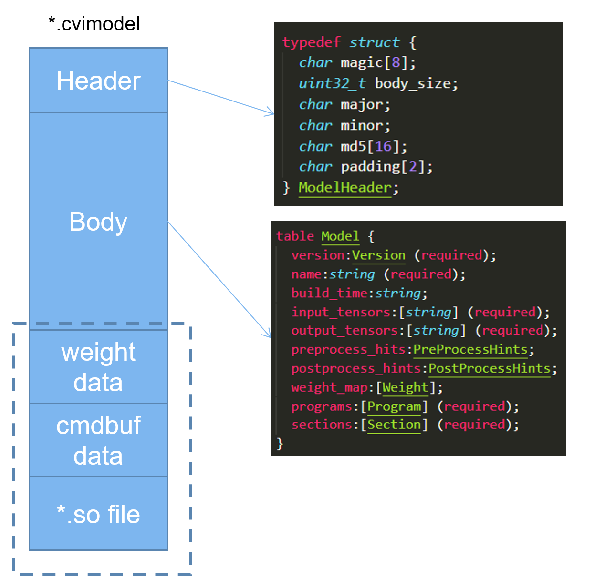

>
> 文档版本: 1.4.0
>
> 发布日期: 2020-12-04

© 2020 北京晶视智能科技有限公司

本文件所含信息归<u>北京晶视智能科技有限公司</u>所有。

未经授权，严禁全部或部分复制或披露该等信息。

**修订记录**

| 版本   | 日期       | 修改人 | 修改描述              |
| ------ | ---------- | ------ | --------------------- |
| V0.0.1 | 2019/12/11 | 王雷   | 初始版本              |
| V0.1.0 | 2020/03/30 | 王雷   | 增加使用说明和API说明 |
| V0.2.0 | 2020/07/17 | 王雷   | 增加使用说明和API说明 |
| V0.3.0 | 2020/10/26 | 秦明康 | 更新使用说明和API说明 |
| V0.3.1 | 2020/11/24 | 肖泉   | 更新mlir op和更新格式 |
| V1.4.0 | 2020/12/04 | 姜江   | 更新文档结构          |
<div STYLE="page-break-after: always;"></div>
# 法律声明

本数据手册包含北京晶视智能科技有限公司（下称"晶视智能"）的保密信息。未经授权，禁止使用或披露本数据手册中包含的信息。如您未经授权披露全部或部分保密信息，导致晶视智能遭受任何损失或损害，您应对因之产生的损失/损害承担责任。

本文件内信息如有更改，恕不另行通知。晶视智能不对使用或依赖本文件所含信息承担任何责任。

本数据手册和本文件所含的所有信息均按"原样"提供，无任何明示、暗示、法定或其他形式的保证。晶视智能特别声明未做任何适销性、非侵权性和特定用途适用性的默示保证，亦对本数据手册所使用、包含或提供的任何第三方的软件不提供任何保证；用户同意仅向该第三方寻求与此相关的任何保证索赔。此外，晶视智能亦不对任何其根据用户规格或符合特定标准或公开讨论而制作的可交付成果承担责任。
<div STYLE="page-break-after: always;"></div>
# 目 录

[TOC]


# 第1章 概述

## 1.1 TPU介绍

> CVITEK TPU是晶视智能开发的边缘计算SoC平台(CV183x)的异构计算引擎。实现了对主流神经网络运算的高效硬件加速，兼顾执行效率和可编程灵活性。计算精度方面同时支持高效的INT8和高动态范围的BF16两种模式，并通过软件平台支持灵活的混合精度配置。

## 1.2 工具链介绍

> CVITEK TPU工具链是一个高效，开放，透明，可扩展，模型移植全流程可控的神经网络编译优化开发工具集。

## 1.3 软件框架

> TPU软件开发框图如下图所示。

> 软件框架由Offline工具链和Runtime模型推理库两部分组成。Offline工具链包括模型转换，编译器，量化工具等组件，完成从用户模型导入，变换，量化，优化，到代码生成等步骤，最终组装为cvimodel格式的推理模型文件。Runtime模型推理库加载cvimodel，读取运行时信息进行设置和资源分配，加载权重数据和指令序列，驱动硬件执行其中的指令序列，完成神经网络推理计算任务，输出推理结果数据。Runtime包含完整仿真平台的支持，客户可以先在仿真平台完成模型移植，验证和精度测试，再加载到真实硬件上验证和执行。


## 1.4 神经网络编译器

> 神经网络编译器基于MLIR框架开发。编译器完成从一个现有框架模型文件到TPU指令集的转换。具体包括下述几个工具:

-   模型转换工具：一组python脚本用于将caffe/pytorch等框架生成的模型转换为以mlir为前端的fp32模型文件，用于后续的量化，优化和指令生成.

-   mlir-opt：实现多种优化和变换Pass，并实现组合调用。包含如下类别:

> 优化变换，量化变换，Lowering，性能优化，资源优化，分析统计。

-   mlir-interpreter：实现基于CPU/TPU的IR推理计算，将输出tensor数据，以及用户指定的全部或部分中间结果tensor数据保存为numpy格式（\*.npz）文件。基于interpreter，开发者可以在模型转换的各个环节随时对转换的正确性和精度进行测试，包括量化前和量化后的各个阶段，验证各种优化路径的正确性，比较各量化选项的精度差异，以及详细比对所有中间计算结果的数据。Interpreter支持python
    binding，开发者可以使用python进行数据预处理，后处理，及数据分析。

-   calibration：基于mlir-interpreter实现的量化校准工具，对开发者指定的校准数据集执行推理计算，对每个tensor的数据进行统计，形成模型量化所需的参数。使用python进行数据读取，预处理，后处理和统计分析。

-   mlir-translate：用于将mlir文件转化为TPU硬件指令序列，并和模型权重数据，Runtime需要的信息打包为cvimodel

-   仿真库：仿真库不同于mlir-interpreter，仿真库模拟真实TPU硬件的指令执行和运算逻辑。对于INT8量化计算，mlir-interpreter的计算结果与仿真库的计算结果bit-accurate一致。对于浮点类型组合计算，mlir-interpreter会和硬件有一定差异，仿真器则仍然保证结果与硬件的bit-accurate一致性。

-   数据分析工具：一组python工具集，用于对模型移植和编译过程中所产生的数据进行比较，统计，分析和问题定位。支持对转换的各个步骤输出的每层Tensor数据进行多种相似度比对，以确保模型INT8定点以及BF16推理精度达到要求。

## 1.5 模型转储cvimodel文件

> cvimodel文件是离线编译的最终结果，交付给runtime进行解析和在线推理。cvimodel还支持：

-   多batch和多分辨率：对于不同的batch_size和输入分辨率，由于资源和优化选择等差异，需要执行不同的指令序列，但共享权重数据。cvimodel采用相应文件数据格式支持同一模型对多种batch和多种分辨率的推理。

-   模型分段：对于包含TPU不支持算子的模型，支持采用TPU和CPU协同方式进行推理计算。将一个模型分成若干段，每段由特定引擎（TPU或CPU）分别执行。

-   自定义算子：自定义算子目前仅支持采用CPU实现。在cvimodel中，用户自定义算子编译为特定平台的动态链接库并保存在cvimodel模型文件中。

## 1.6 Runtime

> Runtime库和应用程序运行在CV183x SoC的ARM
> aarch64处理器Linux系统中。Runtime提供一组API供应用程序运行时调用，实现模型在板端的在线推理。主要功能包括：

-   解析cvimodel文件；

-   加载权重数据、根据配置的batch_size和分辨率信息加载指令序列数据；

-   根据CPU段信息加载CPU函数；

-   加载输入数据；

-   执行推理计算；

-   返回结果数据。

### 1.6.1 Python Binding

> Runtime支持Python
> Binding，方便利用python的数据预处理和后处理代码快速进行模型开发和验证以及离线仿真。

### 1.6.2 仿真器

> Runtime除了调用硬件外，还支持以同样的API调用仿真器，进行离线测试和调试。仿真器具体内容可以参考3.11章节。

### 1.6.3 Profiling工具

> Profiling工具基于Runtime获取的硬件性能计数器或仿真器运行统计数据，对数据分析并提供可视化展现，便于对性能和资源占用情况进行分析和优化。

## 1.7 开发环境配置

推荐使用docker，具体使用方法请参考《TPU快速入门指南》中第三章"开发环境配置"。

<div STYLE="page-break-after: always;"></div>

# 第2章 模型编译指南

## 工具链参考

### IR定义参考

#### 概述

> IR（Intermediate
> Representation）即中间表示语言，其作用是将基于各类框架的神经网络图转换为统一的中间表示形式。Cvitek编译器借助了MLIR的IR框架，定义了面向TPU开发和优化的TPU
> Dialect。
>
> 每一个操作被定义一个Op，按照SSA规则定义，遵循如下原则

-   每个Op有一个或者多个输入Tensor；

-   每个Op有且只有一个输出Tensor；

-   每个Tensor只有一个Op会改写它的值；

-   每个Op的操作除了会影响输出Tensor的值以外，不会产生任何其他副作用；

> 例如，对于SliceOp，虽然原本含义会有多个Output。但在TPU
> IR的定义中会对每一个sub tensor生成一个SliceOp，它们的input
> tensor指向同一个tensor，通过attribute指定offset等参数，但每个SliceOp只有一个输出tensor。

#### Operation支持列表

> 支持的Operation如下表所示**：**

  |**操作**              |**Engine**      |**Quantization**   |**Lowering**|
|---------------------| ---------------| ------------------| --------------|
  |BatchNorm             |Optimized       |No                 |No|
  |BroadcastMul          |TPU             |Yes                |Yes|
  |Clip                  |TPU             |Yes                |Yes|
  |Concat                |TPU/Optimized   |Yes                |Yes|
  |Conv2D                |TPU             |Yes                |Yes|
  |Crop                  |TPU             |Yes                |Yes|
  |Custom                |CPU             |Yes                |No|
  |DeConv2D              |TPU             |Yes                |Yes|
  |DetectionOutput       |CPU             |No                 |No|
  |EltwiseAdd            |TPU             |Yes                |Yes|
  |EltwiseMax            |TPU             |Yes                |Yes|
  |EltwiseMul            |TPU             |Yes                |Yes|
  |FrcnDetection         |CPU             |No                 |No|
  |FullyConnected        |TPU             |Yes                |Yes|
  |Gru                   |TPU             |Yes                |Yes|
  |Interp                |TPU             |Yes                |Yes|
  |LeakyRelu             |TPU             |Yes                |Yes|
  |LrnOne                |CPU             |Yes                |No|
  |LrnTwo                |CPU             |Yes                |No|
  |LrnThree              |CPU             |Yes                |No|
  |Lstm                  |TPU             |Yes                |Yes|
  |MatMul                |TPU             |Yes                |Yes|
  |Mish                  |TPU             |Yes                |Yes|
  |Normalize             |Optimzied       |No                 |No|
  |Pad                   |TPU             |Yes                |Yes|
  |Permute               |TPU             |Yes                |Yes|
  |PixelShuffle          |TPU             |Yes                |Yes|
  |PoolAvg2D             |TPU             |Yes                |Yes|
  |PoolMask              |Optimzied       |No                 |No|
  |PoolMax2D             |TPU             |Yes                |Yes|
  |Power                 |TPU             |Yes                |Yes|
  |PRelu                 |TPU             |Yes                |Yes|
  |Preprocess            |TPU             |Yes                |Yes|
  |PriorBox              |CPU             |No                 |No|
  |Proposal              |CPU             |No                 |No|
  |QuadraticSum          |TPU             |Yes                |Yes|
  |Reciprocal            |TPU             |Yes                |Yes|
  |ReduceMax             |TPU             |Yes                |Yes|
  |ReduceMean            |TPU             |Yes                |Yes|
  |Relu                  |TPU             |Yes                |Yes|
  |Reorg                 |TPU             |Yes                |Yes|
  |RetinaFaceDetection   |CPU             |No                 |No|
  |ROIPooling            |CPU             |Yes                |No|
  |Scale                 |TPU             |No                 |No|
  |ShuffleChannel        |TPU             |Yes                |Yes|
  |Sigmoid               |TPU             |Yes                |Yes|
  |Slice                 |Optimzied       |Yes                |Yes|
  |Sqrt                  |TPU             |Yes                |Yes|
  |Square                |TPU             |Yes                |Yes|
  |Softmax               |TPU             |Yes                |Yes|
  |SoftmaxCpu            |CPU             |No                 |No|
  |SwapChannel           |TPU             |Yes                |Yes|
  |TanH                  |TPU             |Yes                |Yes|
  |Tile                  |TPU             |Yes                |Yes|
  |TileInterp            |TPU             |Yes                |Yes|
  |Transpose             |CPU             |No                 |No|
  |Upsample              |TPU             |Yes                |Yes|
  |YoloDetection         |CPU             |No                 |No|
  |ZeroMask              |TPU             |Yes                |Yes|

用来指定当前指令的执行阶段，比如Optimized表示在优化过程中使用，TPU

表示指令在TPU上执行，CPU表示在CPU上执行。

Quantization表示是否需要做量化。比如在优化过程中使用的指令，以及在

CPU中执行的指令是不需要做量化的。

Lowering表示当前指令需要转化为TPU指令，然后在TPU上执行。

#### 通用数据结构

-   基础数据类型

  |类型   |描述|
  |------ |-----------------------------|
  |I8     |DataType，8 bit整型数据|
  |I32    |DataType，32 bit整型数据|
  |F32    |DataType，32 bit浮点数据|
  |BF16   |DataType，16 bit BF浮点数据|
  |I64    |DataType，64 bit整型数据|

-   Tensor类型

  |类型                          |描述|
  |----------------------------- |------------------------------------------------|
  |Tensor\<DataType\>            |以DataType为数据类型的Tensor，不许为空|
  |TensorOfOrNone\< DataType\>   |以DataType为数据类型的Tensor，None表示空Tensor|
  |AnyTensor                     |以任意DataType为数据类型的Tensor|
  |Variadic Tensor               |一个或多个Tensor|

-   基础属性类型

  类型                 描述
  -------------------- ------------------------------
  StrAttr              属性，字符串类型属性
  NonNegativeI32Attr   属性，非负32 bit整数类型属性
  I32Attr              属性，32 bit整数类型属性
  F32Attr              属性，32 bit浮点类型属性
  BoolAttr             属性，布尔属性

-   TPU_QuantParamAttr

  参数名称        类型                     描述
  --------------- ------------------------ -------------------------------
  mode            TPU_QuantModeAttr        Quant的类型
  param_type      TPU_QuantParamTypeAttr   Quant变量类型
  is_perchannel   BoolAttr                 是为PerChannel，否为PerTensor
  is_asymmetric   BoolAttr                 是否为非对称两行
  threshold_max   F32Attr                  量化最大值
  threshold_min   F32Attr                  量化最小值（仅限非对称量化）
  zero_point      I32Attr                  零点值

-   TPU_QuantModeAttr

  枚举   描述
  ------ ------------------
  NONE   无量化，保持FP32
  INT8   量化为INT8
  BF16   量化为BF16

-   TPU_QuantParamTypeAttr

  枚举                描述
  ------------------- ----------------------------------------------------
  NONE                当前Op的量化无需变量
  THRESHOLD           量化变量以Threshold方式描述
  SCALE               量化变量以Scale描述，支持PerChannel或PerTensor
  RSHIFT_ONLY         量化变量以RSHIFT描述，支持PerChannel或PerTensor
  RSHIFT_AND_M\_I32   量化变量以RSHIFT+I32 MULTIPLER描述，支持PerChannel
  RSHIFT_AND_M\_I8    量化变量以RSHIFT+I8 MULTIPLER描述，支持PerTensor
  LUT_INT8            量化变量以INT8 LUT描述
  LUT_BF16            量化变量以BF16 LUT描述

-   TPU_ConvParamAttr

  参数名称     类型              描述
  ------------ ----------------- ------------------------
  stride_h     I32Attr           stride_h
  stride_w     I32Attr           stride_w
  padding      TPU_PaddingAttr   VALID或SAME
  dilation_h   I32Attr           dilation_h
  dilation_w   I32Attr           dilation_w
  group        I32Attr           group
  is_dw        BoolAttr          是否为Depthwise
  with_bias    BoolAttr          是否有Bias
  do_relu      BoolAttr          是否对结果进行relu操作
  ins          I32ArrayAttr      对h， w插入0
  pad_value    I32Attr           填充值

-   TPU_PoolParamAttr

  参数名称            类型       描述
  ------------------- ---------- ------------------------
  kernel_h            I32Attr    kernel_h
  kernel_w            I32Attr    kernel_w
  padding_t           I32Attr    padding_t
  padding_b           I32Attr    padding_b
  padding_l           I32Attr    padding_l
  padding_r           I32Attr    padding_r
  stride_h            I32Attr    stride_h
  stride_w            I32Attr    stride_w
  do_relu             BoolAttr   是否对结果进行relu操作
  count_include_pad   BoolAttr   计算时是否包含pad部分

#### Operation定义

-   BatchNorm

  参数名称           类型                      描述               类别
  ------------------ ------------------------- ------------------ ------
  output             AnyTensor                 输出Tensor         输出
  input              AnyTensor                 输入Tensor         输入
  mean               AnyTensor                 mean参数向量       输入
  variance           AnyTensor                 variance参数向量   输入
  scale              AnyTensor                 scale参数          输入
  variance_epsilon   F32Attr                   epsilon            属性
  name               StrAttr                   名称               属性
  chipname           OptionalAttr\<StrAttr\>   芯片名称           属性

-   BroadcastMul

  参数名称           类型                      描述                 类别
  ------------------ ------------------------- -------------------- ------------
  output             AnyTensor                 输出Tensor           输出
  input              AnyTensor                 输入Tensor           输入
  multiplier         AnyTensor                 乘数向量             输入
  quant_scale        TensorOfOrNone            量化scale向量        输入(可选)
  quant_zeropoint    TensorOfOrNone            量化zeropoint向量    输入(可选)
  quant_rshift       TensorOfOrNone            量化rshift向量       输入(可选)
  quant_multiplier   TensorOfOrNone            量化multiplier向量   输入(可选)
  axis               I32Attr                   广播的axis           属性
  do_relu            BoolAttr                  是否对结果执行relu   属性
  quant              TPU_QuantParamAttr        Quant参数            属性
  name               StrAttr                   名称                 属性
  chipname           OptionalAttr\<StrAttr\>   芯片名称             属性

-   Clip

  参数名称           类型                      描述                 类别
  ------------------ ------------------------- -------------------- ------------
  output             AnyTensor                 输出Tensor           输出
  input              Variadic Tensor           多个输入Tensor       多输入
  quant_scale        TensorOfOrNone            量化scale向量        输入(可选)
  quant_zeropoint    TensorOfOrNone            量化zeropoint向量    输入(可选)
  quant_rshift       TensorOfOrNone            量化rshift向量       输入(可选)
  quant_multiplier   TensorOfOrNone            量化multiplier向量   输入(可选)
  min                F32Attr                   最小值               属性
  max                F32Attr                   最大值               属性
  name               StrAttr                   名称                 属性
  chipname           OptionalAttr\<StrAttr\>   芯片名称             属性

-   Concat

  参数名称           类型                      描述                 类别
  ------------------ ------------------------- -------------------- ------------
  output             AnyTensor                 输出Tensor           输出
  input              Variadic Tensor           多个输入Tensor       多输入
  quant_scale        TensorOfOrNone            量化scale向量        输入(可选)
  quant_zeropoint    TensorOfOrNone            量化zeropoint向量    输入(可选)
  quant_rshift       TensorOfOrNone            量化rshift向量       输入(可选)
  quant_multiplier   TensorOfOrNone            量化multiplier向量   输入(可选)
  axis               I32Attr                   连接的axis           属性
  quant              TPU_QuantParamAttr        Quant参数            属性
  name               StrAttr                   名称                 属性
  chipname           OptionalAttr\<StrAttr\>   芯片名称             属性

-   Conv2D

  参数名称           类型                      描述                 类别
  ------------------ ------------------------- -------------------- ------------
  output             AnyTensor                 输出Tensor           输出
  input              AnyTensor                 输入Tensor           输入
  filter             AnyTensor                 Filter Tensor        输入
  bias               TensorOfOrNone            Bias Tensor          输入(可选)
  quant_scale        TensorOfOrNone            量化scale向量        输入(可选)
  quant_zeropoint    TensorOfOrNone            量化zeropoint向量    输入(可选)
  quant_rshift       TensorOfOrNone            量化rshift向量       输入(可选)
  quant_multiplier   TensorOfOrNone            量化multiplier向量   输入(可选)
  param              TPU_ConvParamAttr         Conv参数             属性
  quant              TPU_QuantParamAttr        Quant参数            属性
  name               StrAttr                   名称                 属性
  chipname           OptionalAttr\<StrAttr\>   芯片名称             属性

-   Crop

  参数名称      类型                      描述          类别
  ------------- ------------------------- ------------- ------
  output        AnyTensor                 输出Tensor    输出
  input         AnyTensor                 输入Tensor    输入
  crop_shape    I32ArrayAttr              Crop Shape    属性
  crop_offset   TI32ArrayAttr             Crop Offset   属性
  quant         TPU_QuantParamAttr        Quant参数     属性
  name          StrAttr                   名称          属性
  chipname      OptionalAttr\<StrAttr\>   芯片名称      属性

-   Custom

  参数名称              类型                      描述                类别
  --------------------- ------------------------- ------------------- ------
  output                AnyTensor                 输出Tensor          输出
  input                 AnyTensor                 输入Tensor          输入
  operation_name        StrAttr                   定制操作名字        属性
  param                 DictionaryAttr            操作所需参数        属性
  tpu                   BoolAttr                  是否TPU处理         属性
  do_quant              BoolAttr                  是否需要量化        属性
  threshold_overwrite   StrAttr                   直接覆盖threshold   属性
  name                  StrAttr                   名称                属性
  chipname              OptionalAttr\<StrAttr\>   芯片名称            属性

-   DeConv2D

  参数名称           类型                      描述                 类别
  ------------------ ------------------------- -------------------- ------------
  output             AnyTensor                 输出Tensor           输出
  input              AnyTensor                 输入Tensor           输入
  filter             AnyTensor                 Filter Tensor        输入
  bias               TensorOfOrNone            Bias Tensor          输入(可选)
  quant_scale        TensorOfOrNone            量化scale向量        输入(可选)
  quant_zeropoint    TensorOfOrNone            量化zeropoint向量    输入(可选)
  quant_rshift       TensorOfOrNone            量化rshift向量       输入(可选)
  quant_multiplier   TensorOfOrNone            量化multiplier向量   输入(可选)
  param              TPU_ConvParamAttr         Conv参数             属性
  quant              TPU_QuantParamAttr        Quant参数            属性
  name               StrAttr                   名称                 属性
  chipname           OptionalAttr\<StrAttr\>   芯片名称             属性

-   DetectionOutput

  参数名称               类型                      描述                   类别
  ---------------------- ------------------------- ---------------------- --------
  output                 AnyTensor                 输出Tensor             输出
  input                  Variadic Tensor           输入Tensor             多输入
  num_classes            I32Attr                   检测类别数量           属性
  share_location         BoolAttr                  Share Location         属性
  background_label_id    NonNegativeI32Attr        Background Label ID    属性
  nms_threshold          F32Attr                   NMS threshold          属性
  top_k                  I32Attr                   Top K                  属性
  code_type              CodeTypeAttr              Code Type              属性
  keep_top_k             I32Attr                   Keep Top K             属性
  confidence_threshold   F32Attr                   Confidence Threshold   属性
  name                   StrAttr                   名称                   属性
  chipname               OptionalAttr\<StrAttr\>   芯片名称               属性

-   EltwiseAdd

  参数名称           类型                      描述                 类别
  ------------------ ------------------------- -------------------- ------------
  output             AnyTensor                 输出Tensor           输出
  input              Variadic Tensor           多个输入Tensor       多输入
  quant_scale        TensorOfOrNone            量化scale向量        输入(可选)
  quant_zeropoint    TensorOfOrNone            量化zeropoint向量    输入(可选)
  quant_rshift       TensorOfOrNone            量化rshift向量       输入(可选)
  quant_multiplier   TensorOfOrNone            量化multiplier向量   输入(可选)
  do_relu            BoolAttr                  是否对结果执行relu   属性
  do_early_stride    BoolAttr                  是否提前执行stride   属性
  early_stride_h     I32Attr                   设置stride h         属性
  early_stride_w     I32Attr                   设置stride w         属性
  quant_skip         BoolAttr                  是否需要量化         属性
  quant              TPU_QuantParamAttr        Quant参数            属性
  name               StrAttr                   名称                 属性
  chipname           OptionalAttr\<StrAttr\>   芯片名称             属性

-   EltwiseMax

  参数名称           类型                      描述                 类别
  ------------------ ------------------------- -------------------- ------------
  output             AnyTensor                 输出Tensor           输出
  input              Variadic Tensor           多个输入Tensor       多输入
  quant_scale        TensorOfOrNone            量化scale向量        输入(可选)
  quant_zeropoint    TensorOfOrNone            量化zeropoint向量    输入(可选)
  quant_rshift       TensorOfOrNone            量化rshift向量       输入(可选)
  quant_multiplier   TensorOfOrNone            量化multiplier向量   输入(可选)
  do_relu            BoolAttr                  是否对结果执行relu   属性
  do_early_stride    BoolAttr                  是否提前执行stride   属性
  early_stride_h     I32Attr                   设置stride h         属性
  early_stride_w     I32Attr                   设置stride w         属性
  quant_skip         BoolAttr                  是否需要量化         属性
  quant              TPU_QuantParamAttr        Quant参数            属性
  name               StrAttr                   名称                 属性
  chipname           OptionalAttr\<StrAttr\>   芯片名称             属性

-   EltwiseMul

  参数名称           类型                      描述                 类别
  ------------------ ------------------------- -------------------- ------------
  output             AnyTensor                 输出Tensor           输出
  input              Variadic Tensor           多个输入Tensor       多输入
  quant_scale        TensorOfOrNone            量化scale向量        输入(可选)
  quant_zeropoint    TensorOfOrNone            量化zeropoint向量    输入(可选)
  quant_rshift       TensorOfOrNone            量化rshift向量       输入(可选)
  quant_multiplier   TensorOfOrNone            量化multiplier向量   输入(可选)
  do_relu            BoolAttr                  是否对结果执行relu   属性
  do_early_stride    BoolAttr                  是否提前执行stride   属性
  early_stride_h     I32Attr                   设置stride h         属性
  early_stride_w     I32Attr                   设置stride w         属性
  quant_skip         BoolAttr                  是否需要量化         属性
  quant              TPU_QuantParamAttr        Quant参数            属性
  name               StrAttr                   名称                 属性
  chipname           OptionalAttr\<StrAttr\>   芯片名称             属性

-   FrcnDetection

  参数名称        类型                      描述               类别
  --------------- ------------------------- ------------------ --------
  output          AnyTensor                 输出Tensor         输出
  input           Variadic Tensor           输入Tensor         多输入
  class_num       I32Attr                   检测类型数量       属性
  obj_threshold   F32Attr                   Object Threshold   属性
  nms_threshold   F32Attr                   NMS threshold      属性
  keep_top_k      I32Attr                   Keep Top K         属性
  name            StrAttr                   名称               属性
  chipname        OptionalAttr\<StrAttr\>   芯片名称           属性

-   FullyConnected

  参数名称           类型                      描述                 类别
  ------------------ ------------------------- -------------------- ------------
  output             AnyTensor                 输出Tensor           输出
  input              AnyTensor                 输入Tensor           输入
  filter             AnyTensor                 Filter Tensor        输入
  bias               TensorOfOrNone            Bias Tensor          输入(可选)
  quant_scale        TensorOfOrNone            量化scale向量        输入(可选)
  quant_zeropoint    TensorOfOrNone            量化zeropoint向量    输入(可选)
  quant_rshift       TensorOfOrNone            量化rshift向量       输入(可选)
  quant_multiplier   TensorOfOrNone            量化multiplier向量   输入(可选)
  do_relu            BoolAttr                  是否对结果执行relu   属性
  quant              TPU_QuantParamAttr        Quant参数            属性
  name               StrAttr                   名称                 属性
  chipname           OptionalAttr\<StrAttr\>   芯片名称             属性

-   Gru

  参数名称              类型                      描述                          类别
  --------------------- ------------------------- ----------------------------- ------
  output                AnyTensor                 输出Tensor                    输出
  input                 AnyTensor                 输入Tensor                    输入
  weight                AnyTensor                 输入Weight                    输入
  recurrence            AnyTensor                 输入Recurrence                输入
  bias                  TPU_TensorOfOrNone        输入Bias                      输入
  initial_h             AnyTensor                 初始h                         输入
  sigmoid_table         TPU_TensorOfOrNone        sigmoid 表                    输入
  sigmoid_slope_table   TPU_TensorOfOrNone        sigmoid slop表                输入
  tanh_table            TPU_TensorOfOrNone        tanh表                        输入
  tanh_slope_table      TPU_TensorOfOrNone        tanh slop 表                  输入
  quant                 TPU_QuantParamAttr        Quant参数                     属性
  linear_before_reset   BoolAttr                  在reset门之前有一个linear层   属性
  bidirectional         BoolAttr                  是否是bidirectional
  name                  StrAttr                   名称                          属性
  chipname              OptionalAttr\<StrAttr\>   芯片名称                      属性

-   Interp

  参数名称           类型                      描述                 类别
  ------------------ ------------------------- -------------------- ------------
  output             AnyTensor                 输出Tensor           输出
  input              AnyTensor                 输入Tensor           输入
  quant_scale        TensorOfOrNone            量化scale向量        输入(可选)
  quant_zeropoint    TensorOfOrNone            量化zeropoint向量    输入(可选)
  quant_rshift       TensorOfOrNone            量化rshift向量       输入(可选)
  quant_multiplier   TensorOfOrNone            量化multiplier向量   输入(可选)
  height             NonNegativeI32Attr        高                   属性
  width              NonNegativeI32Attr        宽                   属性
  shrink_facker      NonNegativeI32Attr        缩小因子             属性
  zoom_factor        NonNegativeI32Attr        放大因子             属性
  pad_beg            NonNegativeI32Attr        起始填充             属性
  pad_end            NonNegativeI32Attr        结束填充             属性
  quant              TPU_QuantParamAttr        Quant参数            属性
  name               StrAttr                   名称                 属性
  chipname           OptionalAttr\<StrAttr\>   芯片名称             属性

-   LeakyRelu

  参数名称               类型                      描述                 类别
  ---------------------- ------------------------- -------------------- ------------
  output                 AnyTensor                 输出Tensor           输出
  input                  AnyTensor                 输入Tensor           输入
  quant_pos_scale        TensorOfOrNone            量化scale向量        输入(可选)
  quant_pos_zeropoint    TensorOfOrNone            量化zeropoint向量    输入(可选)
  quant_pos_rshift       TensorOfOrNone            量化rshift向量       输入(可选)
  quant_pos_multiplier   TensorOfOrNone            量化multiplier向量   输入(可选)
  quant_neg_scale        TensorOfOrNone            量化scale向量        输入(可选)
  quant_neg_zeropoint    TensorOfOrNone            量化zeropoint向量    输入(可选)
  quant_neg_rshift       TensorOfOrNone            量化rshift向量       输入(可选)
  quant_neg_multiplier   TensorOfOrNone            量化multiplier向量   输入(可选)
  negative_slope         F32Attr                   负值斜率             属性
  quant                  TPU_QuantParamAttr        Quant参数            属性
  name                   StrAttr                   名称                 属性
  chipname               OptionalAttr\<StrAttr\>   芯片名称             属性

-   LrnOne

  参数名称     类型                      描述         类别
  ------------ ------------------------- ------------ ------
  output       AnyTensor                 输出Tensor   输出
  input        Any Tensor                输入Tensor   输入
  local_size   NonNegativeI32Attr        local size   属性
  alpha        F32Attr                   alpha        属性
  beta         F32Attr                   beta         属性
  k            I32Attr                   k            属性
  quant        TPU_QuantParamAttr        Quant参数    属性
  name         StrAttr                   名称         属性
  chipname     OptionalAttr\<StrAttr\>   芯片名称     属性

-   LrnTwo

  参数名称     类型                      描述         类别
  ------------ ------------------------- ------------ ------
  output       AnyTensor                 输出Tensor   输出
  input        Any Tensor                输入Tensor   输入
  local_size   NonNegativeI32Attr        local size   属性
  alpha        F32Attr                   alpha        属性
  beta         F32Attr                   beta         属性
  k            I32Attr                   k            属性
  quant        TPU_QuantParamAttr        Quant参数    属性
  name         StrAttr                   名称         属性
  chipname     OptionalAttr\<StrAttr\>   芯片名称     属性

-   LrnThree

  参数名称     类型                      描述         类别
  ------------ ------------------------- ------------ ------
  output       AnyTensor                 输出Tensor   输出
  input        Any Tensor                输入Tensor   输入
  local_size   NonNegativeI32Attr        local size   属性
  alpha        F32Attr                   alpha        属性
  beta         F32Attr                   beta         属性
  k            I32Attr                   k            属性
  quant        TPU_QuantParamAttr        Quant参数    属性
  name         StrAttr                   名称         属性
  chipname     OptionalAttr\<StrAttr\>   芯片名称     属性

-   Lstm

  参数名称              类型                      描述                  类别
  --------------------- ------------------------- --------------------- ------
  output                AnyTensor                 输出Tensor            输出
  input                 AnyTensor                 输入Tensor            输入
  weight                AnyTensor                 输入Weight            输入
  recurrence            AnyTensor                 输入Recurrence        输入
  bias                  TPU_TensorOfOrNone        输入Bias              输入
  initial_h             AnyTensor                 初始h                 输入
  initial_c             AnyTensor                 初始c                 输入
  sigmoid_table         TPU_TensorOfOrNone        sigmoid 表            输入
  sigmoid_slope_table   TPU_TensorOfOrNone        sigmoid slop表        输入
  tanh_table            TPU_TensorOfOrNone        tanh表                输入
  tanh_slope_table      TPU_TensorOfOrNone        tanh slop 表          输入
  quant                 TPU_QuantParamAttr        Quant参数             属性
  bidirectional         BoolAttr                  是否是bidirectional   属性
  name                  StrAttr                   名称                  属性
  chipname              OptionalAttr\<StrAttr\>   芯片名称              属性

-   MatMul

  参数名称   类型                      描述         类别
  ---------- ------------------------- ------------ --------
  output     AnyTensor                 输出Tensor   输出
  input      Variadic Tensor           输入Tensor   多输入
  do_relu    BoolAttr                  是否relu     属性
  quant      TPU_QuantParamAttr        Quant参数    属性
  name       StrAttr                   名称         属性
  chipname   OptionalAttr\<StrAttr\>   芯片名称     属性

-   Mish

  参数名称         类型                      描述          类别
  ---------------- ------------------------- ------------- --------
  output           AnyTensor                 输出Tensor    输出
  input            Variadic Tensor           输入Tensor    多输入
  table            TPU_TensorOfOrNone        lut表         输入
  table_mantissa   TPU_TensorOfOrNone        mantissa表    输入
  has_table        BoolAttr                  是否有lut表   属性
  quant            TPU_QuantParamAttr        Quant参数     属性
  mish_threshold   F32Attr                   threshold     属性
  name             StrAttr                   名称          属性
  chipname         OptionalAttr\<StrAttr\>   芯片名称      属性

- Normalize

  |参数名称         类型                      描述             类别

  ---------------- ------------------------- ---------------- ------
  |output           AnyTensor                 输出Tensor       输出
  |input            AnyTensor                 输入Tensor       输入
  |scale            AnyTensor                 Scale Tensor     输入
  |across_spatial   BoolAttr                  Across Spatial   属性
  |channel_shared   BoolAttr                  Channel Shared   属性
  |name             StrAttr                   名称             属性
  |chipname         OptionalAttr\<StrAttr\>   芯片名称         属性

-   Pad

  参数名称    类型                      描述             类别
  ----------- ------------------------- ---------------- --------
  output      AnyTensor                 输出Tensor       输出
  input       AnyTensor                 输入Tensor       多输入
  pads        I32ArrayAttr              填充的索引位置   属性
  const_val   F32Attr                   填充值           属性
  quant       TPU_QuantParamAttr        Quant参数        属性
  name        StrAttr                   名称             属性
  chipname    OptionalAttr\<StrAttr\>   芯片名称         属性

-   Permute

  参数名称   类型                      描述             类别
  ---------- ------------------------- ---------------- ------
  output     AnyTensor                 输出Tensor       输出
  input      AnyTensor                 输入Tensor       输入
  order0     NonNegativeI32Attr        Permute order0   属性
  order1     NonNegativeI32Attr        Permute order1   属性
  order2     NonNegativeI32Attr        Permute order2   属性
  order3     NonNegativeI32Attr        Permute order3   属性
  quant      TPU_QuantParamAttr        Quant参数        属性
  name       StrAttr                   名称             属性
  chipname   OptionalAttr\<StrAttr\>   芯片名称         属性

-   PixelShuffle

  参数名称         类型                      描述                     类别
  ---------------- ------------------------- ------------------------ ------
  output           AnyTensor                 输出Tensor               输出
  input            AnyTensor                 输入Tensor               输入
  upscale_factor   NonNegativeI32Attr        Upscale factor           属性
  quant            TPU_QuantParamAttr        Quant参数                属性
  mode             DefaultValuedAttr         mode参数， 默认值是CRD   属性
  name             StrAttr                   名称                     属性
  chipname         OptionalAttr\<StrAttr\>   芯片名称                 属性

-   PoolAvg2D

  参数名称           类型                      描述                 类别
  ------------------ ------------------------- -------------------- ------------
  output             AnyTensor                 输出Tensor           输出
  input              AnyTensor                 输入Tensor           输入
  quant_scale        TensorOfOrNone            量化scale向量        输入(可选)
  quant_zeropoint    TensorOfOrNone            量化zeropoint向量    输入(可选)
  quant_rshift       TensorOfOrNone            量化rshift向量       输入(可选)
  quant_multiplier   TensorOfOrNone            量化multiplier向量   输入(可选)
  param              TPU_PoolParamAttr         Pool参数             属性
  quant              TPU_QuantParamAttr        Quant参数            属性
  name               StrAttr                   名称                 属性
  chipname           OptionalAttr\<StrAttr\>   芯片名称             属性

-   PoolMask

  参数名称    类型                      描述             类别
  ----------- ------------------------- ---------------- --------
  output      AnyTensor                 输出Tensor       输出
  input       AnyTensor                 输入Tensor       多输入
  pads        I32ArrayAttr              填充的索引位置   属性
  const_val   F32Attr                   填充值           属性
  quant       TPU_QuantParamAttr        Quant参数        属性
  name        StrAttr                   名称             属性
  chipname    OptionalAttr\<StrAttr\>   芯片名称         属性

-   PoolMax2D

  参数名称   类型                      描述         类别
  ---------- ------------------------- ------------ ------
  output     AnyTensor                 输出Tensor   输出
  input      AnyTensor                 输入Tensor   输入
  param      TPU_PoolParamAttr         Pool参数     属性
  quant      TPU_QuantParamAttr        Quant参数    属性
  name       StrAttr                   名称         属性
  chipname   OptionalAttr\<StrAttr\>   芯片名称     属性

-   Power

> y = (scale \* x + shift) \^ power

  参数名称   类型                      描述         类别
---------- ------------------------- ------------ ------
  output     AnyTensor                 输出Tensor   输出
  input      AnyTensor                 输入Tensor   输入
  power      F32Attr                   Power        属性
  scale      F32Attr                   Scale        属性
  shift      F32Attr                   shift        属性
  quant      TPU_QuantParamAttr        Quant参数    属性
  name       StrAttr                   名称         属性
  chipname   OptionalAttr\<StrAttr\>   芯片名称     属性

-   PRelu

  参数名称               类型                      描述                 类别
  ---------------------- ------------------------- -------------------- ------------
  output                 AnyTensor                 输出Tensor           输出
  input                  AnyTensor                 输入Tensor           输入
  filter                 AnyTensor                 负值斜率向量         输入
  quant_pos_scale        TensorOfOrNone            量化scale向量        输入(可选)
  quant_pos_zeropoint    TensorOfOrNone            量化zeropoint向量    输入(可选)
  quant_pos_rshift       TensorOfOrNone            量化rshift向量       输入(可选)
  quant_pos_multiplier   TensorOfOrNone            量化multiplier向量   输入(可选)
  quant_neg_scale        TensorOfOrNone            量化scale向量        输入(可选)
  quant_neg_zeropoint    TensorOfOrNone            量化zeropoint向量    输入(可选)
  quant_neg_rshift       TensorOfOrNone            量化rshift向量       输入(可选)
  quant_neg_multiplier   TensorOfOrNone            量化multiplier向量   输入(可选)
  quant                  TPU_QuantParamAttr        Quant参数            属性
  name                   StrAttr                   名称                 属性
  chipname               OptionalAttr\<StrAttr\>   芯片名称             属性

-   Preprocess

  参数名称          类型                      描述         类别
  ----------------- ------------------------- ------------ ------
  output            AnyTensor                 输出Tensor   输出
  input             AnyTensor                 输入Tensor   输入
  color_order       I32ArrayAttr              RGB或者BGR   属性
  mean              F32ArrayAttr              Mean         属性
  raw_scale         F32Attr                   Raw Scale    属性
  scale             F32Attr                   Scale        属性
  std               F32ArrayAttr              Std          属性
  transpose_order   I32ArrayAttr              转置顺序     属性
  crop_offset       I32ArrayAttr              Crop偏移     属性
  pads              I32ArrayAttr              填充大小     属性
  const_val         F32Attr                   填充值       属性
  quant             TPU_QuantParamAttr        Quant参数    属性
  name              StrAttr                   名称         属性
  chipname          OptionalAttr\<StrAttr\>   芯片名称     属性

-   PriorBox

  参数名称                   类型                      描述                 类别
  -------------------------- ------------------------- -------------------- ------
  output                     AnyTensor                 输出Tensor           输出
  input                      AnyTensor                 输入Tensor           输入
  min_size                   F32ArrayAttr              最小框大小           属性
  max_size                   F32ArrayAttr              最大框大小           属性
  aspect_ratios              F32ArrayAttr              缩放宽高比           属性
  variance                   F32ArrayAttr              变量                 属性
  clip                       BoolAttr                  是否裁剪             属性
  step_h                     F32Attr                   H维度的step          属性
  step_w                     F32Attr                   W维度的step          属性
  img_h                      I32Attr                   输入图像的高度       属性
  img_w                      I32Attr                   输入图像的宽度       属性
  offset                     DefaultValuedAttr         默认框中心偏移量     属性
  num_priors                 I32Attr                   默认框数目           属性
  use_default_aspect_ratio   DefaultValuedAttr         是否使用默认宽高比   属性
  name                       StrAttr                   名称                 属性
  chipname                   OptionalAttr\<StrAttr\>   芯片名称             属性

-   Proposal

  参数名称             类型                      描述                  类别
  -------------------- ------------------------- --------------------- ------
  output               AnyTensor                 输出Tensor            输出
  input                AnyTensor                 输入Tensor            输入
  net_input_h          I32Attr                   网络的输入高度        属性
  net_input_w          I32Attr                   网络的输入宽度        属性
  feat_stride          I32Attr                   anchor box 的stride   属性
  anchor_base_size     I32Attr                   anchor 起始大小       属性
  rpn_obj_threshold    F32Attr                   候选框的可信度        属性
  rpn_nms_threshold    F32Attr                   NMS的可信度           属性
  rpn_nms_post_top_n   I32Attr                   保存NMS框数目         属性
  name                 StrAttr                   名称                  属性
  chipname             OptionalAttr\<StrAttr\>   芯片名称              属性

-   QuadraticSum

  参数名称         类型                      描述           类别
  ---------------- ------------------------- -------------- ------
  output           AnyTensor                 输出Tensor     输出
  input            AnyTensor                 输入Tensor     输入
  quant            TPU_QuantParamAttr        Quant参数      属性
  high_precision   OptionalAttr              是否使用FP32   属性
  axis             DefaultValuedAttr         指定维度       属性
  name             StrAttr                   名称           属性
  chipname         OptionalAttr\<StrAttr\>   芯片名称       属性

-   Reciprocal

  参数名称         类型                      描述                 类别
  ---------------- ------------------------- -------------------- ------------
  output           AnyTensor                 输出Tensor           输出
  input            AnyTensor                 输入Tensor           输入
  table            TensorOfOrNone            LUT table            输入(可选)
  Table_mantissa   TensorOfOrNone            LUT table mantissa   输入(可选)
  has_table        BoolAttr                  是否使用LUT计算      属性
  quant            TPU_QuantParamAttr        Quant参数            属性
  name             StrAttr                   名称                 属性
  chipname         OptionalAttr\<StrAttr\>   芯片名称             属性

-   ReduceMax

  参数名称           类型                      描述            类别
  ------------------ ------------------------- --------------- ------
  output             AnyTensor                 输出Tensor      输出
  input              AnyTensor                 输入Tensor      输入
  quant              TPU_QuantParamAttr        Quant参数       属性
  quant_scale        TPU_TensorOfOrNone        Quant收缩因子   属性
  quant_zeropoint    TPU_TensorOfOrNone        Quant零点值     属性
  quant_rshift       TPU_TensorOfOrNone        Quant右移位     属性
  quant_multiplier   TPU_TensorOfOrNone        Quant乘数       属性
  axes               OptionalAttr              指定维度        属性
  keepdims           DefaultValuedAttr         是否保持维度    属性
  name               StrAttr                   名称            属性
  chipname           OptionalAttr\<StrAttr\>   芯片名称        属性

-   ReduceMean

  参数名称           类型                 描述            类别
  ------------------ -------------------- --------------- ------
  output             AnyTensor            输出Tensor      输出
  input              AnyTensor            输入Tensor      输入
  quant              TPU_QuantParamAttr   Quant参数       属性
  quant_scale        TPU_TensorOfOrNone   Quant收缩因子   属性
  quant_zeropoint    TPU_TensorOfOrNone   Quant零点值     属性
  quant_rshift       TPU_TensorOfOrNone   Quant右移位     属性
  quant_multiplier   TPU_TensorOfOrNone   Quant乘数       属性
  keepdims           DefaultValuedAttr    是否保持维度    属性

-   Relu

  参数名称   类型                      描述                类别
  ---------- ------------------------- ------------------- ------------
  output     AnyTensor                 输出Tensor          输出
  input      AnyTensor                 输入Tensor          输入
  maximum    F32Attr                   用于ReluM的最大值   属性(可选)
  quant      TPU_QuantParamAttr        Quant参数           属性
  name       StrAttr                   名称                属性
  chipname   OptionalAttr\<StrAttr\>   芯片名称            属性

-   Reorg

  参数名称   类型                      描述             类别
  ---------- ------------------------- ---------------- ------
  output     AnyTensor                 输出Tensor       输出
  input      AnyTensor                 输入Tensor       输入
  stride     NonNegativeI32Attr        宽和高的stride   属性
  quant      TPU_QuantParamAttr        Quant参数        属性
  name       StrAttr                   名称             属性
  chipname   OptionalAttr\<StrAttr\>   芯片名称         属性

-   RetinaFaceDetection

  参数名称               类型                      描述                   类别
  ---------------------- ------------------------- ---------------------- --------
  output                 AnyTensor                 输出Tensor             输出
  input                  Variadic Tensor           输入Tensor             多输入
  nms_threshold          F32Attr                   NMS threshold          属性
  confidence_threshold   F32Attr                   Confidence Threshold   属性
  keep_top_k             I32Attr                   Keep Top K             属性
  name                   StrAttr                   名称                   属性
  chipname               OptionalAttr\<StrAttr\>   芯片名称               属性

-   ROIPooling

  参数名称   类型        描述         类别
  ---------- ----------- ------------ ------
  output     AnyTensor   输出Tensor   输出
  input      AnyTensor   输入Tensor   输入

-   Scale

  参数名称   类型                      描述                 类别
  ---------- ------------------------- -------------------- ------------
  output     AnyTensor                 输出Tensor           输出
  input      AnyTensor                 输入Tensor           输入
  scale      AnyTensor                 scale向量            输入
  bias       TensorOfOrNone            Bias向量             输入(可选)
  do_relu    BoolAttr                  是否对结果执行relu   属性
  quant      TPU_QuantParamAttr        Quant参数            属性
  name       StrAttr                   名称                 属性
  chipname   OptionalAttr\<StrAttr\>   芯片名称             属性

-   ShuffleChannel

  参数名称   类型                      描述            类别
  ---------- ------------------------- --------------- ------
  output     AnyTensor                 输出Tensor      输出
  input      AnyTensor                 输入Tensor      输入
  group      NonNegativeI32Attr        Shuffle Group   属性
  quant      TPU_QuantParamAttr        Quant参数       属性
  name       StrAttr                   名称            属性
  chipname   OptionalAttr\<StrAttr\>   芯片名称        属性

-   Sigmoid

  参数名称         类型                      描述                 类别
  ---------------- ------------------------- -------------------- ------------
  output           AnyTensor                 输出Tensor           输出
  input            AnyTensor                 输入Tensor           输入
  table            TensorOfOrNone            LUT table            输入(可选)
  table_mantissa   TensorOfOrNone            LUT table mantissa   输入(可选)
  has_table        BoolAttr                  是否使用LUT计算      属性
  quant            TPU_QuantParamAttr        Quant参数            属性
  name             StrAttr                   名称                 属性
  chipname         OptionalAttr\<StrAttr\>   芯片名称             属性

-   Slice

  参数名称   类型                      描述                   类别
  ---------- ------------------------- ---------------------- ------
  output     AnyTensor                 输出Tensor             输出
  input      AnyTensor                 输入Tensor             输入
  axis       I32Attr                   切分的维度             属性
  offset     I32Attr                   在切分维度上的offset   属性
  quant      TPU_QuantParamAttr        Quant参数              属性
  name       StrAttr                   名称                   属性
  chipname   OptionalAttr\<StrAttr\>   芯片名称               属性

-   Sqrt

  参数名称         类型                      描述                 类别
  ---------------- ------------------------- -------------------- ------------
  output           AnyTensor                 输出Tensor           输出
  input            AnyTensor                 输入Tensor           输入
  table            TensorOfOrNone            LUT table            输入(可选)
  table_mantissa   TensorOfOrNone            LUT table mantissa   输入(可选)
  has_table        BoolAttr                  是否使用LUT计算      属性
  quant            TPU_QuantParamAttr        Quant参数            属性
  name             StrAttr                   名称                 属性
  chipname         OptionalAttr\<StrAttr\>   芯片名称             属性

-   Square

  参数名称   类型                      描述         类别
  ---------- ------------------------- ------------ ------
  output     AnyTensor                 输出Tensor   输出
  input      AnyTensor                 输入Tensor   输入
  quant      TPU_QuantParamAttr        Quant参数    属性
  name       StrAttr                   名称         属性
  chipname   OptionalAttr\<StrAttr\>   芯片名称     属性

-   Softmax

  参数名称                    类型                      描述                    类别
  --------------------------- ------------------------- ----------------------- ------------
  output                      AnyTensor                 输出Tensor              输出
  input                       AnyTensor                 输入Tensor              输入
  exponential_table           TPU_TensorOfOrNone        exponential表           输入(可选)
  reciprocal_table            TPU_TensorOfOrNone        Reciprocal表            输入(可选)
  reciprocal_mantissa_table   TPU_TensorOfOrNone        reciprocal_mantissa表   输入(可选)
  axis                        I32Attr                   Softmax的维度           属性
  name                        StrAttr                   名称                    属性
  chipname                    OptionalAttr\<StrAttr\>   芯片名称                属性

-   SoftmaxCpu

  参数名称   类型                      描述            类别
  ---------- ------------------------- --------------- ------
  output     AnyTensor                 输出Tensor      输出
  input      AnyTensor                 输入Tensor      输入
  axis       I32Attr                   Softmax的维度   属性
  name       StrAttr                   名称            属性
  layer_id   NonNegativeI32Attr        Layer ID        属性
  chipname   OptionalAttr\<StrAttr\>   芯片名称        属性

-   SwapChannel

  参数名称        类型                           描述                类别
  --------------- ------------------------------ ------------------- ------
  output          AnyTensor                      输出Tensor          输出
  input           AnyTensor                      输入Tensor          输入
  channel_order   OptionalAttr\<I32ArrayAttr\>   交换channel的顺序   属性
  quant           OptionalAttr\<I32ArrayAttr\>   Quant参数           属性
  name            StrAttr                        名称                属性
  chipname        OptionalAttr\<StrAttr\>        芯片名称            属性

-   TanH

  参数名称         类型                      描述                 类别
  ---------------- ------------------------- -------------------- ------------
  output           AnyTensor                 输出Tensor           输出
  input            AnyTensor                 输入Tensor           输入
  table            TensorOfOrNone            LUT table            输入(可选)
  table_mantissa   TensorOfOrNone            LUT table mantissa   输入(可选)
  has_table        BoolAttr                  是否使用LUT计算      属性
  quant            TPU_QuantParamAttr        Quant参数            属性
  name             StrAttr                   名称                 属性
  chipname         OptionalAttr\<StrAttr\>   芯片名称             属性

-   Tile

  参数名称           类型                      描述            类别
  ------------------ ------------------------- --------------- ------
  output             AnyTensor                 输出Tensor      输出
  input              AnyTensor                 输入Tensor      输入
  quant              TPU_QuantParamAttr        Quant参数       属性
  quant_scale        TPU_TensorOfOrNone        Quant收缩因子   属性
  quant_zeropoint    TPU_TensorOfOrNone        Quant零点值     属性
  quant_rshift       TPU_TensorOfOrNone        Quant右移位     属性
  quant_multiplier   TPU_TensorOfOrNone        Quant乘数       属性
  resp               OptionalAttr              重复次数        属性
  name               StrAttr                   名称            属性
  chipname           OptionalAttr\<StrAttr\>   芯片名称        属性

-   TileInterp

  参数名称           类型                      描述            类别
  ------------------ ------------------------- --------------- ------
  output             AnyTensor                 输出Tensor      输出
  input              AnyTensor                 输入Tensor      输入
  quant              TPU_QuantParamAttr        Quant参数       属性
  quant_scale        TPU_TensorOfOrNone        Quant收缩因子   属性
  quant_zeropoint    TPU_TensorOfOrNone        Quant零点值     属性
  quant_rshift       TPU_TensorOfOrNone        Quant右移位     属性
  quant_multiplier   TPU_TensorOfOrNone        Quant乘数       属性
  resp               OptionalAttr              重复次数        属性
  name               StrAttr                   名称            属性
  chipname           OptionalAttr\<StrAttr\>   芯片名称        属性

-   Transpose

  参数名称   类型                      描述         类别
  ---------- ------------------------- ------------ ------
  output     AnyTensor                 输出Tensor   输出
  input      AnyTensor                 输入Tensor   输入
  name       StrAttr                   名称         属性
  chipname   OptionalAttr\<StrAttr\>   芯片名称     属性

-   Upsample

  参数名称   类型                      描述            类别
  ---------- ------------------------- --------------- ------------
  output     AnyTensor                 输出Tensor      输出
  input      AnyTensor                 输入Tensor      输入
  mask       TPU_TensorOfOrNone        mask            输入(可选)
  group      NonNegativeI32Attr        Shuffle Group   属性
  quant      TPU_QuantParamAttr        Quant参数       属性
  name       StrAttr                   名称            属性
  chipname   OptionalAttr\<StrAttr\>   芯片名称        属性

-   YoloDetection

  参数名称        类型                      描述               类别
  --------------- ------------------------- ------------------ --------
  output          AnyTensor                 输出Tensor         输出
  input           Variadic Tensor           输入Tensor         多输入
  net_input_h     I32Attr                   网路输入分辨率h    属性
  net_input_w     I32Attr                   网路输入分辨率w    属性
  class_num       I32Attr                   检测类型数量       属性
  nms_threshold   F32Attr                   NMS threshold      属性
  obj_threshold   F32Attr                   Object Threshold   属性
  keep_topk       I32Attr                   Keep Top K         属性
  spp_net         BoolAttr                  Spp网络            属性
  tiny_net        BoolAttr                  Tiny网络           属性
  yolo_v4_net     BoolAttr                  Yolo_v4网络        属性
  name            StrAttr                   名称               属性
  chipname        OptionalAttr\<StrAttr\>   芯片名称           属性

### cvimodel文件格式参考

> cvimodel采用flatbuffers进行对权重数据、指令序列以及张量的相关信息进行打包封装，用于部署到平台上。

#### 重要概念

-   模型（Model）：

> 为网络模型所有信息的集合，单个cvimodel中只能包含一个Model对象，但可以包含多个Batch的指令序列。

-   程序（Program）：

> 对应不同batch的指令序列。指令序列包含TPU段和CPU段，分别表示在TPU上运行的指令以及需要切换到CPU上运行的代码段。

-   段（Routine）：

> 现分为TPU段和CPU段。单个Program中可能包含多个TPU段或者CPU段，在运行时会依序执行。

-   张量（Tensor）：

> 为输入输出张量和Activation等的统称，张量中包含其名称、Shape、基本数据类型等信息。

#### Cvimodel结构

> 
>
>Cvimodel的基本结构如上图所示，分为三段。首段为cvimodel文件的header部分，包含magic字串，版本号，中段的数据字节数、md5值等数据，是解析cvimodel文件的基本信息；中段为Model的结构信息，包含Program、Routines等信息，用于解析网络模型的结构和指令信息；尾段为二进制数据段，包含权重数据，各Program的TPU指令序列，以及存储用户自定义CPU段的so文件。

### 工具链命令参考

#### mlir-translate

-   【命令】

> mlir-translate \[options\] \<input file\> -o \<output file\>

-   【作用】

> 将优化后的mlir模型文件转换为能在仿真器或者Soc平台上运行的cvimodel模型文件

-   【输入输出】

  参数名称          描述
  ----------------- ------------------
  \<input file\>    输入文件mlir文件
  \<output file\>   输出cvimodel文件

-   【选项】

  参数名称                    描述
  --------------------------- ----------------------------------------
  \--mlir-to-cvimodel         指定将mlir转换为cvimodel文件
  \--weight-file=\<string\>   模型的weight文件，转cvimodel文件时必选

#### mlir-opt

-   【命令】

> mlir-opt \[options\] \<input file\> -o \<output file\>

-   【作用】

> 用于输入的mlir模型文件进行graph优化、int8/bf16量化、指令融合、内存优化等处理。输出为经过处理或优化后的mlir模型文件

-   【输入输出】

  参数名称          描述
  ----------------- ---------------
  \<input file\>    输入.mlir文件
  \<output file\>   输出.mlir文件

-   【选项】

  参数名称                                描述
  --------------------------------------- ---------------------------------------------------------
  \--canonicalize                         执行所有canonicalize优化
  \--convert-bn-to-scale                  将BatchNorm操作变换为Scale操做
  \--fold-scale                           将连续的2个scale变换为1个scale
  \--merge-scale-into-conv                将Scale操作与之前的Conv操作变换一个操作
  \--fuse-relu                            将relu与前一个操作融合
  \--decompose-normalize                  将Normalize操作分解为一系列细粒度操作
  \--print-tpu-op-info                    输出每个op的信息
  \--import-calibration-table             导入calibration table
  \--calibration-table=\<string\>         Calibration table文件名
  \--tpu-quant                            执行模型量化，默认量化方式为对称，Per-Channel，INT8量化
  \--quant-int8-per-tensor                指定INT8量化以Per-Tensor方式进行
  \--quant-full-bf16                      指定量化以全bf16方式进行
  \--tpu-lower                            Lowering操作
  \--assign-chip-name                     设置芯片名称
  \--group-ops                            执行group ops的优化
  \--tg-fuse-leakyrelu                    将leaky-relu与前一个conv操作融合
  \--deep-fusion-tg2tl-la                 为SimpleDeepFusion优化进行前置分析
  \--deep-fusion-tl-la2lw                 执行SimpleDeepFusion优化
  \--assign-neuron-address                为Neuron Tensor分配地址
  \--tpu-neuron-address-align=\<ulong\>   指定Neuron Tensor分配地址符合alignment
  \--assign-weight-address                为Weight Tensor分配地址
  \--tpu-weight-address-align=\<ulong\>   指定Weight Tensor分配地址符合alignment

#### mlir-tpu-interpreter

-   【命令】

> mlir-tpu-interpreter \[options\] \<input file\>

-   【作用】

> 用于对mlir
> fp32模型文件、量化后的int8或bf16模型文件做一次前向推理，用于验证模型转换的正确性或者为了后续的仿真器运行提供参考输出

-   【输入输出】

  参数名称         描述
  ---------------- ---------------
  \<input file\>   输入.mlir文件

-   【选项】

  参数名称                        描述
  ------------------------------- ---------------------------------------
  \--dump-all-tensor=\<string\>   保存所有Tensor数据到指定文件，npz格式
  \--tensor-in=\<string\>         输入tensor数据文件，npz格式
  \--tensor-out=\<string\>        输出tensor数据文件，npz格式

#### run-calibration

-   【命令】

> python run_calibration.py \<model file\> \<image list file\>

-   【作用】

> 针对mlir
> fp32模型文件，在测试集上随机挑选的images上做多次推理，统计各层的输出分布情况，计算出每层的threshold等值，输出一个threshold
> table用于后续的模型量化

-   【输入输出】

  参数名称              描述
  --------------------- ----------------------
  \<model file\>        输入mlir文件
  \<image list file\>   校准图像文件列表文件

-   【选项】

  参数名称                    描述
  --------------------------- -----------------------------------------
  \--output_file=\<string\>   输出calibration table文件
  \--model_name=\<string\>    Model Name \[1\]，default=generic
  \--image_resize_dims        图像首先进行resize的大小
  \--net_input_dims           在Resize基础上进行crop的大小
  \--raw_scale                预处理raw_scale
  \--mean                     预处理mean
  \--mean_file                预处理mean_file
  \--input_scale              预处理input_scale
  \--calibrator               校准算法类型,可选KLD或Asym，default=KLD
  \--math_lib_path            指向底层计算库的路径
  \--inpu_num                 指定所用的校准图像数量
  \--histogram_bin_num        直方图bin数量

> 【注意】

-   \[1\] Model
    Name这里用来传递一些需要特殊预处理过程的网络名称，如yolo_v3等，对于通用预处理过程建议传递"generic"。由于run_calibration工具为随release开放源码的python工具，用户在扩展新的网络并需要支持新的预处理过程时，可根据需要自行扩展。

#### mlir_to_cvimodel

-   【命令】

> mlir_to_cvimodel.sh -i quanted_mlir_file -o cvimodel_file
> \[other_options\]

-   【作用】

> Bash脚本包含lowering, 优化，指令生成和cvimodel生成等命令的整合脚本

-   【输入输出】

  参数名称            描述
  ------------------- ----------------------
  quanted_mlir_file   输入量化后的mlir文件
  out_cvimodel_file   输出的cvimodel文件

-   【选项】

  -----------------------------------------------------------------------------------------------------------------------------------------------------------
  参数名称                                     描述
  -------------------------------------------- --------------------------------------------------------------------------------------------------------------
  -i \<quanted_mlir_file\>                     输入量化后的mlir模型文件

  -o \<cvimodel_file\>                         输出生成的cvimodel file

  \--dequant-results-to-fp32=\<true\|false\>   是否需要将output tensors dequant成fp32.\

                                               默认为true, 即所有的output tensors将输出为fp32格式. 如果int8模型需要输出int8格式的outputs，请将其设置为false

  -----------------------------------------------------------------------------------------------------------------------------------------------------------

### 前端转换Python API参考

客户可以通过引入mlirimporter.py, 构建mlir
graph。具体操作指令参见3.1.2中的介绍。

#### mlirimporter.py

【原型】

+----------------------------------------------------------------------+
| class MLIRImport:                                                    |
|                                                                      |
|   def \_\_init\_\_(self, inputs_shape, outputs_shape,                |
| input_type="FP32"):                                                  |
|                                                                      |
|      for input in inputs_shape:                                      |
|                                                                      |
| assert(isinstance(input, list))                                      |
|                                                                      |
| self.input_shape_list.append(input)                                  |
|                                                                      |
| for output in outputs_shape:                                         |
|                                                                      |
| assert(isinstance(output, list))                                     |
|                                                                      |
| self.output_shape_list.append(output)                                |
|                                                                      |
| self.declare_func(input_type=input_type)                             |
+----------------------------------------------------------------------+

【主要属性】

MLIRImport.input_shape_list为模型的输入张量shape；

MLIRImport.output_shape_list为模型的输出张量shape。

【主要方法】

+---------------------------------------------------------------+
| def add_input_op(self,                                        |
|                                                               |
| name,                                                         |
|                                                               |
| index)                                                        |
|                                                               |
| 用于构造input指令，用来指定input的数据类型，threshold等属性。 |
+---------------------------------------------------------------+

  功能说明   注释
---------- -------------------
  返回值     Operation \*
  name       指定input名字
  index      指定input输入索引

+--------------------------------------------+
| def add_weight_fileOp(self,                |
|                                            |
| name)                                      |
|                                            |
| 用于构造weight操作，指定对应的weight文件。 |
+--------------------------------------------+

  功能说明   注释
---------- -------------------
  返回值     Operation \*
  name       指定weight 文件名

+----------------------------------------------------+
| def add_load_fileOp(self,                          |
|                                                    |
| name,                                              |
|                                                    |
| output_tensor_shape,                               |
|                                                    |
| tensor_type=TPU_TensorType.Fp32,                   |
|                                                    |
| storage="NONE")                                    |
|                                                    |
| 用于构造load_file操作,用来load weight相关的Tensor. |
+----------------------------------------------------+

  功能说明              注释
--------------------- ------------------
  返回值                Operation \*
  name                  Tensor名
  output_tensor_shape   输出Tensor shape
  tensor_type           Tensor类型
  storage               存储类型

+---------------------------+
| def add_conv_Op(self,     |
|                           |
| op_name,                  |
|                           |
| inputOperands,            |
|                           |
| output_tensor_shape,      |
|                           |
| mode=TPU_MODE.FP32,       |
|                           |
| \*\*kargs)                |
|                           |
| 用于构造convolution操作。 |
+---------------------------+

  功能说明              注释
--------------------- --------------------
  返回值                Operation \*
  op_name               指定conv层的名字
  inputOperands         指定输入操作数
  output_tensor_shape   指定输出shape
  mode                  指定数据类型
  kargs                 指定Conv的属性列表

kargs字典序指定的参数如下

  key            value
-------------- ------------------------
  'dilation_h'   dilation_h值
  'dilation_w'   dilation_w值
  'stride_h'     stride_h值
  'stride_w'     stride_w值
  'padding'      VALID或SAME
  'padding_t'    填充top值
  'padding_b'    填充bottom值
  'padding_l'    填充左侧值
  'padding_r'    填充右侧值
  'group'        group
  'is_dw'        是否为Depthwise
  'with_bias'    是否有bias
  'do_relu'      是否对结果进行relu操作
  'ins'          对h， w插入0

**def add_custom_Op(self,**

**op_name,**

**inputOperands,**

**output_tensor_shape,**

**\*\*kargs)**

用于构造定制化的Op操作

  功能说明              注释
--------------------- ----------------
  返回值                Operation \*
  op_name               指定操作名字
  inputOperands         指定输入操作数
  output_tensor_shape   指定输出shape
  kargs                 指定属性列表

kargs字典序指定的参数如下

  key                     value
----------------------- -------------------------------
  'operation_name'        定制操作名字
  'do_quant'              是否需要量化
  'tpu'                   是否TPU处理
  'threshold_overwrite'   直接覆盖threshold
  'param'                 操作所需参数,这也是一个字典序

其他接口定义类似，所有Op的kargs定义，可以参考3.1.4中指定描述的属性部分，在此不再赘述。

## 模型编译过程

> 一个模型从原训练框架保存的模型文件，编译为一个可以在TPU
> Runtime执行推理的cvimodel需要经历如图3-1所述的过程。

### 模型导入(Float)

> 模型导入阶段进行从训练框架模型文件到mlir描述模型的转换。工具链支持对Caffe，TensorFlow，TFLite，ONNX格式模型文件的导入。除Caffe外，ONNX，TensorFlow和TFLite等框架的导入由Python
> Interface实现。

#### 模型导入

> 模型的导入可以参考如下的指令。

-   Caffe

> 导入Caffe模型的命令如下。

-   ONNX

> 导入ONNX模型的命令如下。

-   TFLite

> 导入TFLite模型的命令如下。

-   TensorFlow

> 导入TensorFlow模型的命令如下。

#### 测试导入模型

> 模型导入为mlir文件后，可以调用mlir-tpu-interpreter进行推理验证。输出数据保存为npz文件。还可以选择输出网络每一层tensor的数据，并打包为npz文件，用于逐层数据比对。

### 前端优化

> 发生在进行calibration和量化之前，进行数学等价变换，除host平台浮点计算精度误差外，不引入任何系统误差。主要包括两种类型的变换。一种是前端优化变换，另一种是分解变换。这个阶段的所有优化会保证优化结果仍然能够被mlir-tpu-interpreter执行。

#### 前端优化变换

> 前端等价优化可以简化原有模型、减少计算量、减小推理过程中数据搬运，以达到整体性能的提升。注意在lowering
> 之后发生的fusion等scheduling优化不属于此范畴。前端优化主要是通过Canonicalization来组织，这是MLIR编译器提供的一种便利措施，它使得注册为canonicalizer的pass得到自动的贪婪匹配和优化。对于同一个Op的多个Pass，canonicalizer基于benefit值确定优化次序，目前支持下述几种变换。

-   convert-bn-to-scale：batchnorm在inference时可以等价转换为scale。

-   fold-scale：两个连续的scale可以等价合并为一个，从而节省一个scale运算。

-   merge-scale-into-conv：将连续的一个conv操作和一个scale操作，合并为一个conv，通过对conv权重数据的乘加预处理，节省一个scale运算并保持等价。

-   fuse-relu：将relu和之前的可fuse操作进行fuse，具体包括Conv，Pool，FullyConnected，Eltwise等。Fuse
    Relu本身并不是运算等价变换，原本属于后端优化范畴，但是如果在quantization之前fuse
    relu，可以在量化环节产生收益，因此将这个pass提前到前端优化。

#### 分解变换

> 分解变换是将一个操作分解为若干个操作的组合，并保持运算等价。这样做的目的通常是因为这些操作的量化通常需要各个中间运算步骤的量化信息。因此这类变换需要在calibration和量化前进行。

-   normalize-decompose：将Normalize操作分解6个操作：Power，Reduction,
    Sqrt, Reciprocal, EltwiseMul，Scale。

### 模型量化

#### 概述

-   Per-Channel和Per-Tensor

> Per-Tensor量化（有时也称为Per-Layer）是指对整个Tensor使用同一组量化参数（scale，zeropoint或threshold）。Per-Channel量化（有时也称为Per-Axis）是指对于Channel这个维度支持各个Channel有各自不同的量化参数。
>
> 理论上，Weight Tensor和Activation
> Tensor都可以选择Per-Tensor或Per-Channel量化。但是实际实现过程中，CVITEK
> TPU选择只对Weight Tensor支持Per-Channel量化，对Activation
> Tensor保持Per-Tensor量化。

-   **对称和非对称**

> 对INT8量化，存在两种常见量化方法。一种是将需要映射的动态范围映射为正负对称的区间，称为对称量化，这时INT8的0点对应的真实值总是为0。另一种是映射到非对称的区间，称为非对称量化，这时INT8的0点会被映射到一个非零的值。

--------------------------------------------------
  real_value = (int8_value -- zero_point) \* scale
  --------------------------------------------------

> 理论上，Weight Tensor和Activation
> Tensor都可以选择对称或非对称量化。但是实际实现过程中，CVITEK
> TPU选择只对Activation Tensor支持非对称量化，而Weight
> Tensor则保持对称量化。

-   **混合量化**

> CV183x
> TPU支持INT8和BF16两种量化方式，并支持以任意的形式组合INT8和BF16的操作，编译器会自动在需要变换数据格式的地方插入quant或者dequant操作。

#### Calibration

> Calibration是获取推理时各个tensor的统计信息过程。对于对称量化，每个tensor的统计结果表现为一个threshold值，对于非对称量化，表现为threshold_max和threshold_min两个值。
>
> calibration工具采用python开发，需要输入量化数据集以及对应的模型前处理参数，结果会将每一层的统计threshold值导入到calibration
> table文件中。不同模型的前处理方式不同，目前支持不同前处理方式的的扩展开发。

#### 导入Calibration Table

> 将calibration结果导入mlir模型

#### 量化

> 模型量化对每一个TPU
> Op在IR上进行变换，对权重进行量化处理。量化基于calibration提供的统计信息进行。TPU支持INT8和BF16两种量化方式。对于INT8量化，可以选择per-tensor或者per-channel，对称或者非对称量化。默认的量化方式是INT8
> per-channel对称量化。BF16的量化有两种方式进行，一种是全BF16量化，另一种是INT8/BF16混合量化。
>
> 量化过程中，编译器默认会根据需要插入quant和dequant操作，包括对输入数据插入FP32到INT8的quant操作，和对输出数据插入INT8到FP32的dequant操作。用户可以通过命令控制禁止插入输入或输出的quant或者dequant操作。对于INT8/BF16混合量化，INT8与BF16间的quant和dequant操作则一定会被插入。

-   INT8 Per-Channel 对称量化

-   INT8 Per-Tensor对称量化

-   全BF16量化

-   INT8/BF16混合量化

> 输入一个文件指定需要量化为BF16的layer

### 验证模型量化

#### 测试量化后模型

> 模型完成量化后，可以使用interpreter进行测试，并使用tensor比较工具进行比较。由于编译器默认会对输入输出数据插入quant或dequant操作，这里的输入和输入数据tensor仍为FP32数据。

#### 数据相似度比较

> 工具链提供了数据分析工具，可以对模型变换的各阶段的各层数据的输出tensor
> 进行以下三种相似度的比较：cosine similarity、correlation
> similarity、eulidean similarity以保证各阶段的精度损失在规定的范围内。

#### 精度测试

> 工具链提供interpreter的python
> binding，以及相应python工具支持对常见类型网络和常见数据集进行精度测试。用户可以基于python快速扩展，开发和对接自有数据集，预处理，后处理等流程。

-   imagenet测试工具

> \* pytorch是指这个工具借用了pytorch的dataloader来读取数据集

### 优化并生成cvimodel文件

#### Lowering

> Lowering是编译器由前端处理向后端处理转换的分水岭。在Lowering前的mlir描述中，tensor是虚拟的，没有具体存储空间的概念。mlir-tpu-interpreter支持对Lowering前的mlir模型的执行推理计算。Lower后的文件数据以backend优化和代码生成为目标。mlir-tpu-interpreter不支持对Lower后文件进行推理计算。Lower后的优化和变换处理不会对数据结果产生变化，因而不会影响前端的量化结果和精度。

#### 后端优化

> Cvitek编译器基于MLIR框架开发，支持解耦的优化pass开发方式，多种优化策略并存，可以根据网络需求进行选择优化或者组合优化。
>
> 1)执行效率优化
>
> 发掘Op间fusion机会并进行fusion的优化。

+-------------------------------+
| \$ mlir-opt \\                |
|                               |
| \--deep-fusion-group-slice \\ |
|                               |
| \--deep-fusion-opt \\         |
|                               |
| input.mlir \\                 |
|                               |
| -o output.mlir                |
+-------------------------------+

> 2)内存占用优化
>
> 分析Activation内存使用并回收利用的的优化，在分配neuron

+----------------------------------------------+
| \$ mlir-opt \\                               |
|                                              |
| \--assign-weight-address \\                  |
|                                              |
| \--tpu-weight-address-align=16 \\            |
|                                              |
| \--tpu-weight-map-filename=weight_map.csv \\ |
|                                              |
| \--tpu-weight-bin-filename=weight.bin \\     |
|                                              |
| \--assign-neuron-address \\                  |
|                                              |
| \--tpu-neuron-address-align=64 \\            |
|                                              |
| \--tpu-neuron-map-filename=neuron_map.csv \\ |
|                                              |
| test_int8_opt.mlir \\                        |
|                                              |
| -o test_int8_addr.mlir                       |
+----------------------------------------------+

#### 生成TPU硬件指令

> 生成TPU硬件指令分为两个步骤，首先利用mlir-opt
> pass为各tensor分配地址，这个过程会同时提取weight数据并保存为weight
> bin文件；接下来调用mlir-translate进行指令生成，产生cvimodel模型文件。

+------------------------------+
| \$ mlir-translate \\         |
|                              |
| \--mlir-to-cvimodel \\       |
|                              |
| \--weight-file weight.bin \\ |
|                              |
| input.mlir \\                |
|                              |
| -o out.cvimodel              |
+------------------------------+

### 仿真器测试

> 生成cvimodel文件后，除可以在目标板runtime进行测试验证外，也可以调用仿真器进行离线测试验证。仿真器可以完全模拟硬件的推理精度。

+--------------------------------+
| \$ model_runner \\             |
|                                |
| \--dump-all-tensors \\         |
|                                |
| \--input tensor_in_fp32.npz \\ |
|                                |
| \--model model.cvimodel \\     |
|                                |
| \--batch-num \$BATCH_SIZE \\   |
|                                |
| \--output sim_out_all_int8.npz |
+--------------------------------+

> model_runner 是集成了runtime
> 的binary工具，可以直接使用，也可以直接调用runtime
> API对cvimodel进行离线测试。离线测试的输出结果可以利用cvi_npz_tool.py
> compare进行数据比对。推荐的做法是和INT8量化后的mlir文件在interpreter上运行的结果进行比较，所有tensor的内容应为bit-accurate一致（不包含混合量化的场景）。

## 模型编译示例

> 本章以mobilenet_v2为例，介绍如何编译迁移一个caffe模型至CV183x
> TPU平台运行，具体环境准备请参考《CV83X_TPU快速入门指南》。

-   **步骤0：获取caffe模型**

> 从下列链接取得模型，
>
> <https://github.com/shicai/MobileNet-Caffe>

下载模型并保存在models_mobilenet_v2目录

+----------------------------------------------------------------------+
| \$ mkdir models_mobilenet_v2 && cd models_mobilenet_v2               |
|                                                                      |
| \$ wget -nc                                                          |
| https://                                                             |
| github.com/shicai/MobileNet-Caffe/raw/master/mobilenet_v2.caffemodel |
|                                                                      |
| \$ wget -nc                                                          |
| https://githu                                                        |
| b.com/shicai/MobileNet-Caffe/raw/master/mobilenet_v2_deploy.prototxt |
+----------------------------------------------------------------------+

> 创建workspace

--------------------
  \$ mkdir workspace
  --------------------

-   **步骤1：执行caffe推理，产生比对数据，供逐层数据比对使用（可选）**

> 加载cvitek_mlir环境

+--------------------------------------+
| \$ source cvitek_mlir/cvitek_envs.sh |
|                                      |
| \$ cd models_mobilenet_v2/workspace  |
+--------------------------------------+

> 取得一张测试用图片，本示例使用cvitek_mlir包含的cat.jpg

---------------------------------------------
  \$ cp \$MLIR_PATH/regression/data/cat.jpg .
  ---------------------------------------------

> 推理前，我们需要了解这个模型的预处理参数，mobilenet_v2的预处理如下

+--------------------------------------------+
| transform_param {                          |
|                                            |
|     scale: 0.017                           |
|                                            |
|     mirror: true                           |
|                                            |
|     crop_size: 224                         |
|                                            |
|     mean_value: \[103.94, 116.78, 123.68\] |
|                                            |
| }                                          |
+--------------------------------------------+

> 运行caffe推理

+-------------------------------------------------------+
| \$ run_caffe_classifier.py \\                         |
|                                                       |
|     \--model_def ../mobilenet_v2_deploy.prototxt \\   |
|                                                       |
|     \--pretrained_model ../mobilenet_v2.caffemodel \\ |
|                                                       |
|     \--net_input_dims 224,224 \\                      |
|                                                       |
|     \--raw_scale 255.0 \\                             |
|                                                       |
|     \--mean 103.94,116.78,123.68 \\                   |
|                                                       |
|     \--input_scale 0.017 \\                           |
|                                                       |
|     \--batch_size 1 \\                                |
|                                                       |
|     \--dump_blobs mobilenet_v2_blobs.npz \\           |
|                                                       |
|     ./cat.jpg \\                                      |
|                                                       |
|     caffe_out.npy                                     |
+-------------------------------------------------------+

> 得到mobilenet_v2_blobs.npz文件，包含caffe推理过程中每一层的数据。
>
> 下列命令可以用来查看一个npz文件的内容。

+--------------------------------------------------------------+
| \# dump blob names                                           |
|                                                              |
| \$ cvi_npz_tool.py dump mobilenet_v2_blobs.npz               |
|                                                              |
| \# dump data for one blob                                    |
|                                                              |
| \$ cvi_npz_tool.py dump mobilenet_v2_blobs.npz \[blob_name\] |
|                                                              |
| eg.                                                          |
|                                                              |
| \$ cvi_npz_tool.py dump mobilenet_v2_blobs.npz input         |
|                                                              |
| \$ cvi_npz_tool.py dump mobilenet_v2_blobs.npz fc7           |
|                                                              |
| \# show Top-K                                                |
|                                                              |
| \$ cvi_npz_tool.py dump mobilenet_v2_blobs.npz fc7 5         |
|                                                              |
| Show Top-K 5                                                 |
|                                                              |
| (285, 10.666397)                                             |
|                                                              |
| (282, 10.424403)                                             |
|                                                              |
| (281, 9.640038)                                              |
|                                                              |
| (277, 8.616049)                                              |
|                                                              |
| (331, 8.516392)                                              |
+--------------------------------------------------------------+

-   **步骤2：转换为mlir，进行前端优化，并逐层比对数据**

> 加载cvitek_mlir环境

+--------------------------------------+
| \$ source cvitek_mlir/cvitek_envs.sh |
|                                      |
| \$ cd models_mobilenet_v2/workspace  |
+--------------------------------------+

> 由caffe模型转换为mlir

+------------------------------------------------------+
| \$ cvi_model_convert.py \\                           |
|                                                      |
|     \--model_path ../mobilenet_v2_deploy.prototxt \\ |
|                                                      |
| \--model_dat ../mobilenet_v2.caffemodel \\           |
|                                                      |
|     \--model_name mobilenet_v2 \\                    |
|                                                      |
|     \--model_type caffe \\                           |
|                                                      |
|     \--mlir_file_path mobilenet_v2.mlir              |
+------------------------------------------------------+

> 得到mobilenet_v2.mlir文件。
>
> 执行模型前端优化

+--------------------------------------------+
| \$ mlir-opt mobilenet_v2.mlir \\           |
|                                            |
|     \--convert-bn-to-scale \\              |
|                                            |
| \--canonicalize \\                         |
|                                            |
|     \--eltwise-early-stride \\             |
|                                            |
|     \--print-tpu-op-info \\                |
|                                            |
|     \--tpu-op-info-filename op_info.csv \\ |
|                                            |
|     -o mobilenet_v2_fp32.mlir              |
+--------------------------------------------+

> 得到mobilenet_v2_fp32.mlir文件。
>
> 运行mlir-tpu-interpreter对转换和优化后的mlir模型进行推理，得到的mlir推理的逐层数据。

+---------------------------------------------------------+
| \# extract input data from mobilenet_v2_blobs.npz       |
|                                                         |
| \$ cvi_npz_tool.py extract mobilenet_v2_blobs.npz \\    |
|                                                         |
|     mobilenet_v2_in_fp32.npz input                      |
|                                                         |
| \# inference with mlir and input data, dump all tensor  |
|                                                         |
| \$ mlir-tpu-interpreter mobilenet_v2_fp32.mlir \\       |
|                                                         |
|     \--tensor-in mobilenet_v2_in_fp32.npz \\            |
|                                                         |
|     \--tensor-out mobilenet_v2_out_fp32.npz \\          |
|                                                         |
|     \--dump-all-tensor=mobilenet_v2_tensor_all_fp32.npz |
+---------------------------------------------------------+

> 得到mobilenet_v2_tensor_all_fp32.npz。
>
> 将caffe推理数据和mlir推理数据进行逐层比对

+-----------------------------------------+
| \$ cvi_npz_tool.py compare \\           |
|                                         |
|     mobilenet_v2_tensor_all_fp32.npz \\ |
|                                         |
|     mobilenet_v2_blobs.npz \\           |
|                                         |
|     \--op_info op_info.csv \\           |
|                                         |
|     \--tolerance=0.999,0.999,0.998 -vv  |
+-----------------------------------------+

-   **步骤3：Calibration**

> Calibration前需要先准备图像文件列表，下述脚本可辅助在指定目录随机选择文件，并将选择结果保存为txt文件（以取1000张为例）。

+---------------------------------------------------+
| \$ python3 \$MLIR_PATH/python/gen_data_list.py \\ |
|                                                   |
|     \$DATASET_PATH/imagenet/img_val_extracted \\  |
|                                                   |
|     1000 \\                                       |
|                                                   |
|     cali_list_imagenet_1000.txt                   |
+---------------------------------------------------+

> 得到cali_list_imagenet_1000.txt文件。
>
> 执行calibration

+-----------------------------------------------------+
| \$ python3 \$MLIR_PATH/python/run_calibration.py \\ |
|                                                     |
|     mobilenet_v2_fp32.mlir \\                       |
|                                                     |
|     cali_list_imagenet_1000.txt \\                  |
|                                                     |
|     \--net_input_dims 224,224 \\                    |
|                                                     |
|     \--raw_scale 255.0 \\                           |
|                                                     |
|     \--mean 103.94,116.78,123.68 \\                 |
|                                                     |
|     \--input_scale 0.017 \\                         |
|                                                     |
|     \--input_num=1000 \\                            |
|                                                     |
|     \--output_file mobilenet_v2_calibration_table   |
+-----------------------------------------------------+

> 得到mobilenet_v2_calibration_table

-   **步骤4：执行量化，逐层数据比对，以及验证精度**

> 执行量化，生成量化后mlir文件

+------------------------------------------------------------+
| \$ mlir-opt mobilenet_v2_fp32.mlir \\                      |
|                                                            |
|     \--import-calibration-table \\                         |
|                                                            |
|     \--calibration-table mobilenet_v2_calibration_table \\ |
|                                                            |
| \--assign-chip-name \\                                     |
|                                                            |
|     \--tpu-quant \\                                        |
|                                                            |
|     \--print-tpu-op-info \\                                |
|                                                            |
|     \--tpu-op-info-filename op_info_int8.csv \\            |
|                                                            |
|     -o mobilenet_v2_int8.mlir                              |
+------------------------------------------------------------+

> 得到mobilenet_v2_int8.mlir。
>
> 【可选】此时，推荐对量化后的mlir模型进行推理，并与fp32的模型推理结果进行比对。mlir-tpu-interpreter对INT8模型的推理结果与硬件计算结果完全一致。
>
> 运行mlir-tpu-interpreter对int8 mlir进行推理，得到的逐层数据。

+---------------------------------------------------------+
| \$ mlir-tpu-interpreter mobilenet_v2_int8.mlir \\       |
|                                                         |
|     \--tensor-in mobilenet_v2_in_fp32.npz \\            |
|                                                         |
|     \--tensor-out mobilenet_v2_out_int8.npz \\          |
|                                                         |
|     \--dump-all-tensor=mobilenet_v2_tensor_all_int8.npz |
+---------------------------------------------------------+

> 得到mobilenet_v2_tensor_all_int8.npz。
>
> 将fp32推理数据和int8推理数据进行逐层比对

+-----------------------------------------+
| \$ cvi_npz_tool.py compare \\           |
|                                         |
|     mobilenet_v2_tensor_all_int8.npz \\ |
|                                         |
|     mobilenet_v2_tensor_all_fp32.npz \\ |
|                                         |
|     \--op_info op_info_int8.csv \\      |
|                                         |
|     \--dequant \\                       |
|                                         |
|     \--tolerance 0.94,0.93,0.67 -vv     |
+-----------------------------------------+

> 这里tolerance是一个初步的衡量指标，具备一定相对比较意义，但是取值随网络结构不同有较大动态范围，需根据具体情形进行调节。
>
> 【可选】对数据集进行精度测试(以测试50000张为例，可酌情减少）

+-------------------------------------------------------------+
| \$ eval_imagenet_pytorch.py \\                              |
|                                                             |
|     \--model=mobilenet_v2_int8.mlir \\                      |
|                                                             |
|     \--dataset=\$DATASET_PATH/imagenet/img_val_extracted \\ |
|                                                             |
|     \--net_input_dims 224,224 \\                            |
|                                                             |
|     \--raw_scale 255.0 \\                                   |
|                                                             |
|     \--mean 103.94,116.78,123.68 \\                         |
|                                                             |
|     \--input_scale 0.017 \\                                 |
|                                                             |
|     \--count=50000                                          |
+-------------------------------------------------------------+

> 注：工具名称含pytorch指data加载和精度计算部分为调用pytorch实现

-   **步骤5：后端优化，代码生成及打包为cvimodel**

> 命令

+------------------------------+
| \$ mlir_to_cvimodel.sh \\    |
|                              |
| -i mobilenet_v2_int8.mlir \\ |
|                              |
| -o mobilenet_v2.cvimodel     |
+------------------------------+

> 得到mobilenet_v2.cvimodel。默认情况下模型的输出会dequant并输出fp32类型的数据。如果特殊网络需要输出tensor不做dequant并输出为int8类型，请在该命令行中加上"*\--dequant-results-to-fp32=false*"。

-   **测试cvimodel**

> 使用model_runner进行测试，model_runner同时支持仿真器测试和EVB运行，命令相同。

+------------------------------------------+
| \$ model_runner \\                       |
|                                          |
|     \--input mobilenet_v2_in_fp32.npz \\ |
|                                          |
|     \--model mobilenet_v2.cvimodel \\    |
|                                          |
|     \--output out.npz                    |
|                                          |
| \# check output data                     |
|                                          |
| \$ cvi_npz_tool.py dump out.npz prob 5   |
|                                          |
| Show Top-K 5                             |
|                                          |
| (282, 0.30102175)                        |
|                                          |
| (285, 0.30102175)                        |
|                                          |
| (281, 0.098654695)                       |
|                                          |
| (331, 0.07892632)                        |
|                                          |
| (287, 0.0631431)                         |
+------------------------------------------+

> 注：随calibraion所选图片不同，calibration结果也不同，因此最终推理结果存在一定差异。

<div STYLE="page-break-after: always;"></div>

# 第3章 Runtime开发指南

## 查看cvimodel

在runtime环境中部署cvimodel，请现在命令行中使用cvimodel_tool去查看cvimodel的详情，如输入、输出tensors的shape、name等，权重、Activations占用空间等信息，具体使用方法如下：

-------------------------------------
  \$ cvimodel -a dump -i xxx.cvimodel
  -------------------------------------

该命令的输出如下：

1)  版本信息部分：

+----------------------------------------------------------------------+
| Cvitek Runtime 1.2.0 (runtime lib的版本号)                           |
|                                                                      |
| Mlir Version: tpu_rel_v1.3.4-42-g2bd9f2a54-dirty:20201205            |
| (编译此cvimodel所用工具链的版本号)                                   |
|                                                                      |
| Cvimodel Version: 1.2.0 (cvimodel的版本号)                           |
|                                                                      |
| Build at 2020-12-05 23:37:09 (cvimodel编译的时间)                    |
+----------------------------------------------------------------------+

2)  权重和指令段

+----------------------------------------------------------------------+
| Sections:                                                            |
|                                                                      |
| ID TYPE NAME SIZE OFFSET ENCRYPT MD5                                 |
|                                                                      |
| 000 weight weight 820800 0 False 49974c37bc674fc529d3e2700902aba6    |
|                                                                      |
| 001 cmdbuf tpu_func0_3e 1440 820800 False                            |
| caa5132dfa53ba41d4f2eabd5a98cead                                     |
+----------------------------------------------------------------------+

其中size为部署时weight或者cmdbuf(指令)所占用的memory的大小；encrypt表示该段是否为加密保存；MD5为该段数据的hash值，用于检查数据的完整性

3)  权重tensor列表

+--------------------------------------------------------+
| WeightMap:                                             |
|                                                        |
| ID OFFSET SIZE TYPE N C H W NAME                       |
|                                                        |
| 000 1600 819200 int8 400 2048 1 1 filter_quant_lowered |
|                                                        |
| 001 0 1600 int32 400 1 1 1 bias_quant_lowered          |
+--------------------------------------------------------+

4)  program信息

> program对应于执行推理所需要的结构信息，具体包括Activations占用空间，模型的输入、输出tensor的名称，tpu子程序或者cpu子程序的详情以及tensor列表等信息

+----------------------------------------------------------------------+
| Program \#0                                                          |
|                                                                      |
| batch_num : 1                                                        |
|                                                                      |
| private_gmem_size: 0 （私有memory大小）                              |
|                                                                      |
| shared_gmem_size: 448 （共有memory\<多个模型共享的内存区域\>大小）   |
|                                                                      |
| inputs: data_quant （模型输入tensor名称，可对应于后面的tensor列表）  |
|                                                                      |
| outputs: input.7_Split_dequant                                       |
| (模型输出tensor名称，可对应于后面的tensor列表)                       |
|                                                                      |
| routines: (program可有多个tpu或cpu子程序组成)                        |
|                                                                      |
| \#00 tpu （tpu子程序）                                               |
|                                                                      |
| inputs : data_quant                                                  |
|                                                                      |
| outputs : input.7_Split_dequant                                      |
|                                                                      |
| section : tpu_func0_3e                                               |
|                                                                      |
| tensor_map: (tensor列表)                                             |
|                                                                      |
| ID OFFSET TYPE N C H W QSCALE MEM NAME                               |
|                                                                      |
| 000 0 int8 1 1 2048 1 5.314389 io_mem data_quant                     |
|                                                                      |
| 001 0 int8 1 1 400 1 - shared fc                                     |
|                                                                      |
| 002 10 int8 1 1 100 1 0.095460 shared input.7_Split                  |
|                                                                      |
| 003 0 fp32 1 1 100 1 - io_mem input.7_Split_dequant                  |
+----------------------------------------------------------------------+

**\
**

## Runtime开发流程

### 模型加载

> Runtime对一个模型进行推理计算首先需要加载模型文件，runtime加载的对象为cvimodel文件。

### 获取输入输出Tensor

> 接下来，程序通过API分别获取Input Tensor和Output
> Tensor信息。对于支持多种batch_size的cvimodel，需要则会获取Tensor时指定batch_size。每个Tensor有自身的名称，类型，维度信息，以及存储空间。在获取Tensor时，用户可以通过prepare_buffer参数指定是否需要runtime分配buffer。
>
> 当不需要runtime分配buffer时，用户需自己进行内存分配和释放。或者将以及维护或者得到的buffer地址赋予tensor直接使用以节省拷贝开销。
>
> 如果用户指定runtime负责分配buffer，则释放也由runtime负责。用户通过API获取Tensor指针进行输入数据传入或者输出数据读出。

### 执行推理

> 数据和buffer准备完毕后就可以开始推理计算。推理计算支持同步和异步两周接口。

### TPU段

> 对于模型的TPU段，Runtime加载Weight和Cmdbuf，并通过driver调用执行。

### CPU段

> CPU段的实现分为built-in和customized两种。Built-in类型的CPU函数实现由runtime预先提供和加载，运行时调用。Customized类型CPU段编译为可装载库随cvimodel交付，并于模型注册时加载。

### 预处理和后处理

> 预处理和后处理有几种处理方式。

-   应用程序自理：用户根据模型对前处理的需要，自行添加代码实现。

-   添加预处理CPU段：在模型导入阶段，通过命令控制增加相应预处理或后处理操作。编译时，这些预处理或后处理操作会被编译为CPU
    Section。运行时，运行时库针调用相应CPU函数，完成预处理或后处理。

-   优化为预处理TPU段：在模型导入阶段，通过命令控制增加相应预处理或后处理操作。编译时，通过优化命令，对符合条件的预处理或后处理操作转换为TPU操作并编译进TPU
    Section中。运行时，随模型执行过程由TPU进行处理。

[]{#_CVI_CONFIG_OPTION .anchor}

## Runtime API参考

### Runtime C API参考

头文件cviruntime.h中定义了runtime C
API的数据结构和函数，用于模型的加载和推理，对应的动态库为
libcviruntime.so，静态库为libcviruntime-static.a。

#### 数据结构

> TPU Runtime涉及下列主要数据结构。

-   CVI_FMT：张量数据的基本类型

-   CVI_MEM_TYPE_E：张量数据的存储内存类型

-   CVI_SHAPE：张量数据的维度

-   CVI_MEM：张量数据的存储内存信息

-   CVI_TENSOR：张量数据结构

-   CVI_FRAME_TYPE：数据帧类型

-   CVI_VIDEO_FRAME_INFO：视频帧数据结构

-   CVI_MODEL_HANDLE：网络模型句柄

-   CVI_CONFIG_OPTION：选项配置

##### CVI_FMT
```c++
typedef enum {
  CVI_FMT_FP32 = 0,
  CVI_FMT_INT32 = 1,
  CVI_FMT_UINT32 = 2,
  CVI_FMT_BF16 = 3,
  CVI_FMT_INT16 = 4,
  CVI_FMT_UINT16 = 5,
  CVI_FMT_INT8 = 6,
  CVI_FMT_UINT8 = 7
} CVI_FMT;
```
【描述】

TENSOR的基本数据类型

|  名称             |描述|
|---------------- |--------------|
|  CVI_FMT_FP32   |  float 32类型|
|  CVI_FMT_INT32  |  int32 类型|
|  CVI_FMT_UINT32 |  uint32类型|
|  CVI_FMT_BF16   |  bfloat16类型|
|  CVI_FMT_INT16  |  int16类型|
|  CVI_FMT_UINT16 |  uint16类型|
|  CVI_FMT_INT8   |  int8类型|
|  CVI_FMT_UINT8  |  uint8类型|

##### CVI_MEM_TYPE_E
```c++
typedef enum {
  CVI_MEM_UNSPECIFIED = 0,
  CVI_MEM_SYSTEM      = 1,
  CVI_MEM_DEVICE      = 2
} CVI_MEM_TYPE_E;
```
【描述】

定义数据存储类型，表示数据存储的位置

|  名称                  |描述|
|--------------------- |-------------------------------|
|  CVI_MEM_UNSPECIFIED |  初始值，表示未指定MEM内存来源|
|  CVI_MEM_SYSTEM      |  MEM来自于系统内存|
|  CVI_MEM_DEVICE      |  MEM来自于设备内存|

##### CVI_SHAPE
```c++
#define CVI_DIM_MAX (6)

typedef struct {
  int32_t dim[CVI_DIM_MAX];
  size_t dim_size;
} CVI_SHAPE;
```
【描述】

定义TENSOR数据维度，按照n/channel/height/width四个维度排列.

  名称       描述
---------- -------------------------
  dim        各个维度大小
  dim_size   维度数量，最多为6个维度

##### CVI_TENSOR
```c++
typedef struct {
  char *name;
  CVI_SHAPE shape;
  CVI_FMT fmt;
  size_t count;
  size_t mem_size;
  uint8_t *sys_mem;
  void *dev_mem;
  CVI_MEM_TYPE_E mem_type;
  float qscale;
} CVI_TENSOR;
```

【描述】

定义TENSOR结构体

|  名称       |描述|
|---------- |------------------------|
|  name     |  tensor的名称|
|  shape    |  tensor的维度|
|  fmt      |  tensor的基本数据类型|
|  count    |  元素个数|
|  mem_size |  tensor的mem大小|
|  sys_mem  |  内存指针，指向系统内存|
|  dev_mem  |  指向设备内存指针|
|  mem_type |  tensor的存储类型|
|  qscale   |  fp32到int8的转换系数|

##### CVI_FRAM_TYPE
```c++
typedef enum {
  CVI_FRAME_PLANAR = 0,
  CVI_FRAME_PACKAGE = 1,
  CVI_FRAME_UNKNOWN = 2
} CVI_FRAME_TYPE;
```

【描述】

定义数据帧类型

|  名称                |描述|
|------------------- |----------------------|
|  CVI_FRAME_PLANAR  |  表明通道数据平面化|
|  CVI_FRAME_PACKAGE |  表明通道数据打包一起|
|  CVI_FRAME_UNKNOWN |  未知类型|

##### CVI_VIDEO_FRAME_INFO
```c++
typedef struct {
  CVI_FRAME_TYPE type;
  CVI_SHAPE shape;
  CVI_FMT fmt;
  uint32_t stride[3];
  uint64_t pyaddr[3];
} CVI_VIDEO_FRAME_INFO;
```
【描述】

定义数据帧类型

|  名称     |描述|
|---|---|
|  type     |数据帧类型|
|  shape    |数据帧的维度数据|
|  fmt      |基本数据类型|
|  stride   |数据间隔|
|  pyaddr   |数据物理地址，当type为PLANAR时需要填入每个通道的地址；当type为PACKAGE时，只用填数据首地址|

##### CVI_MODEL_HANDLE
```c++
typedef void *CVI_MODEL_HANDLE;
```
【描述】

神经网络模型句柄，通过接口CVI_NN_RegisterModel得到该句柄，并由接口

CVI_NN_CleanupModel释放句柄的资源。

##### CVI_CONFIG_OPTION
```c++
typedef enum {
  OPTION_BATCH_SIZE = 1,
  OPTION_OUTPUT_ALL_TENSORS = 4,
  OPTION_SKIP_PREPROCESS = 5, // deprecated
  OPTION_SKIP_POSTPROCESS = 6 // deprecated
} CVI_CONFIG_OPTION;
```
【描述】

定义CVI_NN_GetConfig/CVI_NN_SetConfig接口获取或者设置模型配置的枚举类型:

  |名称                       | 类型   |默认值  | 描述|
  |---|---|---|---|
  |OPTION_BATCH_SIZE        |   int  |  1     |   配置推理模型的batch size，cvimodel可以存放模型多个batch size的指令，如果设置的batch size在cvimodel不存在，则SetConfig会返回失败|
  |OPTION_OUTPUT_ALL_TENOSRS|   bool |  false |   配置runtime将模型所有可见的TENSOR作为模型的输出，则选项可以作为debug的手段之一|
  |OPTION_SKIP_PREPROCESS   |   bool |  false |   配置runtime跳过模型的预处理阶段，即直接以int8类型的数据做为输入(version 1.2后不再使用)|
  |OPTION_SKIP_POSTPROCESS  |   bool |  false |   配置runtime跳过模型的后处理阶段，即直接输出int8的数据作为输出(version 1.2后不再使用)|

##### 返回码
```c++
 #define CVI_RC_SUCCESS 0 // The operation was successful
 #define CVI_RC_AGAIN 1   // Not ready yet
 #define CVI_RC_FAILURE 2 // General failure
 #define CVI_RC_TIMEOUT 3 // Timeout
 #define CVI_RC_UNINIT 4  // Uninitialzed
 #define CVI_RC_INVALID_ARG 5 // Arguments invalid
 #define CVI_RC_NOMEM 6       // Not enough memory
 #define CVI_RC_DATA_ERR 7    // Data error
 #define CVI_RC_BUSY 8        // Busy
 #define CVI_RC_UNSUPPORT 9   // Not supported yet
 typedef int CVI_RC;
```
【描述】

返回码用于表示接口执行结果是否存在异常，其中CVI_RC_SUCCESS为成功，其他值为失败。

#### 函数

> TPU Runtime提供下述基本接口。

-   CVI_NN_RegisterModel：从文件中加载神经网络模型

-   CVI_NN_RegisterModelFromBuffer：从内存中加载网络模型

-   CVI_NN_CloneModel: 复制神经网络模型

-   CVI_NN_SetConfig:　配置神经网络模型

-   CVI_NN_GetConfig: 获取神经网络模型配置

-   CVI_NN_GetModelBatchSizes：获得模型的batch数据

-   CVI_NN_GetInputOutputTensors：获取输入以及输出TENSOR的信息

-   CVI_NN_Forward：神经网络推理，同步接口

-   CVI_NN_ForwardAsync：神经网络推理，异步接口

-   CVI_NN_ForwardWait：等待推理任务完成

-   CVI_NN_CleanupModel：释放网络资源

-   CVI_NN_GetTensorByName：根据名字获取张量信息

-   CVI_NN_TensorPtr：获取张量的系统内存指针

-   CVI_NN_TensorSize：获取张量的系统内存大小

-   CVI_NN_TensorCount：获得张量的元素个数

-   CVI_NN_TensorQuantScale：获得张量的量化系数

-   CVI_NN_TensorShape：获得张量的Shape

-   CVI_NN_SetTensorPr：设置张量的系统内存

-   CVI_NN_SetTensorDeviceMem：设置张量的设备内存

-   CVI_NN_FeedTensorWithFrames：将视频帧数据拷贝到张量

##### CVI_NN_RegisterModel

【原型】
```c++
 CVI_RC CVI_NN_RegisterModel(const char *model_file,
  CVI_MODEL_HANDLE *model)
```
【描述】

> 从文件中加载cvimodel，并返回模型句柄。此句柄将作为后续API调用的接口的参数。当模型不再使用时，需要调用CVI_NN_CleanupModel接口对模型资源进行释放。

|参数名称|描述|输入/输出|
|---|---|---|
|Model_file |cvimodel模型文件名  |输入|
|model      |网络模型句柄        |输出|

##### CVI_NN_RegisterModelFromBuffer

【原型】
```c++
CVI_RC CVI_NN_RegisterModelFromBuffer(
    const int8_t *buf,
    uint32_t size,
    CVI_MODEL_HANDLE *model);
```
【描述】

> 从内存中加载cvimodel，并返回模型句柄。此句柄将作为后续API调用的接口的参数。当模型不再使用时，需要调用CVI_NN_CleanupModel接口对模型资源进行释放。

|  参数名称   |描述             |输入/输出|
|---------- |-------------|---|
|  buf      |  内存地址       |  输入|
|  size     |  模型的内存大小  | 输入|
|  model    |  网络模型句柄    | 输出|

##### CVI_NN_CloneModel

【原型】
```c++
CVI_RC CVI_NN_CloneModel(
    CVI_MODEL_HANDLE model,
    CVI_MODEL_HANDLE *cloned)
```
【描述】

> 当需要运行同一个cvimodel模型的不同或者不同batch
> size指令时，可以调用此接口复制模型，复制后的模型句柄将和之前句柄共享部分资源，可以有效的减少系统内存开销。该句柄在不使用后，也需通过CVI_NN_CleanupModel进行释放。

  参数名称   描述                 输入/输出
---------- -------------------- -----------
  model      已经存在模型句柄     输入
  cloned     返回复制的模型句柄   输出

##### CVI_NN_SetConfig

【原型】
```c++
CVI_RC CVI_NN_SetConfig(
    CVI_MODEL_HANDLE model,
    CVI_CONFIG_OPTION option,
    ...)
```

【描述】

> 用于对模型模型进行配置，可供配置的选项请参考[CVI_CONFIG_OPTION](#_CVI_CONFIG_OPTION)。如果不需要改变配置的默认值，则可不必调用。

注意，此接口需要在CVI_NN_GetInputOutputTensors之前调用。

  参数名称   描述                         输入/输出
---------- ---------------------------- -----------
  model      模型句柄                     输入
  option     配置选项                     输入
  可变参数   根据option的类型传入配置值   输入

【示例】
```c++
CVI_NN_SetConfig(model, OPTION_BATCH_SIZE, 1);
CVI_NN_SetConfig(model, OPTION_OUTPUT_ALL_TENSORS, false);
```
##### CVI_NN_GetConfig

【原型】
```c++
CVI_RC CVI_NN_GetConfig(
    CVI_MODEL_HANDLE model,
    CVI_CONFIG_OPTION option,
    ...)
```
【描述】

> 获取模型的配置，可供选项请参考[CVI_CONFIG_OPTION](#_CVI_CONFIG_OPTION)。

  参数名称       描述                       输入/输出
-------------- -------------------------- -----------
  model          模型句柄                   输入
  option         配置选项                   输入
  可变参数指针   根据option的类型传入指针   输出

【示例】
```c++
int32_t batch_size;
bool dump_all_tensors;

CVI_NN_GetConfig(model, OPTION_BATCH_SIZE, &batch_size);
CVI_NN_GetConfig(model, OPTION_PREPARE_BUF_FOR_INPUTS,
                 prepare_buf_for_inputs);
```
##### CVI_NN_GetModelBatchSizes

【原型】
```c++
CVI_RC CVI_NN_GetModelBatchSizes(
    CVI_MODEL_HANDLE model, int32_t **batchSizes,
    int32_t *num);
```

【描述】

> 获得模型的batch数据

|  参数名称     |描述|            输入/输出|
|---|---|---|
|  tensor     |  tensor指针   |   输入|
|  batchSizes |  batch数组指针 |  输出|
|  num        |  数组元素个数  |  输出|

##### CVI_NN_GetInputOutputTensors

【原型】
```c++
CVI_RC CVI_NN_GetInputOutputTensors(
    CVI_MODEL_HANDLE model,
    CVI_TENSOR **inputs, int32_t *input_num,
    CVI_TENSOR **outputs, int32_t *output_num)
```
【描述】

> 获取输入和输出TENSOR的信息，如果OPTION_PREPARE_FOR_INPUTS或OPTION_PREPARE_OUTPUTS设置为false，则需要用户在获取到输入或输出TENSOR后手动给TENSOR分配内存。

|  参数名称     |描述             |输入/输出|
|------------ |-------------|---|
|  model      |  模型句柄       |  输入|
|  inputs     |  输入TENSOR数组 |  输出|
|  input_num  |  输入TENSOR个数 |  输出|
|  outputs    |  输出TENSOR数组 |  输出|
|  output_num |  输出TENSOR个数 |  输出|

##### CVI_NN_Forward

【原型】
```c++
CVI_RC CVI_NN_Forward(
     CVI_MODEL_HANDLE model,
     CVI_TENSOR inputs[], int32_t input_num,
     CVI_TENSOR outputs[], int32_t output_num);
```
【描述】

> 模型前向推理。此接口为阻塞型，会阻塞直至前向推理完成。inputs和outputs必须已经申请过buffer，且输入数据已经存储在inputs的buffer中，推理的结果会保存在outputs的buffer中。

|参数名称|描述|输入/输出|
|---|---|---|
|model        |网络模型句柄        |输入|
|inputs       |输入tensors     |    输入|
|input_num    |输入tensor的数量   | 输入|
|outputs      |输出tensors     |    输出|
|output_num   |输出tensors的数量  | 输入|

##### CVI_NN_CleanupModel

【原型】
```c++
CVI_RC CVI_NN_CleanupModel(CVI_MODEL_HANDLE model)
```
【描述】

> 释放模型所有资源。如果模型被复制过，则此接口只会将模型的引用次数递减。当引用次数为0时，才会释放模型所有资源。

|参数名称|描述|输入/输出|
|---|---|---|
|model|网络模型句柄|输入|

##### CVI_NN_GetTensorByName

【原型】
```c++
CVI_TENSOR *CVI_NN_GetTensorByName(
    const char *name,
    CVI_TENSOR *tensors,
    int32_t num)
```
【描述】

根据名称从tensors中获得对应的tensor指针。

|参数名称|描述|输入/输出|
|---|---|---|
|name|Tensor的名称;可以指定为 CVI_NN_DEFAULT_TENSOR, input_num为1时返回唯一的那个tensor，否则返回NULL|输入|
|tensors|tensors数组|输入|
|num|tensor的个数|输入|

##### CVI_NN_TensorPtr

【原型】

```c++
void *CVI_NN_TensorPtr(CVI_TENSOR *tensor)
```

【描述】

> 获得TENSOR中的系统内存指针。

|  参数名称   |描述        | 输入/输出|
|---|---|---|
|  tensor |    tensor指针   |输入|

##### CVI_NN_TensorSize

【原型】
```c++
size_t CVI_NN_TensorSize(CVI_TENSOR *tensor);
```
【描述】

> 获得tensor的字节大小。

| 参数名称  | 描述       |  输入/输出|
|--------|--------|-----------|
| tensor  |tensor指针 |输入|

##### CVI_NN_TensorCount

【原型】
```c++
size_t CVI_NN_TensorCount(CVI_TENSOR *tensor);
```

【描述】

> 获得TENSOR的元素个数。

|参数名称  | 描述 |        输入/输出|
|--------|------------|----|
|tensor    | tensor指针   |输入|

##### CVI_NN_TensorQuantScale

【原型】

```c++
float CVI_NN_TensorQuantScale(CVI_TENSOR *tensor)
```
【描述】

> 获得TENSOR的量化系数，用于fp32到int8的转化

|参数名称 |  描述        | 输入/输出|
|--------|------------|-----------|
|tensor   |  tensor指针  | 输入|

##### CVI_NN_TensorShape

【原型】
```c++
  CVI_SHAPE CVI_NN_TensorShape(CVI_TENSOR *tensor)
```
【描述】

> 获得TENSOR的Shape。

|参数名称|描述|输入/输出|
|---|---|---|
|tensor|tensor指针|输入|

##### CVI_NN_SetTensorPtr

【原型】
```c++
CVI_RC CVI_NN_SetTensorPtr(
    CVI_TENSOR *tensor,
    uint8_t *buf,
    size_t size)
```
【描述】

> 设置TENSOR的buffer内存。

| 参数名称   |描述          | 输入/输出|
|--------|-----|----|
| tensor |    tensor指针|     输入|
| buf    |    系统内存指针  | 输入|
| size   |    buf的大小  |    输入|


##### CVI_NN_FeedTensorWithFrames

【原型】
```c++
CVI_RC CVI_NN_FeedTensorWithFrames(
    CVI_MODEL_HANDLE model, CVI_TENSOR *tensor,
    CVI_FRAME_TYPE type, CVI_FMT format,
    int32_t frame_num, uint64_t *frame_paddrs,
    int32_t height, int32_t width,
    uint32_t height_stride)
```
【描述】

> 将视频帧数据拷贝到张量。

|参数名称|描述|输入/输出|
|---|---|---|
|  model          | 模型句柄      |   输入|
|  tensor         | tensor指针  |     输入|
|  type           | 视频帧类型     |  输入|
|  format         | 基础数据类型    | 输入|
|  frame_num      | 视频帧数量     |  输入|
|  frame_paddrs   | 视频帧物理地址   |输入|
|  height         | 帧数据高度     |  输入|
|  width          | 帧数据宽度     |  输入|
|  height_stride  | 每列的间隔     |  输入|

### Runtime Python API

> Runtime通过pybind11将底层Runtime C++代码封装为Python API。Runtime
> Python API目前支持在python3.6环境下执行。其主要API如下所示：

#### pyruntime.Tensor

Tensor表示张量对象，

【原型】

```python
class Tensor:

  def __init__(self):
    self.name = str()
    self.data = numpy.ndarray()
```
【属性】

> Tensor.name为张量的名称；
>
> Tensor.data为numpy
> arrary用于存放张量的数据。可以分别用data.shape和data.dtype获取张量的Shape以及基本数据类型。

#### pyruntime.Model

> Model表示模型对象

【原型】

```python
 class Model:

   def __init__(self, model_file, batch_num=0, dump_all_tensors=False):
     self.inputs = [Tensor]
     self.outputs = [Tensor]

   def forward(self):
     pass
```
【属性】

> Model.inputs 为模型的输入张量(pyruntime.Tensor)数组；
>
> Model.outputs为模型的输出张量(pyruntime.Tensor)数组。

【方法】

```python
def __init__(self, model_file, batch_num=0, dump_all_tensors=False)
```
> Model类的构造方法，用于注册并配置cvimodel模型文件。

|  功能说明              |注释|
|--------------------|------------------------------------------|
|  返回值                |None|
|  batch_size         |  Int型, 指定模型的batch size|
|  dump_all_tensors |  Bool型, 将网络可见的张量作为输出Tensors|

```python
def forward(self)
```
> 用于做模型的前向推理

|  功能说明   |注释|
|----------|------|
|  返回值    |None|


#### 示例

```python
 import pyruntime

 # initialize the cvimodel
 model = pyruntime.Model("1.cvimodel")
 if model == None:
   raise Exception("cannot load cvimodel")

# fill data to inputs
 data = model.inputs[0].data
 input_data = np.fromfile("input.bin", dtype=data.dtype)
                .reshape(data.shape)
 data[:] = input_data

 # forward
 model.forward()

 # get output date
 for out in model.outputs:
   print(outputs)
```