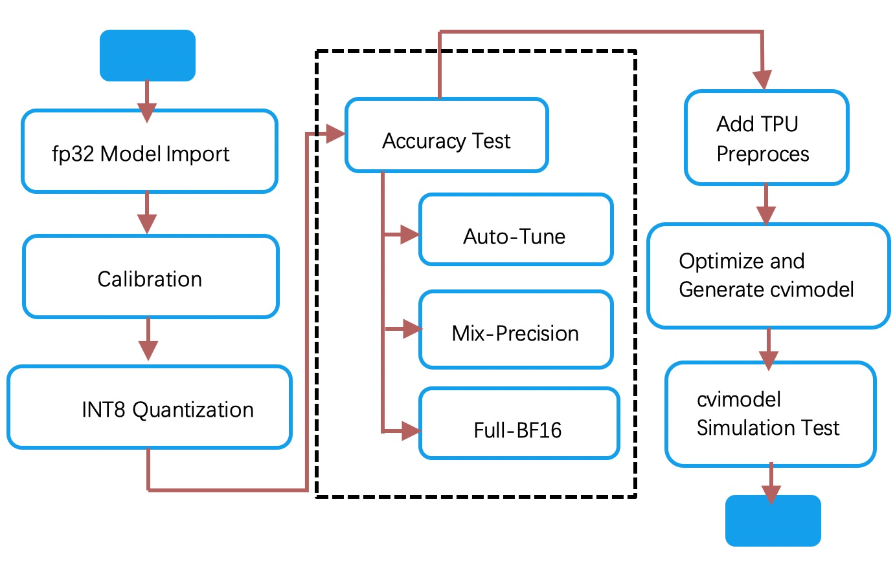

# CV183x/CV182x TPU Development Guide

>
> Document version: 1.5.0
>
> Release date: 2021-04-22

© 2020 CVITEK Co., Ltd. All rights reserved.

No part of this document may be reproduced or transmiited in any form or by any means without prior written consent of CVITEK Co., Ltd.

**Revision History**

| Version | Data       | Modifier      | Modify description                            |
| ------- | ---------- | ------------- | --------------------------------------------- |
| V0.0.1  | 2019/12/11 | Lei Wang      | Initial version                               |
| V0.1.0  | 2020/03/30 | Lei Wang      | Added usage instructions and API instructions |
| V0.2.0  | 2020/07/17 | Lei Wang      | Added usage instructions and API instructions |
| V0.3.0  | 2020/10/26 | Ming kang Qin | Added usage instructions and API instructions |
| V0.3.1  | 2020/11/24 | Quan Xiao     | Update mlir op and update format              |
| V1.4.0  | 2020/12/04 | Jiang Jiang   | Update document structure                     |
| V1.5.0  | 2021/01/29 | Jiang Jiang   | Modified according to toolchain 1.5           |
| V1.5.1  | 2021/04/22 | Jiang Jiang   | Modified according to toolchain 1.5           |
<div STYLE="page-break-after: always;"></div>
# Terms and Conditions

The document and all information contained herein remain the CVITEK Co., Ltd’s (“CVITEK”）confidential information, and should not disclose to any third party or use it in any way without CVITEK’s prior written consent. User shall be liable for any damage and loss caused by unauthority use and disclosure.

CVITEK reserves the right to make changes to information contained in this document at any time and without notice.

All information contained herein is provided in “AS IS” basis, without warranties of any kind, expressed or implied, including without limitation mercantability, non-infringement and fitness for a particular purpose. In no event shall CVITEK be liable for any third party’s software provided herein, User shall only seek remedy against such third party. CVITEK especially disclaims that CVITEK shall have no liable for CVITEK’s work result based on Customer’s specification or published shandard.

<div STYLE="page-break-after: always;"></div>
# Contents

[TOC]

<div STYLE="page-break-after: always;"></div>

# Chapter 1 Overview

## 1.1 TPU Introduction

> CVITEK TPU is a heterogeneous computing engine of edge computing SoC platform (CV183x/CV182x) developed by CVITEK. The hardware acceleration of mainstream neural network operation is realized, and the execution efficiency and programming flexibility are considered. In terms of calculation accuracy, it supports two modes of high efficiency INT8 and high dynamic range BF16, and supports flexible mixed accuracy configuration through software platform.

## 1.2 Tool Chain Introduction

> CVITEK TPU tool chain is an efficient, open, transparent, extensible, and model transplant process controllable neural network compilation optimization development tool set.

## 1.3 Software Framework

> The block diagram of TPU software development is shown in the figure below.
> 
>
> The software framework consists of offline tool chain and runtime model reasoning library. The offline tool chain includes model transformation, compiler, quantization tools and other components. It completes the steps from user model import, transformation, quantization, optimization to code generation, and finally assembles into cvimodel format reasoning model file. The runtime model inference library loads cvimodel, reads runtime information for setting and resource allocation, loads weight data and instruction sequence, drives hardware to execute instruction sequence, completes neural network inference task, and outputs inference result data. The runtime includes the support of a complete simulation platform. Customers can first complete model migration, verification and accuracy test on the simulation platform, and then load it to real hardware for verification and execution.


## 1.4 Neural Network Compiler

> The neural network compiler is developed based on the MLIR framework. The compiler completes the transformation from an existing framework model file to the TPU instruction set. It includes the following tools.

-   Model conversion tool: a set of Python scripts are used to convert the models generated by caffe/pytorch and other frameworks into fp32 model files with mlir as the front end for subsequent quantization, optimization and instruction generation.
-   mlir-opt: realize a variety of optimization as well as transformation Pass, and realize combination call. It includes the following categories:

> optimization transformation, quantization transformation, Lowering, performance optimization, resource optimization, and analysis and statistics.

-   mlir-interpreter：realize IR reasoning calculation based on CPU / TPU, and save the output tenor data and all or part of the intermediate result tenor data specified by the user in numpy format （*.npz） file. Based on the interpreter, developers can test the correctness and accuracy of the transformation at any time in all aspects of the model transformation, including each stage before and after quantization, verify the correctness of various optimization paths, compare the accuracy differences of various quantization options, and compare the data of all intermediate calculation results in detail. Interpreter supports python binding. Developers can use Python for data preprocessing, post-processing and data analysis.

-   calibration：a quantitative calibration tool based on mlir-interpreter, which performs reasoning calculation on the calibration data set specified by the developer, makes statistics on the data of each sensor, and forms the parameters needed for model quantification. Developers can use python for data reading, preprocessing, post-processing and statistical analysis.

-   mlir-translate：it is used to convert mlir files into TPU hardware instruction sequences, and package the model weight data and runtime information into cvimodel.

-   Simulation library：different from mlir-interpreter, simulation library simulates instruction execution and operation logic of real TPU hardware. For INT8 quantization, the result of mlir-interpreter is consistent with that of bit-accurate. For the floating-point type combination calculation, the mlir-interpreter will be different from the hardware to some extent, while the emulator still guarantees the bit-accurate consistency between the result and the hardware.

-   Data analysis tools: a set of python tools, used to compare, count, analyze and locate the data generated in the process of model transplantation and compilation. It supports a variety of similarity comparison for each layer of tensor data output in each step of transformation to ensure that the model int8 fixed-point and BF16 reasoning accuracy meet the requirements.

## 1.5 Model Dump cvimodel File

> Cvimodel file is the final result of offline compilation, which is delivered to runtime for parsing and online reasoning. Cvimodel also supports:

-   Multi-batch and multi-resolution: for different batch_size_and input resolution, different instruction sequences need to be executed but the weight data is shared because of the differences of resource and optimization selection. Cvimodel supports the first mock exam of multiple models of batch and multiple resolutions by using corresponding file data formats.
-   Model segmentation: for models that contain TPU and do not support operators, TPU and CPU can be used for collaborative reasoning. A model is divided into several segments, and each segment is executed by a specific engine (TPU or CPU).
-   Customed operator: Currently, customed operator only supports CPU implementation. In cvimodel, the user-defined operator is compiled into a dynamic link library of a specific platform and saved in the cvimodel model file.
> The cvimodel generated for the cv183x platform can run on cv183x system chips such as 1832/1835/1838; the cvimodel generated for the cv182x platform can run on the cv182x series chips such as 1821/1822/1826.

## 1.6 Runtime

> The runtime library and application program run in ARM aarch64 processor Linux system of CV183x/CV182x SOC. Runtime provides a set of APIs to be called by the application runtime to realize the online reasoning of the model at the board end. The main functions include:

-   Analyze cvimodel file;
-   Load weight data, and instruction sequence data according to the configured batch_size_ and resolution information;
-   Load CPU function according to CPU segment information;
-   Load input data
-   Perform inference calculations
-   Return the result data.

### 1.6.1 Python Binding

> Runtime supports Python Binding, which makes it easy to use python data preprocessing and post-processing code to quickly develop and verify models and offline simulation.

### 1.6.2 Simulator

> In addition to calling hardware, runtime also supports calling emulator with the same API for offline testing and debugging.

## 1.7 Development Environment Configuration

It is recommended to use docker. For details, please refer to Chapter 3 "development environment configuration" in TPU quick start guide.

<div STYLE="page-break-after: always;"></div>

# Chapter 2 Model Compilation Guide

## 2.1 Tool Chain Reference

### 2.1.1 IR Definition Reference

#### 2.1.1.1 Overview

> IR (Intermediate Representation) is an intermediate representation language, which is used to transform neural network diagrams based on various frameworks into a unified intermediate representation. With the help of the IR framework of MLIR, Cvitek compiler defines TPU Dialect for TPU development and optimization.
>
> Each operation is defined as an Op, which is defined according to SSA rules and follows the following principles.

-   Each Op has one or more input Tensor;

-   Each Op has and only has one output Tensor;

-   Only one Op in each Tensor will rewrite its value;

-   The operation of each Op will not produce any other side effects except that it will affect the value of output Tensor;

> For example, SliceOp has multiple Outputs. However, in the definition of TPU IR, a SliceOp is generated for each sub tensor. Their input tensors point to the same tensor, and parameters such as offset are specified through attribute, However, each SliceOp has only one output tensor.

<br>

#### 2.1.1.2 Operation Support List

> The supported Operations are as follows.

|Operation              |**Engine**^(1)^      |**Quantization**^(2)^   |**Lowering**^(3)^|
|---------------------|---------------|------------------|--------------|
|BatchNorm             |TPU       |yes                 |yes|
|BroadcastMul          |TPU             |Yes                |Yes|
|Clip                  |TPU             |Yes                |Yes|
|Concat                |TPU   |Yes                |Yes|
|Conv2D                |TPU             |Yes                |Yes|
|Crop                  |TPU             |Yes                |Yes|
|Custom                |CPU             |Yes                |No|
|DeConv2D              |TPU             |Yes                |Yes|
|DetectionOutput       |CPU             |No                 |No|
|EltwiseAdd            |TPU             |Yes                |Yes|
|EltwiseMax            |TPU             |Yes                |Yes|
|EltwiseMul            |TPU             |Yes                |Yes|
|FrcnDetection         |CPU             |No                 |No|
|FullyConnected        |TPU             |Yes                |Yes|
|Gru                   |TPU             |Yes                |Yes|
|LeakyRelu             |TPU             |Yes                |Yes|
|Lstm                  |TPU             |Yes                |Yes|
|Mish                  |TPU             |Yes                |Yes|
|Normalize             |TPU       |No                 |No|
|Pad                   |TPU             |Yes                |Yes|
|Permute               |TPU             |Yes                |Yes|
|PixelShuffle          |TPU             |Yes                |Yes|
|PoolAvg2D             |TPU             |Yes                |Yes|
|PoolMask              |TPU       |No                 |No|
|PoolMax2D             |TPU             |Yes                |Yes|
|PoolMask              |TPU             |Yes                |Yes|
|Power                 |TPU             |Yes                |Yes|
|PRelu                 |TPU             |Yes                |Yes|
|PriorBox              |CPU             |No                 |No|
|Proposal              |CPU             |No                 |No|
|ReduceMax             |TPU             |Yes                |Yes|
|ReduceMean            |TPU             |Yes                |Yes|
|Relu                  |TPU             |Yes                |Yes|
|Reorg                 |TPU             |Yes                |Yes|
|RetinaFaceDetection   |CPU             |No                 |No|
|ROIPooling            |CPU             |Yes                |No|
|Scale                 |TPU             |No                 |No|
|Sigmoid               |TPU             |Yes                |Yes|
|Slice                 |TPU       |Yes                |Yes|
|Sqrt                  |TPU             |Yes                |Yes|
|Softmax               |TPU             |Yes                |Yes|
|TanH                  |TPU             |Yes                |Yes|
|Tile                  |TPU             |Yes                |Yes|
|Upsample              |TPU             |Yes                |Yes|
|YoloDetection         |CPU             |No                 |No|

> (1) It is used to specify the execution stage of the current. TPU indicates that the instruction is executed on
>
> the TPU, while CPU indicates that it is executed on the CPU.

> (2) Quantification indicates whether quantification is needed. The instructions executed on the CPU do not need to be quantified.

> (3) owering means that the current instruction needs to be converted into TPU instruction and then executed on TPU.

<br>

#### 2.1.1.3 General Data Structure

- Basic data type

  |Type   |Description|
  |------ |-----------------------------|
  |I8     |DataType，8 bit integer data|
  |I32    |DataType，32 bit integer data|
  |F32    |DataType，32 bit floating-point data|
  |BF16   |DataType，16 bit BF floating-point data|
  |I64    |DataType，64 bit integer data|
  <br>

- Tensor type

  |Type                          |Description|
  |----------------------------- |------------------------------------------------|
  |Tensor<DataType>            |Tensor with DataType, cannot be null|
  |TensorOfOrNone<DataType>   |Tensor Tensor with DataType, None means null Tensor|
  |AnyTensor                     |Tensor with any DataType data type|
  |Variadic Tensor               |Tensor One or more Tensor|
  <br>

- Basic attribute types

  |Type|Description|
  |---|---|
  |StrAttr             | Attribute, string type attribute |
  |NonNegativeI32Attr  | Attribute, non-negative integer type attribute |
  |I32Attr             | Attribute, 32-bit integer type attribute |
  |F32Attr             | Attribute, 32-bit floating-point type attribute |
  |BoolAttr            | Attribute, boolean attribute |
  <br>

- TPU_QuantParamAttr

  |Parameter|Type|Description|
  |---|---|---|
  |mode           | TPU_QuantModeAttr      | Types of Quant |
  |param_type     | TPU_QuantParamTypeAttr | Quant variable type |
  |is_perchannel  | BoolAttr               | Yes for PerChannel，No for PerTensor |
  |is_asymmetric  | BoolAttr               | Whether it is asymmetric quantization |
  |threshold_max  | F32Attr                | Quantized maximum |
  |threshold_min  | F32Attr                | Quantization minimum (asymmetric quantization only) |
  |zero_point     | I32Attr                | Zero point value |

  <br>

- TPU_QuantModeAttr

  |Enumeration|Description|
  |---|---|
  |NONE  | No quantization, keep FP32 |
  |INT8  | Quantized to INT8 |
  |BF16  | Quantified to BF16 |

<br>

- TPU_QuantParamTypeAttr

  |Enumeration|Description|
  |---|---|
  |NONE               | The quantification of current Op does not require variables |
  |THRESHOLD          | The quantitative variables are described by Threshold. |
  |SCALE              | The quantitative variables are described by Scale, and support PerChannel or PerTensor. |
  |RSHIFT_ONLY        | The quantitative variables are described by RSHIFT, and support PerChannel or PerTensor. |
  |RSHIFT_AND_M_I32  | The quantitative variables are described by RSHIFT and I32MULTIPLER, and support PerChannel or PerTensor. |
  |RSHIFT_AND_M_I8   | The quantitative variables are described by RSHIFT and I8MULTIPLER, and support PerChannel or PerTensor. |
  |LUT_INT8           | The quantitative variables are described by INT8 LUT. |
  |LUT_BF16           | The quantitative variables are described by BF16 LUT. |

<br>

- TPU_ConvParamAttr

  |Parameter|Type|Description|
  |---|---|---|
  |stride_h    | I32Attr         | stride_h|
  |stride_w    | I32Attr         | stride_w|
  |padding     | TPU_PaddingAttr | VALID or SAME |
  |dilation_h  | I32Attr         | dilation_h|
  |dilation_w  | I32Attr         | dilation_w|
  |group       | I32Attr         | group|
  |is_dw       | BoolAttr        | Whether it is Depthwise |
  |with_bias   | BoolAttr        | Whether it has Bias |
  |do_relu     | BoolAttr        | Whether to perform Relu to the result |
  |ins         | I32ArrayAttr    | Insert 0 to h, w |
  |pad_value   | I32Attr         | Pad the value |

<br>

- TPU_PoolParamAttr

  |Parameter|Type|Description|
  |---|---|---|
  |kernel_h           | I32Attr  | kernel_h|
  |kernel_w           | I32Attr  | kernel_w|
  |padding_t          | I32Attr  | padding_t|
  |padding_b          | I32Attr  | padding_b|
  |padding_l          | I32Attr  | padding_l|
  |padding_r          | I32Attr  | padding_r|
  |stride_h           | I32Attr  | stride_h|
  |stride_w           | I32Attr  | stride_w|
  |do_relu            | BoolAttr | Whether to perform Relu to the result |
  |count_include_pad  | BoolAttr | Whether pad part is included in calculation. |

<br>

#### 2.1.1.4 Operation Definition

- BatchNorm

  |Parameter|Type|Description|Category|
  |---|---|---|---|
  |output            | AnyTensor               | output Tensor  | Output |
  |input             | AnyTensor               | input Tensor   | input |
  |mean              | AnyTensor               | mean parameter vector | Input |
  |variance          | AnyTensor               | variance parameter vector | Input |
  |scale             | AnyTensor               | scale parameter | Input |
  |variance_epsilon  | F32Attr                 | epsilon          | Attribute |
  |name              | StrAttr                 | operation name | Attribute |

  <br>

- BroadcastMul

  |Parameter|Type|Description|Category|
  |---|---|---|---|
  |output            | AnyTensor               | output Tensor    | Output |
  |input             | AnyTensor               | input Tensor     | Input |
  |multiplier        | AnyTensor               | Multiplier vector | Input |
  |quant_scale       | TensorOfOrNone          | quantified scale vector | input(optional) |
  |quant_zeropoint   | TensorOfOrNone          | quantified zeropoint vector | input(optional) |
  |quant_rshift      | TensorOfOrNone          | quantified rshift vector | input(optional) |
  |quant_multiplier  | TensorOfOrNone          | quantified multiplier vector | input(optional) |
  |axis              | I32Attr                 | axis of broadcasting | Attribute |
  |do_relu           | BoolAttr                | Whether to perform Relu to the result | Attribute |
  |quant             | TPU_QuantParamAttr      | Quant parameter  | Attribute |
  |name              | StrAttr                 | operation name | Attribute |

  <br>

- Clip

  |Parameter|Type|Description|Category|
  |---|---|---|---|
  |output            | AnyTensor               | output Tensor    | Output |
  |input             | Variadic Tensor         | multiple input Tensor | Multiple input |
  |quant_scale       | TensorOfOrNone          | quantified scale vector | input(optional) |
  |quant_zeropoint   | TensorOfOrNone          | quantified zeropoint vector | input(optional) |
  |quant_rshift      | TensorOfOrNone          | quantified rshift vector | input(optional) |
  |quant_multiplier  | TensorOfOrNone          | quantified multiplier vector | input(optional) |
  |min               | F32Attr                 | Minimum         | Attribute |
  |max               | F32Attr                 | Maximum         | Attribute |
  |name              | StrAttr                 | operation name   | Attribute |

  <br>

- Concat

  |Parameter|Type|Description|Category|
  |---|---|---|---|
  |output            | AnyTensor               | output Tensor    | Output |
  |input             | Variadic Tensor         | multiple input Tensor | multiple input |
  |quant_scale       | TensorOfOrNone          | quantified scale vector | input(optional) |
  |quant_zeropoint   | TensorOfOrNone          | quantified zeropoint vector | input(optional) |
  |quant_rshift      | TensorOfOrNone          | quantified rshift vector | input(optional) |
  |quant_multiplier  | TensorOfOrNone          | quantified multiplier vector | input(optional) |
  |axis              | I32Attr                 | connected axis  | Attribute |
  |quant             | TPU_QuantParamAttr      | Quant parameter  | Attribute |
  |name              | StrAttr                 | operation name   | Attribute |

  <br>

- Conv2D

  |Parameter|Type|Description|Category|
  |---|---|---|---|
  |output            | AnyTensor               | output Tensor    | Output |
  |input             | AnyTensor               | input Tensor     | Input |
  |filter            | AnyTensor               | Filter Tensor      | Input |
  |bias              | TensorOfOrNone          | Bias Tensor        | input(optional) |
  |quant_scale       | TensorOfOrNone          | quantified scale vector | input(optional) |
  |quant_zeropoint   | TensorOfOrNone          | quantified zeropoint vector | input(optional) |
  |quant_rshift      | TensorOfOrNone          | quantified rshift vector | input(optional) |
  |quant_multiplier  | TensorOfOrNone          | quantified multiplier vector | input(optional) |
  |param             | TPU_ConvParamAttr       | Conv parameter   | Attribute |
  |quant             | TPU_QuantParamAttr      | Quant parameter  | Attribute |
  |name              | StrAttr                 | operation name   | Attribute |

  <br>

- Crop

  |Parameter|Type|Description|Category|
  |---|---|---|---|
  |output       | AnyTensor               | output Tensor | Output |
  |input        | AnyTensor               | input Tensor | Input |
  |crop_shape   | I32ArrayAttr            | Crop Shape  | Attribute |
  |crop_offset  | TI32ArrayAttr           | Crop Offset | Attribute |
  |quant        | TPU_QuantParamAttr      | Quant parameter | Attribute |
  |name         | StrAttr                 | operation name | Attribute |

  <br>

- Custom

  |Parameter|Type|Description|Category|
  |---|---|---|---|
  |output               | AnyTensor               | output Tensor | Output |
  |input                | AnyTensor               | input Tensor    | Input |
  |operation_name       | StrAttr                 | custom operation name | attribute |
  |param                | DictionaryAttr          | parameters required | Attribute |
  |tpu                  | BoolAttr                | Whether TPU processing is needed | Attribute |
  |do_quant             | BoolAttr                | Whether quantify is needed | Attribute |
  |threshold_overwrite  | StrAttr                 | Overwrite threshold | Attribute |
  |name                 | StrAttr                 | operation name | Attribute |

  <br>

- DeConv2D

  |Parameter|Type|Description|Category|
  |---|---|---|---|
  |output            | AnyTensor               | output Tensor    | output |
  |input             | AnyTensor               | input Tensor     | Input |
  |filter            | AnyTensor               | Filter Tensor      | Input |
  |bias              | TensorOfOrNone          | Bias Tensor        | input(optional) |
  |quant_scale       | TensorOfOrNone          | quantified scale vector | input(optional) |
  |quant_zeropoint   | TensorOfOrNone          | quantified zeropoint vector | input(optional) |
  |quant_rshift      | TensorOfOrNone          | quantified rshift vector | input(optional) |
  |quant_multiplier  | TensorOfOrNone          | quantified multiplier vector | input(optional) |
  |param             | TPU_ConvParamAttr       | Conv parameter | Attribute |
  |quant             | TPU_QuantParamAttr      | Quant parameter  | Attribute |
  |name              | StrAttr                 | operation name   | Attribute |

  <br>

- DetectionOutput

  |Parameter|Type|Description|Category|
  |---|---|---|---|
  |output                | AnyTensor               | output Tensor      | Output |
  |input                 | Variadic Tensor         | input Tensor       | Multiple input |
  |num_classes           | I32Attr                 | number of detection categories | Attribute |
  |share_location        | BoolAttr                | Share Location       | Attribute |
  |background_label_id   | NonNegativeI32Attr      | Background Label ID  | Attribute |
  |nms_threshold         | F32Attr                 | NMS threshold        | Attribute |
  |top_k                 | I32Attr                 | Top K                | Attribute |
  |code_type             | CodeTypeAttr            | Code Type            | Attribute |
  |keep_top_k            | I32Attr                 | Keep Top K           | Attribute |
  |confidence_threshold  | F32Attr                 | Confidence Threshold | Attribute |
  |name                  | StrAttr                 | operation name | Attribute |

  <br>

- EltwiseAdd

  |Parameter|Type|Description|Category|
  |---|---|---|---|
  |output            | AnyTensor               | output Tensor    | Output |
  |input             | Variadic Tensor         | multiple input Tensor | multiple input |
  |quant_scale       | TensorOfOrNone          | quantified scale vector | input(optional) |
  |quant_zeropoint   | TensorOfOrNone          | quantified zeropoint vector | input(optional) |
  |quant_rshift      | TensorOfOrNone          | quantified rshift vector | input(optional) |
  |quant_multiplier  | TensorOfOrNone          | quantified multiplier vector | input(optional) |
  |do_relu           | BoolAttr                | Whether to perform Relu to the result | Attribute |
  |do_early_stride   | BoolAttr                | Whether to perform stride in advance | Attribute |
  |early_stride_h    | I32Attr                 | set stride h     | Attribute |
  |early_stride_w    | I32Attr                 | set stride w     | Attribute |
  |quant             | TPU_QuantParamAttr      | Quant parameter  | Attribute |
  |name              | StrAttr                 | operation name   | Attribute |

  <br>

- EltwiseMax

  |Parameter|Type|Description|Category|
  |---|---|---|---|
  |output            | AnyTensor               | output Tensor  | Output |
  |input             | Variadic Tensor         | multiple input Tensor | multiple input |
  |quant_scale       | TensorOfOrNone          | quantified scale vector | input(optional) |
  |quant_zeropoint   | TensorOfOrNone          | quantified zeropoint vector | input(optional) |
  |quant_rshift      | TensorOfOrNone          | quantified rshift vector | input(optional) |
  |quant_multiplier  | TensorOfOrNone          | quantified multiplier vector | input(optional) |
  |do_relu           | BoolAttr                | Whether to perform Relu to the result | Attribute |
  |do_early_stride   | BoolAttr                | Whether to perform stride in advance | Attribute |
  |early_stride_h    | I32Attr                 | set stride h     | Attribute |
  |early_stride_w    | I32Attr                 | set stride w     | Attribute |
  |quant             | TPU_QuantParamAttr      | Quant parameter  | Attribute |
  |name              | StrAttr                 | operation name   | Attribute |

  <br>

- EltwiseMul

  |Parameter|Type|Description|Category|
  |---|---|---|---|
  |output            | AnyTensor               | output Tensor | Output |
  |input             | Variadic Tensor         | multiple input Tensor | multiple input |
  |quant_scale       | TensorOfOrNone          | quantified scale vector | input(optional) |
  |quant_zeropoint   | TensorOfOrNone          | quantified zeropoint vector | input(optional) |
  |quant_rshift      | TensorOfOrNone          | quantified rshift vector | input(optional) |
  |quant_multiplier  | TensorOfOrNone          | quantified multiplier vector | input(optional) |
  |do_relu           | BoolAttr                | Whether to perform Relu to the result | Attribute |
  |do_early_stride   | BoolAttr                | Whether to perform stride in advance | Attribute |
  |early_stride_h    | I32Attr                 | set stride h     | Attribute |
  |early_stride_w    | I32Attr                 | set stride w     | Attribute |
  |quant             | TPU_QuantParamAttr      | Quant parameter  | Attribute |
  |name              | StrAttr                 | operation name   | Attribute |

  <br>

- FrcnDetection

  |Parameter|Type|Description|Category|
  |---|---|---|---|
  |output         | AnyTensor               | output Tensor  | Output |
  |input          | Variadic Tensor         | multiple input Tensor | Multiple input |
  |class_num      | I32Attr                 | number of detection categories | Attribute |
  |obj_threshold  | F32Attr                 | Object Threshold | Attribute |
  |nms_threshold  | F32Attr                 | NMS threshold    | Attribute |
  |keep_top_k     | I32Attr                 | Keep Top K       | Attribute |
  |name           | StrAttr                 | operation name | Attribute |

  <br>

- FullyConnected

  |Parameter|Type|Description|Category|
  |---|---|---|---|
  |output            | AnyTensor               | output Tensor    | output |
  |input             | AnyTensor               | input Tensor     | Input |
  |filter            | AnyTensor               | Filter Tensor      | Input |
  |bias              | TensorOfOrNone          | Bias Tensor        | input(optional) |
  |quant_scale       | TensorOfOrNone          | quantified scale vector | input(optional) |
  |quant_zeropoint   | TensorOfOrNone          | quantified zeropoint vector | input(optional) |
  |quant_rshift      | TensorOfOrNone          | quantified rshift vector | input(optional) |
  |quant_multiplier  | TensorOfOrNone          | quantified multiplier vector | input(optional) |
  |do_relu           | BoolAttr                | Whether to perform Relu to the result | Attribute |
  |quant             | TPU_QuantParamAttr      | Quant parameter  | Attribute |
  |name              | StrAttr                 | operation name   | Attribute |

  <br>

- Gru

  |Parameter|Type|Description|Category|
  |---|---|---|---|
  |output               | AnyTensor               | output Tensor           | output |
  |input                | AnyTensor               | input Tensor              | Input |
  |weight               | AnyTensor               | input Weight              | Input |
  |recurrence           | AnyTensor               | input Recurrence          | Input |
  |bias                 | TPU_TensorOfOrNone      | input Bias                | Input |
  |initial_h            | AnyTensor               | initial h               | Input |
  |sigmoid_table        | TPU_TensorOfOrNone      | sigmoid table              | Input |
  |sigmoid_slope_table  | TPU_TensorOfOrNone      | sigmoid slop table         | Input |
  |tanh_table           | TPU_TensorOfOrNone      | tanh table                 | Input |
  |tanh_slope_table     | TPU_TensorOfOrNone      | tanh slop table            | Input |
  |quant                | TPU_QuantParamAttr      | Quant parameter           | Attribute |
  |linear_before_reset  | BoolAttr                | a linear layer in front of the reset gate | Attribue |
  |bidirectional        | BoolAttr                | whether it is bidirectional |Attribute|
  |name                 | StrAttr                 | operation name            | Attribute |


<br>

- LeakyRelu

  |Parameter|Type|Description|Category|
  |---|---|---|---|
  |output                | AnyTensor               | output Tensor | Output |
  |input                 | AnyTensor               | input Tensor     | Input |
  |quant_pos_scale       | TensorOfOrNone          | quantified scale vector | input(optional) |
  |quant_pos_zeropoint   | TensorOfOrNone          | quantified zeropoint vector | input(optional) |
  |quant_pos_rshift      | TensorOfOrNone          | quantified rshift vector | input(optional) |
  |quant_pos_multiplier  | TensorOfOrNone          | quantified multiplier vector | input(optional) |
  |quant_neg_scale       | TensorOfOrNone          | quantified scale vector | input(optional) |
  |quant_neg_zeropoint   | TensorOfOrNone          | quantified zeropoint vector | input(optional) |
  |quant_neg_rshift      | TensorOfOrNone          | quantified rshift vector | input(optional) |
  |quant_neg_multiplier  | TensorOfOrNone          | quantified multiplier vector | input(optional) |
  |negative_slope        | F32Attr                 | negative slope | Attribute |
  |quant                 | TPU_QuantParamAttr      | Quant parameter  | Attribute |
  |name                  | StrAttr                 | operation name   | Attribute |

  <br>

- Lstm

  |Parameter|Type|Description|Category|
  |---|---|---|---|
  |output               | AnyTensor               | output Tensor   | Output |
  |input                | AnyTensor               | input Tensor      | Input |
  |weight               | AnyTensor               | input Weight      | Input |
  |recurrence           | AnyTensor               | input Recurrence  | Input |
  |bias                 | TPU_TensorOfOrNone      | input Bias        | Input |
  |initial_h            | AnyTensor               | initial h         | Input |
  |initial_c            | AnyTensor               | intial c          | Input |
  |sigmoid_table        | TPU_TensorOfOrNone      | sigmoid table      | Input |
  |sigmoid_slope_table  | TPU_TensorOfOrNone      | sigmoid slop table | Input |
  |tanh_table           | TPU_TensorOfOrNone      | tanh table        | Input |
  |tanh_slope_table     | TPU_TensorOfOrNone      | tanh slop table    | Input |
  |quant                | TPU_QuantParamAttr      | Quant parameter   | Attribute |
  |bidirectional        | BoolAttr                | whether it is bidirectional | Attribute |
  |name                 | StrAttr                 | operation name    | Attribute |

  <br>

- MatMul

  |Parameter|Type|Description|Category|
  |---|---|---|---|
  |output    | AnyTensor               | output Tensor | Output |
  |input     | Variadic Tensor         | multiple input Tensor | multiple input |
  |do_relu   | BoolAttr                | Whether to perform Relu to the result | Attribute |
  |quant     | TPU_QuantParamAttr      | Quant parameter | Attribute |
  |name      | StrAttr                 | operation name | Attribute |

  <br>

- Mish

  |Parameter|Type|Description|Category|
  |---|---|---|---|
  |output          | AnyTensor               | output Tensor | Output |
  |input           | Variadic Tensor         | input Tensor | multiple input |
  |table           | TPU_TensorOfOrNone      | lut table  | Input |
  |table_mantissa  | TPU_TensorOfOrNone      | mantissa table | Input |
  |has_table       | BoolAttr                | whether it has lut table | Attribute |
  |quant           | TPU_QuantParamAttr      | Quant parameter | Attribute |
  |mish_threshold  | F32Attr                 | threshold   | Attribute |
  |name            | StrAttr                 | operation name | Attribute |

  <br>

- Normalize

  |Parameter|Type|Description|Category|
  |---|---|---|---|
  |output          | AnyTensor               | output Tensor | Output |
  |input           | AnyTensor               | input Tensor | Input |
  |scale           | AnyTensor               | Scale Tensor   | Input |
  |across_spatial  | BoolAttr                | Across Spatial | Attribute |
  |channel_shared  | BoolAttr                | Channel Shared | Attribute |
  |name            | StrAttr                 | operation name | Attribute |

  <br>

- Pad

  |Parameter|Type|Description|Category|
  |---|---|---|---|
  |output     | AnyTensor               | output Tensor | Output |
  |input      | AnyTensor               | multiple input Tensor | multiple input |
  |pads       | I32ArrayAttr            | index position for padding | Attribute |
  |const_val  | F32Attr                 | Padding value | Attribute |
  |quant      | TPU_QuantParamAttr      | Quant parameter | Attribute |
  |name       | StrAttr                 | operation name | Attribute |

  <br>

- Permute

  |Parameter|Type|Description|Category|
  |---|---|---|---|
  |output    | AnyTensor               | output Tensor | Output |
  |input     | AnyTensor               | input Tensor | Input |
  |order0    | NonNegativeI32Attr      | Permute order0 | Attribute |
  |order1    | NonNegativeI32Attr      | Permute order1 | Attribute |
  |order2    | NonNegativeI32Attr      | Permute order2 | Attribute |
  |order3    | NonNegativeI32Attr      | Permute order3 | Attribute |
  |quant     | TPU_QuantParamAttr      | Quant parameter | Attribute |
  |name      | StrAttr                 | operation name | Attribute |

  <br>

- PixelShuffle

  |Parameter|Type|Description|Category|
  |---|---|---|---|
  |output          | AnyTensor               | output Tensor        | Output |
  |input           | AnyTensor               | input Tensor         | Input |
  |upscale_factor  | NonNegativeI32Attr      | Upscale factor         | Attribute |
  |quant           | TPU_QuantParamAttr      | Quant parameter      | Attribute |
  |mode            | DefaultValuedAttr       | default value is CRD | Attribute |
  |name            | StrAttr                 | operation name       | Attribute |

  <br>

- PoolAvg2D

  |Parameter|Type|Description|Category|
  |---|---|---|---|
  |output            | AnyTensor               | output Tensor    | output |
  |input             | AnyTensor               | input Tensor     | Input |
  |quant_scale       | TensorOfOrNone          | quantified scale vector | input(optional) |
  |quant_zeropoint   | TensorOfOrNone          | quantified zeropoint vector | input(optional) |
  |quant_rshift      | TensorOfOrNone          | quantified rshift vector | input(optional) |
  |quant_multiplier  | TensorOfOrNone          | quantified multiplier vector | input(optional) |
  |param             | TPU_PoolParamAttr       | Pool parameter   | Attribute |
  |quant             | TPU_QuantParamAttr      | Quant parameter  | Attribute |
  |name              | StrAttr                 | operation name   | Attribute |

  <br>

- PoolMask

  |Parameter|Type|Description|Category|
  |---|---|---|---|
  |output     | AnyTensor               | output Tensor | Output |
  |input      | AnyTensor               | input Tensor | Input |
  |pads       | I32ArrayAttr            | index position for padding | Attribute |
  |const_val  | F32Attr                 | padding value | Attribute |
  |quant      | TPU_QuantParamAttr      | Quant parameter | Attribute |
  |name       | StrAttr                 | operation name | Attribute |

  <br>

- PoolMax2D

  |Parameter|Type|Description|Category|
  |---|---|---|---|
  |output    | AnyTensor               | output Tensor | Output |
  |input     | AnyTensor               | input Tensor | Input |
  |param     | TPU_PoolParamAttr       | Pool parameter | Attribute |
  |quant     | TPU_QuantParamAttr      | Quant parameter | Attribute |
  |name      | StrAttr                 | operation name | Attribute |

  <br>
- Power

  |Parameter|Type|Description|Category|
  |---|---|---|---|
  |output    | AnyTensor               | output Tensor | Output |
  |input     | AnyTensor               | input Tensor | Input |
  |power     | F32Attr                 | Power      | Attribute |
  |scale     | F32Attr                 | Scale      | Attribute |
  |quant     | TPU_QuantParamAttr      | Quant parameter | Attribute |
  |name      | StrAttr                 | operation name | Attribute |

<br>

- PRelu
  |Parameter|Type|Description|Category|
  |---|---|---|---|
  |output                | AnyTensor               | output Tensor  | Output |
  |input                 | AnyTensor               | input Tensor     | Input |
  |filter                | AnyTensor               | negative slope | Input |
  |quant_pos_scale       | TensorOfOrNone          | quantified scale vector | input(optional) |
  |quant_pos_zeropoint   | TensorOfOrNone          | quantified zeropoint vector | input(optional) |
  |quant_pos_rshift      | TensorOfOrNone          | quantified rshift vector | input(optional) |
  |quant_pos_multiplier  | TensorOfOrNone          | quantified multiplier vector | input(optional) |
  |quant_neg_scale       | TensorOfOrNone          | quantified scale vector | input(optional) |
  |quant_neg_zeropoint   | TensorOfOrNone          | quantified zeropoint vector | input(optional) |
  |quant_neg_rshift      | TensorOfOrNone          | quantified rshift vector | input(optional) |
  |quant_neg_multiplier  | TensorOfOrNone          | quantified multiplier vector | input(optional) |
  |quant                 | TPU_QuantParamAttr      | Quant parameter  | Attribute |
  |name                  | StrAttr                 | operation name   | Attribute |

  <br>

- PriorBox

  |Parameter|Type|Description|Category|
  |---|---|---|---|
  |output                    | AnyTensor               | output Tensor    | Output |
  |input                     | AnyTensor               | input Tensor     | Input |
  |min_size                  | F32ArrayAttr            | minimum box size | Attribute |
  |max_size                  | F32ArrayAttr            | maximum box size | Attribute |
  |aspect_ratios             | F32ArrayAttr            | Scale aspect ratio | Attribute |
  |variance                  | F32ArrayAttr            | Variable         | attribute |
  |clip                      | BoolAttr                | Cur or not    | attribute |
  |step_h                    | F32Attr                 | step of H dimension | attribute |
  |step_w                    | F32Attr                 | step of W dimension | attribute |
  |img_h                     | I32Attr                 | The height of input image | attribute |
  |img_w                     | I32Attr                 | The width of input image | attribute |
  |offset                    | DefaultValuedAttr       | default box center offset | attribute |
  |num_priors                | I32Attr                 | number of default box | attribute |
  |use_default_aspect_ratio  | DefaultValuedAttr       | use default aspect ratio or not | attribute |
  |name                      | StrAttr                 | operation name   | attribute |

<br>

- Proposal

  |Parameter|Type|Description|Category|
  |---|---|---|---|
  |output              | AnyTensor               | output Tensor       | output |
  |input               | AnyTensor               | input Tensor        | input |
  |net_input_h         | I32Attr                 | The input height of net | attribute |
  |net_input_w         | I32Attr                 | the input width of net | attribute |
  |feat_stride         | I32Attr                 | the stride of anchor box | attribute |
  |anchor_base_size    | I32Attr                 | anchor base size | attribute |
  |rpn_obj_threshold   | F32Attr                 | Confidence of candidate box | attribute |
  |rpn_nms_threshold   | F32Attr                 | confidence of NMS | attribute |
  |rpn_nms_post_top_n  | I32Attr                 | number of saved NMS | attribute |
  |name                | StrAttr                 | operation name    | attribute |

  <br>

- ReduceMax

  |Parameter|Type|Description|Category|
  |---|---|---|---|
  |output            | AnyTensor               | output Tensor | output |
  |input             | AnyTensor               | input Tensor  | input |
  |quant             | TPU_QuantParamAttr      | Quant parameter | attribute |
  |quant_scale       | TPU_TensorOfOrNone      | quantified scale vector | attribute |
  |quant_zeropoint   | TPU_TensorOfOrNone      | quantified zeropoint vector | attribute |
  |quant_rshift      | TPU_TensorOfOrNone      | quantified rshift vector | attribute |
  |quant_multiplier  | TPU_TensorOfOrNone      | quantified multiplier vector | attribute |
  |axes              | OptionalAttr            | Indicated axes | attribute |
  |keepdims          | DefaultValuedAttr       | keep dimension or not | attribute |
  |name              | StrAttr                 | operation name | attribute |

  <br>

- ReduceMean

  |Parameter|Type|Description|Category|
  |---|---|---|---|
  |output            | AnyTensor          | output Tensor | output |
  |input             | AnyTensor          | input Tensor  | input |
  |quant             | TPU_QuantParamAttr | Quant parameter | attribute |
  |quant_scale       | TPU_TensorOfOrNone | quantified scale vector | attribute |
  |quant_zeropoint   | TPU_TensorOfOrNone | quantified zeropoint vector | attribute |
  |quant_rshift      | TPU_TensorOfOrNone | quantified rshift vector | attribute |
  |quant_multiplier  | TPU_TensorOfOrNone | quantified multiplier vector | attribute |
  |keepdims          | DefaultValuedAttr  | keep dimension or not | attribute |

  <br>

- Relu

  |Parameter|Type|Description|Category|
  |---|---|---|---|
  |output    | AnyTensor               | output Tensor     | output |
  |input     | AnyTensor               | input Tensor      | input |
  |maximum   | F32Attr                 | Max  | attribute(optional) |
  |quant     | TPU_QuantParamAttr      | Quant parameter | attribute |
  |name      | StrAttr                 | operation name  | attribute |

  <br>

- Reorg

  |Parameter|Type|Description|Category|
  |---|---|---|---|
  |output    | AnyTensor               | output Tensor  | output |
  |input     | AnyTensor               | input Tensor   | input |
  |stride    | NonNegativeI32Attr      | stride of height and width | attribute |
  |quant     | TPU_QuantParamAttr      | Quant parameter | attribute |
  |name      | StrAttr                 | operation name | attribute |

  <br>

- RetinaFaceDetection

  |Parameter|Type|Description|Category|
  |---|---|---|---|
  |output                | AnyTensor               | output Tensor        | output |
  |input                 | Variadic Tensor         | input Tensor         | multiple input |
  |nms_threshold         | F32Attr                 | NMS threshold        | attribute |
  |confidence_threshold  | F32Attr                 | Confidence Threshold | attribute |
  |keep_top_k            | I32Attr                 | Keep Top K           | attribute |
  |name                  | StrAttr                 | operation name     | attribute |

  <br>

- ROIPooling

  |Parameter|Type|Description|Category|
  |---|---|---|---|
  |output    | AnyTensor | output Tensor | output |
  |input     | AnyTensor | input Tensor | input |

  <br>

- Scale

  |Parameter|Type|Description|Category|
  |---|---|---|---|
  |output    | AnyTensor               | output Tensor      | output |
  |input     | AnyTensor               | input Tensor       | input |
  |scale     | AnyTensor               | scale            | input |
  |bias      | TensorOfOrNone          | Bias             | input(optional) |
  |do_relu   | BoolAttr                | do relu or not | attribute |
  |quant     | TPU_QuantParamAttr      | Quant parameter | attribute |
  |name      | StrAttr                 | Operation name  | attribute |

  <br>

- ShuffleChannel

  |Parameter|Type|Description|Category|
  |---|---|---|---|
  |output    | AnyTensor               | output Tensor | output |
  |input     | AnyTensor               | input Tensor  | input |
  |group     | NonNegativeI32Attr      | Shuffle Group | attribute |
  |quant     | TPU_QuantParamAttr      | Quant parameter | attribute |
  |name      | StrAttr                 | operation name | attribute |

  <br>

- Sigmoid

  |Parameter|Type|Description|Category|
  |---|---|---|---|
  |output          | AnyTensor               | output Tensor      | output |
  |input           | AnyTensor               | input Tensor       | input |
  |table           | TensorOfOrNone          | LUT table          | input(optional) |
  |table_mantissa  | TensorOfOrNone          | LUT table mantissa | input(optional) |
  |has_table       | BoolAttr                | use LUT or not | attribute |
  |quant           | TPU_QuantParamAttr      | Quant parameter  | attribute |
  |name            | StrAttr                 | operation name   | attribute |

  <br>

- Slice

  |Parameter|Type|Description|Category|
  |---|---|---|---|
  |output    | AnyTensor               | output Tensor        | output |
  |input     | AnyTensor               | input Tensor         | input |
  |axis      | I32Attr                 | indicated axis | attribute |
  |offset    | I32Attr                 | The offset in indicated axis | attribute |
  |quant     | TPU_QuantParamAttr      | Quant parameter    | attribute |
  |name      | StrAttr                 | operation name     | attribute |

  <br>

- Sqrt

  |Parameter|Type|Description|Category|
  |---|---|---|---|
  |output          | AnyTensor               | output Tensor      | output |
  |input           | AnyTensor               | input Tensor       | input |
  |table           | TensorOfOrNone          | LUT table          | input(optional) |
  |table_mantissa  | TensorOfOrNone          | LUT table mantissa | input(optional) |
  |has_table       | BoolAttr                | use LUT or not | attribute |
  |quant           | TPU_QuantParamAttr      | Quant parameter  | attribute |
  |name            | StrAttr                 | operation name   | attribute |

  <br>

- Softmax

  |Parameter|Type|Description|Category|
  |---|---|---|---|
  |output                     | AnyTensor               | output Tensor         | output |
  |input                      | AnyTensor               | input Tensor          | input |
  |exponential_table          | TPU_TensorOfOrNone      | exponential table    | input(optional) |
  |reciprocal_table           | TPU_TensorOfOrNone      | Reciprocal table     | input(optional) |
  |reciprocal_mantissa_table  | TPU_TensorOfOrNone      | reciprocal_mantissa table | input(optional) |
  |axis                       | I32Attr                 | indicated axis | attribute |
  |name                       | StrAttr                 | operation name      | attribute |

<br>

- TanH

  |Parameter|Type|Description|Category|
  |---|---|---|---|
  |output          | AnyTensor               | output Tensor      | output |
  |input           | AnyTensor               | input Tensor       | input |
  |table           | TensorOfOrNone          | LUT table          | input(optional) |
  |table_mantissa  | TensorOfOrNone          | LUT table mantissa | input(optional) |
  |has_table       | BoolAttr                | use LUT or not | attribute |
  |quant           | TPU_QuantParamAttr      | Quant parameter | attribute |
  |name            | StrAttr                 | operation name   | attribute |

  <br>

- Tile

  |Parameter|Type|Description|Category|
  |---|---|---|---|
  |output            | AnyTensor               | output Tensor | output |
  |input             | AnyTensor               | input Tensor  | input |
  |quant             | TPU_QuantParamAttr      | Quant parameter | attribute |
  |quant_scale       | TPU_TensorOfOrNone      | quantified scale vector | attribute |
  |quant_zeropoint   | TPU_TensorOfOrNone      | quantified zeropoint vector | attribute |
  |quant_rshift      | TPU_TensorOfOrNone      | quantified rshift vector | attribute |
  |quant_multiplier  | TPU_TensorOfOrNone      | quantified multiplier vector | attribute |
  |resp              | OptionalAttr            | Repeat times | attribute |
  |name              | StrAttr                 | operation name | attribute |

  <br>

- Upsample

  |Parameter|Type|Description|Category|
  |---|---|---|---|
  |output    | AnyTensor               | output Tensor | output |
  |input     | AnyTensor               | input Tensor  | input |
  |mask      | TPU_TensorOfOrNone      | mask          | input(optional) |
  |group     | NonNegativeI32Attr      | Shuffle Group | attribute |
  |quant     | TPU_QuantParamAttr      | Quant parameter | attribute |
  |name      | StrAttr                 | operation name | attribute |

<br>

-   YoloDetection

  |Parameter|Type|Description|Category|
  |---|---|---|---|
  |output         | AnyTensor               | output Tensor    | output |
  |input          | Variadic Tensor         | input Tensor     | multiple input |
  |net_input_h    | I32Attr                 | The input height of net | attribute |
  |net_input_w    | I32Attr                 | The input width of net | attribute |
  |class_num      | I32Attr                 | Number of detection types | attribute |
  |nms_threshold  | F32Attr                 | NMS threshold    | attribute |
  |obj_threshold  | F32Attr                 | Object Threshold | attribute |
  |keep_topk      | I32Attr                 | Keep Top K       | attribute |
  |spp_net        | BoolAttr                | Spp net        | attribute |
  |tiny_net       | BoolAttr                | Tiny net       | attribute |
  |yolo_v4_net    | BoolAttr                | Yolo_v4 net    | attribute |
  |name           | StrAttr                 | operation name | attribute |

<br>

#### 2.1.1.5 Front-end model import

> The tool chain provides a python interface for importing the IR of the front-end framework into the mlir model. All high level operations are defined in mlirimporter.py, which can facilitate the construction of mlir graph.

【Prototype】
```python
# mlirimporter.py
class MLIRImport:

  def __init__(self, inputs_shape, outputs_shape, input_type="FP32"):
    for input in inputs_shape:
      assert(isinstance(input, list))
      self.input_shape_list.append(input)
    for output in outputs_shape:
      assert(isinstance(output, list))
       self.output_shape_list.append(output)
    self.declare_func(input_type=input_type)
```
【Main attributes】

 	MLIRImport.input_shape_list is the Input tensor shape of the model;
 	
 	MLIRImport.output_shape_list is the Output tensor shape of the model.

【Main method】
```python
def add_input_op(self, name, index):
  pass
```
> Used to construct input instructions, used to specify the input data type, threshold and other attributes.

| Function Description | Annotation          |
| -------------------- | ------------------- |
| Return Value         | Operation           |
| name                 | Specify input name  |
| index                | Specify input index |
<br>

```python
def add_weight_fileOp(self, name):
  pass
```
> Used to construct the weight operation and specify the corresponding weight file.

| Function Description | Annotation                   |
| -------------------- | ---------------------------- |
| Return Value         | Operation *                  |
| name                 | Specify the weight file name |
<br>
```python
def add_load_fileOp(self, name, output_tensor_shape,
                    tensor_type=TPU_TensorType.Fp32,
                    storage="NONE")
```
> Used to construct load_file operation, used to load weight related Tensor.

| Function Description | Annotation          |
| -------------------- | ------------------- |
| Return Value         | Operation \\*       |
| name                 | Tensor name         |
| output_tensor_shape  | Output Tensor shape |
| tensor_type          | Tensor type         |
| storage              | Storage type        |
<br>

```python
def add_conv_Op(self, op_name, inputOperands,
                output_tensor_shape,
                mode=TPU_MODE.FP32,
                **kargs)
```
> Used to construct convolution operations.
| Function Description | Annotation                         |
| -------------------- | ---------------------------------- |
| Return Value         | Operation \\*                      |
| op_name              | Specify the name of conv layer     |
| inputOperands        | Specify the input operands         |
| output_tensor_shape  | Specify the output shape           |
| mode                 | Specify data type                  |
| kargs                | Specify the attribute list of conv |

> The parameters specified in kargs dictionary order are as follows

| key          | value                  |
| ------------ | ---------------------- |
| dilation_h | dilation_h           |
| dilation_w | dilation_w           |
| stride_h   | stride_h             |
| stride_w   | stride_w             |
| padding    | VALID or SAME        |
| padding_t  | padding top |
| padding_b  | padding bottom |
| padding_l  | padding left |
| padding_r  | padding right |
| group      | group                  |
| is_dw      | Is depthwise or not |
| with_bias  | With bias or not |
| do_relu    | Do relu or not |
| ins        | Insert 0 to h, w |

<br>

### 2.1.2 cvimodel file format reference

> cvimodel uses flatbuffers to package and encapsulate the weight data, instruction sequence and tensor related information for deployment to the platform.

#### 2.1.2.1 Basic concepts

-   Model：

> It is the collection of all the information of the network model. A single cvimodel can only contain one Model object, but it can contain multiple batch instruction sequences.

-   Program：

> Corresponding to the instruction sequence of different batches. The instruction sequence includes the TPU segment and the CPU segment, which respectively represent the instructions that run on the TPU and the code segments that need to be switched to run on the CPU.

-   Routine：

> It is divided into TPU section and CPU section. A single Program may contain multiple TPU segments or CPU segments, which will be executed in sequence during runtime.

-   Tensor：

> It is a collective term for input and output tensor and Activation, etc. The tensor contains information such as its name, shape, and basic data types.

<br>

#### 2.1.2.1 Cvimodel Structure

> 
>
>The basic structure of cvimodel is shown in the figure above, which is divided into three sections. The first segment is the header part of cvimodel file, including magic string, version number, data byte number in the middle segment and md5 value, which is the basic information for parsing cvimodel file; the middle segment is the structure information of model, including program, routes and other information, which is used to parse the structure and instruction information of network model; the last segment is binary data segment, including weight data, and TPU of each program refers to Command sequence, and so file to store user-defined CPU segment.

<br>

### 2.1.2 Tool Chain Command Reference

#### 2.1.2.1 model_transform

-   【Command】
  ```sh
  model_transform.py [options] --mlir <output_mlir_file>
  ```
-   【Description】

> Convert the caffe/onnx/ model to a single-precision model based on mlir, and verify the accuracy of each layer to ensure the correctness of the converted model.

-   【Options】

  |Parameter|Description|
  |---|---|
  |--model_type \<type\>               | The frame type of the source model, supports caffe, onnx and other frameworks (pytorch, tensorflow need to be converted to onnx) |
  |--model_name \<name\>               | Model name |
  |--model_def \<model_file\>          | Model files(***.prototxt**, ***.onnx** etc.) |
  |--model_data \<caffemodel\>         | caffe model weight file(***.caffemodel**) |
  |--image_resize_dims \<h,w\>         | The h and w after the image is resized, such as "256,256", optional; if the set image_resize_dims and net_input_dims are not equal, the image will be resized and center cropped to the height and width specified by net_input_dims; if not set, this value defaults to net_input_dims the same |
  |--resize_keep_aspect_ratio \<bool\> | Whether to keep the original aspect ratio unchanged during resize, the value is 1 or 0, and the default value is 0; if set to 1, the insufficient height and width part will be filled with 0 after resize |
  |--net_input_dims \<h,w\>            | H and w of the input shape of the model:  such as **"224,224"** |
  |--model_channel_order \<order\>     | Channel order，such as **"bgr"** or  **“rgb"**,  the default value is **"bgr"** |
  |--raw_scale**^(1)^** \<255.0\>      | The default value of raw_scale is **255** |
  |--mean**^(1)^** \<0,0,0\>           | The mean value of the channel, the default value is **"0,0,0"**, the order of the values should be consistent with model_channel_order |
  |--input_scale**^(1)^** \<1.0\>      | input_scale，the default value is **1.0** |
  |--std**^(1)^**  \<1,1,1\>           | std, channel standard deviation, the default value is  "1,1,1"**, The order of the values should be consistent with model_channel_order. |
  |--batch_size \<num\>                | Specify the batch num of the generated model |
  |--gray \<bool\>                     | Whether the input image is a grayscale image, the default value is false |
  |--image \<image_file\>              | Reference input image used to verify whether the single-precision model conversion is correct |
  |--tolerance \<0.99,0.99,0.98\>      | The minimum acceptable degree of similarity between the mlir single-precision model and the source model when comparing layer by layer accuracy. The similarity includes three items: cosine similarity, correlation similarity, and Euclidean distance similarity. The default value is "0.99,0.99,0.98" |
  |--excepts \<"-"\>                   | Skip some layers when comparing layer by layer, multiple layers can be separated by commas, such as: "layer1, layer2", the default value is "-", that is, all layers are compared |
  |--mlir \<model_fp32_mlir\>          | Output mlir single precision model |

> **^Note(1)^**  $preprocess = (x * raw\_scale / 255 - mean) *input\_scale / std$

-   【Example】

  ```sh
  model_transform.py \
      --model_type caffe \
      --model_name yolo_v3 \
      --model_def yolov3.prototxt \
      --pretrained_model yolov3.caffemodel \
      --image_resize_dims '424,424' \
      --resize_keep_aspect_ratio 1 \
      --net_input_dims '424,424' \
      --raw_scale 255 \
      --mean '0,0,0' \
      --input_scale 1.0 \
      --std '1,1,1'
      --model_channel_order 'rgb' \
      --batch_size 1 \
      --mlir yolo_v3_fp32.mlir
  ```

<br>

#### 2.1.2.2 run-calibration

-   【Command】
```sh
run_calibration.py <model file> [option]
```
-   【Description】

> For the mlir single-precision model, perform inference on images randomly selected on the test set, count the output distribution of each layer, calculate the threshold equivalent of each layer, and output a threshold table is used for subsequent model quantification

-   【Input / Output】

  |Parameter|Description|
  |---|---|
  |\<model file\>       | Input mlir file |

-   【Options】

  |Parameter|Description|
  |---|---|
  |--dataset                   | Specify the path to the calibration images |
  |--input_num                 | Specify the number to the calibration images |
  |--histogram_bin_num         | The number of histogram bins, the default is 2048, you can increase the value appropriately to improve the accuracy of quantization. |
  |-o \<calib_tabe\>           | Output calibration table file |

<br>

#### 2.1.2.3 run_tune

-   【Command】

> run_tune.py [options\] <model_fp32_mlir> -tuned_table <tuned_calib_table>

-   【Description】

> For the calibration table, further fine-tune the threshold of each layer on the test set, in order to improve the overall accuracy of the model

- 【Options】

  | Parameter | Description |
| --- | --- |
  | --dataset \<path\>                  | Specify the path to the calibration images |
  | --input_num \<image_num\>           | Specify the number to the calibration images, the default value is 10. |
  | --calibration_table \<calib_table\> | Input calibration table |
  | --mix_precision_table \<mix_table\> | Input mix precision table |
  | --tune_iteration \<iterate_num\>    | Fine-tune the number of rounds of threshold for each layer, the default value is 30 |
  | --stragegy \<stragegy_name\>        | Fine-tuning strategy: "greedy" or "overall"<br/>"greedy": ine-tune the threshold with the goal of improving the Euclidean distance similarity of each layer;<br/>"overall":To improve the cosine or Euclidean distance similarity of the result as the goal, fine-tune the threshold of each layer |
  | --evaluation \<method_num\>         | Evaluation Method of Output Accuracy of "Overall" Strategy："cosine" or "euclid" |
  | -o \<out_calib_table\>              | Output the fine-tuned calibration table |

<br>

#### 2.1.2.4 run_mix_precision

-   【Command】

> run_mix_precision.py <model_fp32_mlir> [options\] -o <mix_precision_table>

-   【Description】

> Calculate the gains of the model output accuracy after each layer is quantified as BF16 on the test set, and then sort by the size of the gains, and take the top n layers as the layers quantified as BF16 in the quantification of the mixing accuracy.

- 【Options】

  | Parameter | Description |
| --- | --- |
  | --dataset \<path\>                  | Specify the path to the calibration images |
  | --input_num \<image_num\>           | Specify the number to the calibration images, the default value is 15. |
  | --image_list \<image_list_file\>    | The file of the test picture path list, used to specify a fixed number of pictures for testing, the picture path must be an absolute path. |
  | --calibration_table \<calib_table\> | Input calibration table |
  | -o \<mix_table\>                    | Output mix precision table |

<br>

#### 2.1.2.5 model_deploy

-   【Command】

> model_depoly.py [options\] <model_fp32_mlir> --cvimodel <out_cvimodel>

-   【Description】

> Perform int8 or bf16 quantization and generate cvimodel files; verify the accuracy error between the quantized model and the single-precision model layer by layer; verify that the results of cvimodel running on the simulator are correct.

- 【Options】

  | Parameter | Description |
| --- | --- |
  | --model_name \<name\>                | Specify model name |
  | --mlir \<model_fp32_mlir\>           | Specify mlir single-precision model file |
  | --calibration_table \<calib_table\>  | Specify calibration table, quantified as int8 model. [optional] |
  | --mix_precision_table \<mix_table\>  | Specify mix precision table,  cooperate with calib_table as a mixed precision model. [optional] |
  | --all_bf16                           | Quantified as a full bf16 model |
  | --tolerance  \<cos,cor,euc\>         | The minimum acceptable degree of similarity between the accuracy of the inference output and the reference output. [optional]<br/>Similarity includes three items: cosine similarity, correlation similarity, and Euclidean distance similarity. |
  | --excepts \<"-"\>                    | Skip some layers when comparing layer by layer, multiple layers can be separated by commas, such as: "layer1, layer2", the default value is "-", that is, all layers are compared |
  | --correctness \<cos,cor,euc\>        | The minimum similarity that can be accepted when the results of cvimodel running on the simulation are compared with the results of the quantitative model inference,<br/>the default value is :"0.99,0.99,0.98" |
  | --chip \<chip_name\>                 | The name of the target platform where cvimodel is deployed,  the value is "cv183x" or "cv182x". |
  | --fuse_preprocess \<bool\>           | Whether to add preprocess op to cvimodel, the default value is false |
  | --pixel_format \<format\>            | The image input format accepted by preprocess, the optional values are:<br/>  "RGB_PACKED", "BGR_PACKED", "RGB_PLANAR",<br/>"BGR_PLANAR", "YUV420_PLANAR", "GRAYSCALE" |
  | --aligned_input \<bool\>             | Whether the input image accepted by preprocess is in alignment format, the default value is false |
  | --dequant_outputs_to_fp32 \<bool\>   | Whether to dequantize the output of the model to fp32 format, the default value is true |
  | --image \<image_file\>               | Input image used to verify accuracy |
  | --cvimodel \<out_cvimodel\>          | The cvimodel name of output |

<br>


#### 2.1.2.6 model_runner

-   【Command】

> model_runner -i <inputs.npz> -m <cvimodel> [options\] -o <outputs.npz>

-   【Description】

> Run the generated cvimodel through the simulator to verify the correctness of the results (this command can also be executed on the EVB)

- 【Options】

  | Parameter | Description |
| --- | --- |
  | --model \<cvimodel\>                | Input cvimodel model file. [required option] |
  | --input \<input_npz_file\>          | The reference input npz file of the input model, this file is generated by model_deplopy.py. [required option] |
  | --output \<output_npz_file\>        | The result of model inference is saved as an npz file, which can be read through numpy. [optional] |
  | --reference \<reference_npz_file\>  | The reference file of the output result, this file is generated by model_deploy.py. [optional] |
  | --tolerance  \<cos,cor,euc\>        | The minimum acceptable degree of similarity between the accuracy of the inference output and the reference output. [optional]<br/>Similarity includes three items: cosine similarity, correlation similarity, and Euclidean distance similarity. |
  <br>

<div STYLE="page-break-after: always;"></div>

## 2.2 Model Compilation Process

> A model is compiled from the model file saved in the original training framework into a cvimodel that can perform inference at TPURuntime, and it needs to go through the process described in the following figure.



The specific process is defined as follows：

### 2.2.1 FP32 model import

> The model import stage carries out the conversion from the training framework model file to the mlir description model. The tool chain supports the import of model files in Caffe and ONNX format. Import commands are implemented by Python Interface.
>
> The model import process is mainly divided into three parts:
>
> - Original model inference, save the output of each layer to numpy npz file
> - Import the original model and convert the model to an FP32 MLIR model
>   - FP32 MLIR model inference, save the output of each layer of mlir model to numpy npz file
>   - Output comparison, compare the npz files generated by each of the two inferences to ensure that the model conversion is correct
>   - FP32 MLIR model graph optimization, the optimized mlir model will be used as the source file of the subsequent process

  ```sh
  model_transform.py \
      --model_type $MODEL_TYPE \
      --model_name $NET \
      --model_def $MODEL_DEF \
      --model_data $MODEL_DAT \
      --image_resize_dims $IMAGE_RESIZE_DIMS \
      --net_input_dims $NET_INPUT_DIMS \
      --raw_scale $RAW_SCALE \
      --mean $MEAN \
      --input_scale $INPUT_SCALE \
      --model_channel_order $MODEL_CHANNEL_ORDER \
      --gray $GRAY \
      --batch_size $BATCH_SIZE \
      --mlir ${NET}_fp32.mlir
  ```
> In this command and subsequent commands, three similarity comparisons will be performed on the Activation output of the mlir model: cosine similarity, correlation similarity, and eulidean similarity to ensure that the accuracy loss of each stage is within the specified range.

<br>

### 2.2.2 Calibration

The command for Calibration is as follows:

```sh
# Set the calibration set directory
export DTATSET='xxxxxx/xxxx'
# Set the number of pictures randomly selected by the calibration set
export CALIBRATION_IMAGE_COUNT=1000

# Generate calibration table
run_calibration.py \
    ${NET}_opt_fp32.mlir \
    --dataset=$DATASET \
    --input_num=${CALIBRATION_IMAGE_COUNT} \
    --histogram_bin_num=20480 \
    -o ${NET}_calibration_table
```

> Calibration is the process of obtaining statistical information of each tensor during inference. The statistical result of each tensor is expressed as a threshold value, and two values of max and min that characterize the dynamic range of each tensor.
> The Calibration tool is developed in python, and needs to input the quantitative data set and the corresponding model pre-processing parameters. As a result, the statistical threshold value of each layer will be imported into the calibration table file.

<br>

### 2.2.3 INT8 model quantification

> The quantification of the model is mainly divided into two ways:
>
> - Per-Tensor quantization (sometimes called Per-Layer) refers to the use of the same set of quantization parameters (scale or threshold) for the entire Tensor;
> - Per-Channel quantization (sometimes referred to as Per-Axis) means that each Channel has its own different quantization parameters for the Channel dimension.
>
> In theory, both Weight Tensor and Activation Tensor can choose Per-Tensor or Per-Channel quantization. However, in the actual implementation process, CVITEK TPU chose to only support Per-Channel quantization for Weight Tensor, and maintain Per-Tensor quantization for Activation Tensor.
>
>In addition, according to the INT8, zero point mapping method, the quantization method can also be divided into two types:
>
>- Symmetric quantization, mapping the dynamic range that needs to be mapped into a positive and negative symmetric interval;
> - Asymmetric quantization is mapped to an asymmetric interval. At this time, the zero point of INT8 will be mapped to a non-zero value;
>
>In the quantization tools of the CVITEK tool chain, the symmetric quantification method is mainly selected. At present, most models use this method to achieve good results.

The quantized command of model INT8 is as follows:

```sh
# Load the calibration table to generate an INT8 mlir model
model_deploy.py \
    --model_name ${NET}_int8 \
    --mlir ${NET}_fp32.mlir \
    --calibration-table ${NET}_calibration_table \
    --mix_precision_table ${NET}_mix_table \
    --chip [cv183x|cv182x] \
    --image ${IMAGE} \
    --tolerance ${INT8_QUANT_TOLERANCE} \
    --excepts ${EXCEPTS} \
    --cvimodel $CVIMODEL
```
<br>

> In this command, the activation output of the mlir quantitative model is compared with the mlir single-precision model to compare three similarities: cosine similarity, correlation similarity, and eulidean similarity to ensure that the accuracy loss of each stage is within the specified range

If the similarity is compared layer by layer, especially if the similarity of the output layer of the model is relatively high, the accuracy of the mlir quantitative model can be further verified on the test set.

> The tool chain provides python binding for the inference of the mlir quantitative model, and the corresponding python tool supports accuracy testing of common types of networks and common data sets. Users can quickly expand based on python, develop and dock their own data sets, post-processing and other processes.

If the result of similarity comparison is not ideal, you can adjust it in the following ways:

- Increase the number of pictures  in run_calibration.py. Increasing the number of pictures can get a more realistic data distribution of each layer activation;

- Adjust the histogram_bin_num of run_calibration.py, which can be expanded by 10 times or more. A larger histogram_bin_num can make the granularity of the activation histograms of each layer smaller, which is conducive to obtaining more realistic data distribution;

- If the similarity of some layers of the INT8 model drops a lot, you can manually adjust the threshold value of the corresponding layer in the calibration table file, and you can increase or decrease it until you get a better similarity when you compare it again;

<br>In addition, you can also achieve better accuracy in the following ways:

### 2.2.4 Full-BF16 Quantification

CVITEK TPU supports the acceleration of INT8 and BF16 data format operations. When the accuracy of INT8 is not ideal, you can first try to quantify the model to a BF16 model, and then test the accuracy. The command is as follows:

```sh
# SET_CHIP_NAME can be set to cv183x or cv182x according to the type of platform deployed
model_deploy.py \
    --model_name ${NET}_bf16 \
    --mlir ${NET}_fp32.mlir \
    --all_bf16 \
    --chip [cv183x|cv182x] \
    --image ${IMAGE_PATH} \
    --tolerance ${TOLERANCE_BF16} \
    --excepts ${EXCEPTS} \
    --correctness 0.99,0.99,0.99 \
    --cvimodel $cvimodel

```

### 2.2.5 Mix-Precision Quantification

The performance of the full BF16 model on the CVITEK TPU will be worse than that of the full INT8 model. If the accuracy of the full BF16 model can meet the requirements, you can try to quantify the model in a mixed-precision way to balance performance and accuracy. The principle of mixing accuracy is based on the INT8 model, using tools to automatically search for the layers that need to be converted to BF16, and then output these BF layers to the mix-precision table. After importing the mix-precision table, the mixed precision model can be generated. The specific commands are as follows:

```sh
# The number of layers that need to be quantified as BF16 can be set as needed
run_mix_precision.py \
    ${NET}_fp32.mlir \
    --dataset ${DATASET_PATH} \
    --input_num 15 \
    --max_bf16_layers $MIX_PRECISION_BF16_LAYER_NUM \
    --calibration_table ${NET}_calib_table.txt \
    -o ${NET}_mix_precision_table


model_deploy.py \
    --model_name ${NET}_bf16 \
    --mlir ${NET}_fp32.mlir \
    --calibration_table ${CALIBRATION_TABLE} \
    --mix_table ${MIX_PRECISION_TABLE} \
    --chip [cv183x|cv182x] \
    --image ${IMAGE_PATH} \
    --tolerance ${TOLERANCE_BF16} \
    --excepts ${EXCEPTS} \
    --correctness 0.99,0.99,0.99 \
    --cvimodel $cvimodel

```
### 2.2.6 Auto-Tune

If the performance requirements of the model are relatively high, and the performance of the mixing accuracy cannot meet the requirements, you can try to use auto-tune, and use tools to optimize the similarity of each layer as the goal to adjust the threshold of each layer, in order to obtain a better one Accuracy. However, this method will be more time-consuming. The specific commands are as follows:

```sh
# --mix_precision_table is optional, this step can be performed after calibration,
# You can also do it after mix-precision
run_tune.py \
    ${NET}_fp32.mlir \
    --dataset=$DATASET \
    --calibration_table ${NET}_calib_table \
    --mix_precision_table ${NET}_mix_precision_table \
    --input_num=${COUNT} \
    --tune_iteration=20 \
    --stragegy greedy \
    --evaluation euclid
    -o ${NET}_tuned_calib_table

model_deploy.py \
    --model_name ${NET}_int8 \
    --mlir ${NET}_fp32.mlir \
    --calibration_table ${NET}_tuned_calib_table \
    --mix_table ${NET}_mix_able \
    --chip [cv183x|cv182x] \
    --image ${IMAGE_PATH} \
    --tolerance ${INT8_QUANT_TOLERANCE} \
    --excepts ${EXCEPTS} \
    --correctness 0.99,0.99,0.99 \
    --cvimodel $cvimodel
```
> Auto-tune can be repeated, or change strategy options and evaluation method options; or auto-tune after mix-precision, which will achieve better accuracy

<br>

### 2.2.7 Add TPU Preprocessing

CVITEK TPU supports pre-processing operations such as crop, minus mean, multiply scale, and channel swap. This step is optional, you can add TPU preprocessing as needed; (Because the image processing hardware of the CVITEK platform does not support outputting the BF16 format, it is necessary to add TPU preprocessing for the BF16 model or the model with the first layer of the mixed precision model as the BF16 layer) . The specific commands are as follows:

```sh
# --pixel_format Set the format of the input data, currently supports:
#                RGB_PACKED, RGB_PLANAR,
#                BGR_PACKED, BGR_PLANAR,
#                GRAYSCALE, YUV420_PLANAR
model_deploy.py \
    --model_name ${NET}_int8 \
    --mlir ${NET}_fp32.mlir \
    --calibration_table ${NET}_tuned_calib_table \
    --mix_table ${NET}_mix_able \
    --chip [cv183x|cv182x] \
    --image ${IMAGE_PATH} \
    --tolerance ${INT8_QUANT_TOLERANCE} \
    --excepts ${EXCEPTS} \
    --fuse_preprocess \
    --pixel_format BGR_PACKED \
    --cvimodel $cvimodel
```

<br>


> After the cvimodel file is generated, in addition to the test verification in the target board runtime, the simulator can also be called for offline test verification. The simulator can fully simulate the inference accuracy of the hardware.
>
> model_runner is a binary tool integrated with runtime, which can be used directly or directly call runtime API to test cvimodel offline. The output result of offline test can be compared with cvi_npz_tool.py compare.
<br>

<div STYLE="page-break-after: always;"></div>

# Chapter 3 Runtime Development Guide

## 3.1 View cvimodel

To deploy cvimodel in the runtime environment, please use cvimodel_tool in the command line to view the details of cvimodel, such as the shape and name of the input and output Tensors, the weight, and the space occupied by Activations. The specific usage methods are as follows:
```sh
$ cvimodel_tool -a dump -i xxx.cvimodel
```
The output of this command is as follows:

a. Version information section:
```sh
Cvitek Runtime 1.2.0 # The version number of runtime lib
Mlir Version: tpu_rel_v1.3.4-42-g2bd9f2a54-dirty:20201205
# The version number of the toolchain used to compile this cvimodel
Cvimodel Version: 1.2.0 # cvimodel version number
Build at 2020-12-05 23:37:09 # cvimodel compilation time
```

b. Weights and instruction sections
```sh
 Sections:

 ID   TYPE   NAME        SIZE   OFFSET ENCRYPT MD5
 000 weight weight       820800 0      False   49974c...
 001 cmdbuf tpu_func0_3e 1440   820800 False   caa513...
```
Where size is the size of the memory occupied by weight or cmdbuf (instruction) during deployment; encrypt indicates whether the segment is encrypted and saved; MD5 is the hash value of the data, used to check the integrity of the data

c. Weight tensor list
```sh
WeightMap:
ID  OFFSET SIZE   TYPE  N   C    H W NAME
000 1600   819200 int8  400 2048 1 1 filter_quant_lowered
001 0      1600   int32 400 1    1 1 bias_quant_lowered
```
d. program information

> The program corresponds to the structural information required to perform inference, including the space occupied by Activations, the input of the model, the name of the output Tensor, the details of the tpu subroutine or the cpu subroutine, and the tensor list.
```sh
 Program %0
  batch_num : 1
  private_gmem_size: 0  # private memory size
  shared_gmem_size: 448 # shared memory\\<Memory area shared by multiple models\\>size
  inputs: data_quant    # Model input Tensor name, Can correspond to the following tensor list
  outputs: input.7_Split_dequant # model outputtensor name, Can correspond to the following tensor list

  routines: # program can consist of multiple tpu or cpu subprograms
    %000 tpu # tpu sub routine
      inputs : data_quant
      outputs : input.7_Split_dequant
      section : tpu_func0_3e

  tensor_map: # tensor list
    ID  OFFSET TYPE N C H    W QSCALE   MEM    NAME
    000 0      int8 1 1 2048 1 5.314389 io_mem data_quant
    001 0      int8 1 1 400  1 -        shared fc
    002 10     int8 1 1 100  1 0.095460 shared input.7_Split
    003 0      fp32 1 1 100  1 -        io_mem input.7_Split_dequant
```


## 3.2 Runtime Development Process

### Model loading

> Runtime to perform inference calculation on a model first needs to load the model file, and the object loaded by the runtime is the cvimodel file.

### Get input and output Tensor

> Next, the program obtains Input Tensor and Output Tensor information respectively through API. For cvimodel that supports multiple batch_sizes, batch_size will be specified when Tensor is needed. Each Tensor has its own name, type, dimension information, and storage space.
>

### Perform inference

> After the data and buffer are prepared, the inference calculation can begin.

### Preprocessing and postprocessing

> There are several methods for preprocessing and postprocessing.

-   Application customization: According to the model's needs for pre-processing, the user can add code to realize it.

-   Optimized for preprocessing TPU section：In the model import stage, increase the corresponding pre-processing or post-processing operations through command control. When compiling, through optimization commands, the pre-processing or post-processing operations that meet the conditions are converted into TPU operations and compiled into the TPU Section. At runtime, it is processed by the TPU along with the execution of the model.

<br>

## 3.3 Runtime API Reference

### 3.3.1 Runtime C API Reference

The header file cviruntime.h defines the data structure and functions of the runtime C API for model loading and inference. The corresponding dynamic library is libcviruntime.so, and the static library is libcviruntime-static.a.

#### Data structure

> TPU Runtime involves the following main data structures.

-   CVI_FMT：Basic types of tensor data

-   CVI_MEM_TYPE_E：Storage memory type of tensor data

-   CVI_SHAPE：Dimensions of tensor data

-   CVI_MEM：Storage memory information of tensor data

-   CVI_TENSOR：Tensor data structure

-   CVI_FRAME_TYPE：Data frame type

-   CVI_VIDEO_FRAME_INFO：Video frame data structure

-   CVI_MODEL_HANDLE：Network model handle

-   CVI_CONFIG_OPTION：Option configuration

##### CVI_FMT
```c++
typedef enum {
  CVI_FMT_FP32 = 0,
  CVI_FMT_INT32 = 1,
  CVI_FMT_UINT32 = 2,
  CVI_FMT_BF16 = 3,
  CVI_FMT_INT16 = 4,
  CVI_FMT_UINT16 = 5,
  CVI_FMT_INT8 = 6,
  CVI_FMT_UINT8 = 7
} CVI_FMT;
```
【Description】

Basic data types of TENSOR

|  Name     |Description|
|---------------- |--------------|
|  CVI_FMT_FP32   | float32 type |
|  CVI_FMT_INT32  | int32 type |
|  CVI_FMT_UINT32 | uint32 type |
|  CVI_FMT_BF16   | bfloat16 type |
|  CVI_FMT_INT16  | int16 type |
|  CVI_FMT_UINT16 | uint16 type |
|  CVI_FMT_INT8   | int8 type |
|  CVI_FMT_UINT8  | uint8 type |

##### CVI_MEM_TYPE_E
```c++
typedef enum {
  CVI_MEM_UNSPECIFIED = 0,
  CVI_MEM_SYSTEM      = 1,
  CVI_MEM_DEVICE      = 2
} CVI_MEM_TYPE_E;
```
【Description】

Define the data storage type, indicating the location of the data storage

|  Name              |Description|
|--------------------- |-------------------------------|
|  CVI_MEM_UNSPECIFIED | The initial value, which means that the MEM memory source is not specified |
|  CVI_MEM_SYSTEM      | MEM comes from system memory |
|  CVI_MEM_DEVICE      | MEM comes from device memory |

##### CVI_SHAPE
```c++
#define CVI_DIM_MAX (6)

typedef struct {
  int32_t dim[CVI_DIM_MAX];
  size_t dim_size;
} CVI_SHAPE;
```
【Description】

Define the dimensions of TENSOR data and arrange them according to the four dimensions of n/channel/height/width.

|Name|Description|
|---|---|
|dim       | Size of each dimension |
|dim_size  | Number of dimensions, up to 6 dimensions |

##### CVI_TENSOR
```c++
typedef struct {
  char            *name;
  CVI_SHAPE       shape;
  CVI_FMT         fmt;
  size_t          count;
  size_t          mem_size;
  uint8_t         *sys_mem;
  uint64_t        paddr;
  CVI_MEM_TYPE_E  mem_type;
  float           qscale;
} CVI_TENSOR;
```

【Description】

Define TENSOR structure

|  Name   |Description|
|---------- |------------------------|
|  name     | tensor name |
|  shape    | tensor shape |
|  fmt      | tensor format |
|  count    | Number of elements of tensor |
|  mem_size | The size of the memory occupied by tensor |
|  sys_mem  | Memory pointer, pointing to system memory |
|  paddr    | The physical address of the memory pointer |
|  mem_type | Type of input memory |
|  qscale   | Quantization conversion scale factor |
<br/>

##### CVI_FRAM_TYPE
```c++
typedef enum {
  CVI_NN_PIXEL_RGB_PACKED    = 0,
  CVI_NN_PIXEL_BGR_PACKED    = 1,
  CVI_NN_PIXEL_RGB_PLANAR     = 2,
  CVI_NN_PIXEL_BGR_PLANAR     = 3,
  CVI_NN_PIXEL_YUV_420_PLANAR = 13,
  CVI_NN_PIXEL_GRAYSCALE      = 15,
  CVI_NN_PIXEL_TENSOR         = 100,
  // please don't use below values,
  // only for backward compatibility
  CVI_NN_PIXEL_PLANAR         = 101,
  CVI_NN_PIXEL_PACKED        = 102
} CVI_NN_PIXEL_FORMAT_E;

typedef CVI_NN_PIXEL_FRAME_E CVI_FRAME_TYPE;
```

【Description】

Define the format of the input data

|  Name            |Description|
|------------------- |----------------------|
| CVI_NN_PIXEL_RGB_PACKED     | RGB packed type, the format is nhwc |
| CVI_NN_PIXEL_BGR_PACKED     | BGR packed type, the format is nhwc |
| CVI_NN_PIXEL_RGB_PLANAR     | RGB planar type, the format is nchw |
| CVI_NN_PIXEL_BGR_PLANAR     | BGR planar type, the format is nchw |
| CVI_NN_PIXEL_YUV_420_PLANAR | YUV420 planar type |
| CVI_NN_PIXEL_GRAYSCALE      | Grayscale, YUV400 |
| CVI_NN_PIXEL_TENSOR         | Tightly arranged 4-dimensional tensor (default type before version 1.3) |

##### CVI_VIDEO_FRAME_INFO
```c++
typedef struct {
  CVI_FRAME_TYPE type;
  CVI_SHAPE shape;
  CVI_FMT fmt;
  uint32_t stride[3];
  uint64_t pyaddr[3];
} CVI_VIDEO_FRAME_INFO;
```
【Description】

Define the data frame type

|  Name  |Description|
|---|---|
|  type     |Data frame type|
|  shape    |Data frame shape|
|  fmt      |Format|
|  stride   |The stride of frame w dimension, aligned to bytes|
|  pyaddr   |The physical address of the channel, when the type is PLANAR, the address of each channel needs to be filled; when the type is PACKED, only the first address of the data is used|

##### CVI_MODEL_HANDLE
```c++
typedef void *CVI_MODEL_HANDLE;
```
【Description】

The neural network model handle is obtained through the interface CVI_NN_RegisterModel, and the resource of the handle is released by the interface CVI_NN_CleanupModel.

##### CVI_CONFIG_OPTION
```c++
typedef enum {
  OPTION_OUTPUT_ALL_TENSORS = 4,
  OPTION_PROGRAM_INDEX      = 9
} CVI_CONFIG_OPTION;
```
【Description】

Define the CVI_NN_GetConfig/CVI_NN_SetConfig interface to get or set the enumeration type of the model configuration:

|Name                       | Type |Default  Value  | Description |
|---|---|---|---|
|OPTION_PRGRAM_INDEX        |   int  |  0     | Configure the program index of the inference model, cvimodel can store instructions of multiple batch sizes or multiple resolutions (or called program) of the model, and the corresponding program can be selected to execute through the program id |
|OPTION_OUTPUT_ALL_TENOSRS|   bool |  false | Configure the runtime to use all visible TENSOR of the model as the output of the model, then the option can be used as one of the debugging methods |

##### Return code
```c++
 #define CVI_RC_SUCCESS 0 // The operation was successful
 #define CVI_RC_AGAIN 1   // Not ready yet
 #define CVI_RC_FAILURE 2 // General failure
 #define CVI_RC_TIMEOUT 3 // Timeout
 #define CVI_RC_UNINIT 4  // Uninitialzed
 #define CVI_RC_INVALID_ARG 5 // Arguments invalid
 #define CVI_RC_NOMEM 6       // Not enough memory
 #define CVI_RC_DATA_ERR 7    // Data error
 #define CVI_RC_BUSY 8        // Busy
 #define CVI_RC_UNSUPPORT 9   // Not supported yet
 typedef int CVI_RC;
```
【Description】

The return code is used to indicate whether there is an exception in the interface execution result, where CVI_RC_SUCCESS is success, and the other values are failure.

#### Function

> TPU Runtime provides the following basic interfaces.

-   CVI_NN_RegisterModel：Load neural network model from file

-   CVI_NN_RegisterModelFromBuffer：Load the network model from memory

-   CVI_NN_CloneModel: Copy the neural network model

-   CVI_NN_SetConfig:　Configure the neural network model

-   CVI_NN_GetInputOutputTensors：Get input and output Tensor information

-   CVI_NN_Forward：Neural network inference, synchronous interface

-   CVI_NN_ForwardAsync：Neural network inference, asynchronous interface

-   CVI_NN_ForwardWait：Wait for the inference task to complete

-   CVI_NN_CleanupModel：Release network resources

-   CVI_NN_GetTensorByName：Get tensor information based on name

-   CVI_NN_TensorPtr：Get the system memory pointer of the tensor

-   CVI_NN_TensorSize：Get the system memory size of the tensor

-   CVI_NN_TensorCount：Get the number of elements of the tensor

-   CVI_NN_TensorQuantScale：Get the quantized coefficients of the tensor

-   CVI_NN_TensorShape：Get the shape of tensor

-   CVI_NN_SetTensorPr：Set the system memory of the tensor

-   CVI_NN_SetTensorDeviceMem：Set the device memory of the tensor

-   CVI_NN_SetTensorWithAlignedFrames：Copy video frame data to tensor

-   CVI_NN_SetTensorWithVideoFrames: Copy video frame data to tensor

##### CVI_NN_RegisterModel

【Prototype】
```c++
 CVI_RC CVI_NN_RegisterModel(
     const char *model_file,
     CVI_MODEL_HANDLE *model)
```
【Description】

> Load cvimodel from the file and return the model handle. This handle will be used as an interface parameter for subsequent API calls. When the model is no longer in use, the CVI_NN_CleanupModel interface needs to be called to release the model resources.

|Parameter|Description|Input/Output|
|---|---|---|
|Model_file |cvimodel name  |Input|
|model      |Network model handle        |Output|

<br>

##### CVI_NN_RegisterModelFromBuffer

【Prototype】
```c++
CVI_RC CVI_NN_RegisterModelFromBuffer(
    const int8_t *buf,
    uint32_t size,
    CVI_MODEL_HANDLE *model);
```
【Description】

> Load cvimodel from memory and return the model handle. This handle will be used as an interface parameter for subsequent API calls. When the model is no longer in use, the CVI_NN_CleanupModel interface needs to be called to release the model resources.

|  Parameter  |Description             |Input/Output|
|---------- |-------------|---|
|  buf      | Memory address | Input |
|  size     |  The memory size of the model  | Input |
|  model    | Network model handle | Output |

<br>

##### CVI_NN_CloneModel

【Prototype】
```c++
CVI_RC CVI_NN_CloneModel(
    CVI_MODEL_HANDLE model,
    CVI_MODEL_HANDLE *cloned)
```
【Description】

> When you need to run different or different batch size commands of the same cvimodel model, you can call this interface to copy the model. The copied model handle will share some resources with the previous handle, which can effectively reduce the system memory overhead. After the handle is not used, it also needs to be released through CVI_NN_CleanupModel.

|Parameter|Description|Input/Output|
|---|---|---|
|model     | Model handle already exists | Input |
|cloned    | Return the copied model handle | Output |

<br>

##### CVI_NN_SetConfig

【Prototype】
```c++
CVI_RC CVI_NN_SetConfig(
    CVI_MODEL_HANDLE model,
    CVI_CONFIG_OPTION option,
    ...)
```

【Description】

> It is used to configure the model. For the options available for configuration, please refer to [CVI_CONFIG_OPTION](#_CVI_CONFIG_OPTION). If you don't need to change the default value of the configuration, you don't need to call it.

Note that this interface needs to be called before CVI_NN_GetInputOutputTensors.

|Parameter|Description|Input/Output|
|---|---|---|
|model     | Model handle           | Input |
|option    | Configuration options  | Input |
|variable parameter      | Pass in the configuration value according to the type of option | Input |

【Example】
```c++
CVI_NN_SetConfig(model, OPTION_BATCH_SIZE, 1);
CVI_NN_SetConfig(model, OPTION_OUTPUT_ALL_TENSORS, false);
```
<br>

##### CVI_NN_GetInputOutputTensors

【Prototype】
```c++
CVI_RC CVI_NN_GetInputOutputTensors(
    CVI_MODEL_HANDLE model,
    CVI_TENSOR **inputs, int32_t *input_num,
    CVI_TENSOR **outputs, int32_t *output_num)
```
【Description】

> Get the input and output Tensor information. If OPTION_PREPARE_FOR_INPUTS or OPTION_PREPARE_OUTPUTS is set to false, the user needs to manually allocate memory to TENSOR after obtaining the input or output Tensor.

|  Parameter  |Description             |Input/Output|
|------------ |-------------|---|
|  model      |  Model handle  | Input |
|  inputs     | input Tensor array | Output |
|  input_num  | input Tensor number | Output |
|  outputs    | output Tensor array | Output |
|  output_num | output Tensor number | Output |

<br>

##### CVI_NN_Forward

【Prototype】
```c++
CVI_RC CVI_NN_Forward(
     CVI_MODEL_HANDLE model,
     CVI_TENSOR inputs[], int32_t input_num,
     CVI_TENSOR outputs[], int32_t output_num);
```
【Description】

> Model forward inference. This interface is a blocking type and will block until the forward inference is completed. Inputs and outputs must have applied for a buffer, and the input data must be stored in the input buffer, and the result of the inference will be stored in the output buffer.

|Parameter|Description|Input/Output|
|---|---|---|
|model        |Network model handle        |Input|
|inputs       |input Tensors     | Input |
|input_num    |input Tensor number   | Input |
|outputs      |output Tensors     | Output |
|output_num   |output Tensors number  | Input |

<br>

##### CVI_NN_CleanupModel

【Prototype】
```c++
CVI_RC CVI_NN_CleanupModel(CVI_MODEL_HANDLE model)
```
【Description】

> Release all resources of the model. If the model has been copied, this interface will only decrement the number of references to the model. When the number of references is 0, all resources of the model will be released.

|Parameter|Description|Input/Output|
|---|---|---|
|model|Network model handle|Input|

<br>

##### CVI_NN_GetTensorByName

【Prototype】
```c++
CVI_TENSOR *CVI_NN_GetTensorByName(
    const char *name,
    CVI_TENSOR *tensors,
    int32_t num)
```
【Description】

Obtain the corresponding tensor pointer from tensors according to the name.

|Parameter|Description|Input/Output|
|---|---|---|
|name|The name of the tensor; it can be specified as CVI_NN_DEFAULT_TENSOR, when input_num is 1, it returns the only tensor, otherwise it returns NULL|Input|
|tensors|tensors array|Input|
|num|tensor number|Input|

<br>

##### CVI_NN_TensorPtr

【Prototype】

```c++
void *CVI_NN_TensorPtr(CVI_TENSOR *tensor)
```

【Description】

> Get the system memory pointer in TENSOR.

| Parameter |Description        | Input/Output |
|---|---|---|
|  tensor |   tensor pointer   |Input|

<br>

##### CVI_NN_TensorSize

【Prototype】
```c++
size_t CVI_NN_TensorSize(CVI_TENSOR *tensor);
```
【Description】

> Get the byte size of the tensor.

| Parameter | Description | Input/Output |
|--------|--------|-----------|
| tensor  |tensor pointer |Input|

<br>

##### CVI_NN_TensorCount

【Prototype】
```c++
size_t CVI_NN_TensorCount(CVI_TENSOR *tensor);
```

【Description】

> Get the number of elements in TENSOR.

|Parameter  | Description | Input/Output |
|--------|------------|----|
|tensor    | tensor pointer |Input|

<br>

##### CVI_NN_TensorQuantScale

【Prototype】

```c++
float CVI_NN_TensorQuantScale(CVI_TENSOR *tensor)
```
【Description】

> Get the quantized coefficient of TENSOR, which is used for conversion from fp32 to int8

|Parameter | Description | Input/Output |
|--------|------------|-----------|
|tensor   |  tensor pointer  | Input |

<br>

##### CVI_NN_TensorShape

【Prototype】
```c++
  CVI_SHAPE CVI_NN_TensorShape(CVI_TENSOR *tensor)
```
【Description】

> Get the shape of TENSOR.

|Parameter|Description|Input/Output|
|---|---|---|
|tensor|tensor pointer|Input|

<br>

##### CVI_NN_SetTensorPtr

【Prototype】
```c++
CVI_RC CVI_NN_SetTensorPtr(
    CVI_TENSOR *tensor,
    uint8_t *buf,
    size_t size)
```
【Description】

> Set the buffer memory of TENSOR.

| Parameter |Description          | Input/Output |
|--------|-----|----|
| tensor | tensor pointer | Input |
| buf    |  System memory pointer  | Input |
| size   |  buf size  | Input |

<br>

##### CVI_NN_SetTensorWithAlignedFrames

【Prototype】
```c++
CVI_RC CVI_NN_SetTensorWithAlignedFrames(
    CVI_TENSOR *tensor,
    uint64_t frame_paddrs[],
    int32_t frame_num,
    CVI_NN_PIXEL_FORMAT_E pixel_format);
```
【Description】

> Copy one or more frames of data to a tensor.

|Parameter|Description|Input/Output|
|---|---|---|
|  tensor         | tensor pointer | Input |
|  frame_paddrs   | The physical address array of the video frame | Input |
|  frame_num      | Number of video frames | Input |
|  pixel_format   | Video frame format type | Input |
<br>

##### CVI_NN_SetTensorWithVideoFrame

【Prototype】
```c++
CVI_RC CVI_NN_SetTensorWithVideoFrame(
    CVI_MODEL_HANDLE model, CVI_TENSOR* tensor,
    CVI_VIDEO_FRAME_INFO* video_frame_info);
```
【Description】

> Copy video frame data to tensor

|Parameter|Description|Input/Output|
|---|---|---|
| model            | Model handle | Input |
| tensor           | tensor pointer | Input |
| video_frame_info | Video frame information | Input |
<br/>
<br/>

### 3.3.2 Runtime Python API

> Runtime encapsulates the underlying Runtime C++ code into Python API through pybind11. The Runtime Python API currently supports execution in the python3.6 environment. The main API is as follows:

#### pyruntime.Tensor

Tensor represents a tensor object,

【Prototype】

```python
class Tensor:

  def __init__(self):
    self.name = str()
    self.data = numpy.ndarray()
```
【Attribute】

> Tensor.name is the name of the tensor;
>
> Tensor.data is numpy arrary, used to store tensor data. You can use data.shape and data.dtype to obtain the shape and basic data type of the tensor respectively.

<br>

#### pyruntime.Model

> Model represents the model object

【Prototype】

```python
 class Model:

   def __init__(self, model_file, batch_num=0, dump_all_tensors=False):
     self.inputs = [Tensor]
     self.outputs = [Tensor]

   def forward(self):
     pass
```
【Attribute】

> Model.inputs is the input tensor array of the model;
>
> Model.inputs is the input tensor array of the model;

【Method】

```python
def __init__(self, model_file, batch_num=0, dump_all_tensors=False)
```
> The construction method of the Model class is used to register and configure the cvimodel model file.

|  Description   |Annotation|
|--------------------|------------------------------------------|
|  Return Value    |None|
|  batch_size         | Int type, specify the batch size of the model |
|  dump_all_tensors | Bool type, use the visible tensor of the network as output Tensors |

```python
def forward(self)
```
> Forward inference for the model

|Description|Annotation|
|----|---|
|  Return Value  |None|


#### Example

```python
 import pyruntime

 # initialize the cvimodel
 model = pyruntime.Model("1.cvimodel")
 if model == None:
   raise Exception("cannot load cvimodel")

# fill data to inputs
 data = model.inputs[0].data
 input_data = np.fromfile("input.bin", dtype=data.dtype)
                .reshape(data.shape)
 data[:] = input_data

 # forward
 model.forward()

 # get output date
 for out in model.outputs:
   print(outputs)
```
